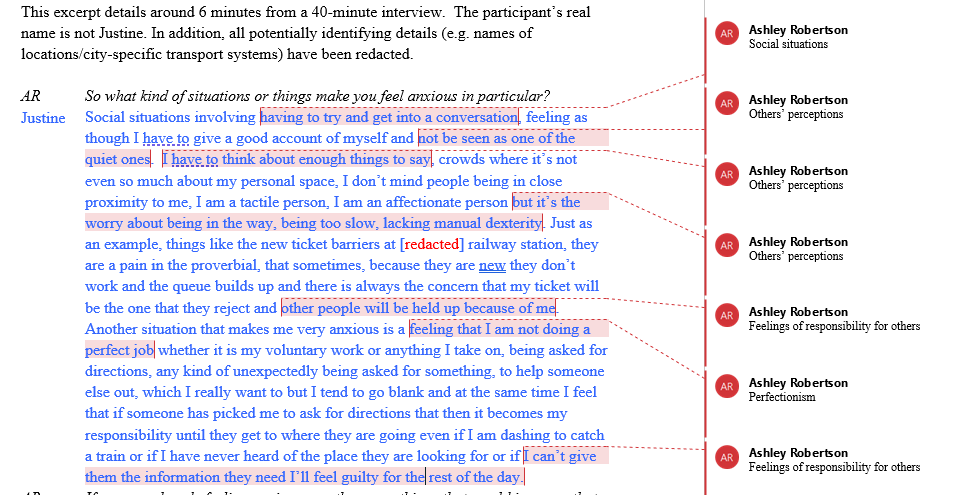

# Analysis and Summative Assessment: Qualitative report


## Data analysis

This chapter has activities to support you with Thematic Analysis. This chapter, alongside with Ashley's lectures, will talk you through the six steps required for TA; we advise using Braun & Clarke (2006) to structure your data analysis. This can be accessed through the library, using the following link: https://tinyurl.com/ybrsf5eg. There is also a good overview in Braun & Clarke (2013), which is on the reading list.

**Overview of the steps of TA**

  1. Familiarisation with the data
  2. Generating initial codes
  3. Searching for themes
  4. Reviewing themes
  5. Defining and naming themes
  6. Producing the report


## Coding (steps 1-2)

Here, we'll focus on Steps 1 and 2 of the process. These can be found on pages 87-89 of the Braun & Clarke (2006) paper. We also covered how to do the analysis in the Thematic Analysis lecture in Semester 1 Week 12.

### Step 1: Familiarisation with the data

  * Transcribing (or sorting/anonymising your transcript) helps you to become more familiar with your data
  * Read over the transcript, but do it in an 'active' way. This means reading while searching for meanings and patterns
  * Note down anything of interest that comes up

**Practical steps:**

Read through your transcript and take notes and/or make comments in the margins. Generate a list of ideas: what is interesting about the discussion?

### Step 2: Generating initial codes

  * Codes identify a feature of the data that seems interesting
  * The process of coding involves going through the transcript and thinking about the data, and picking out what seems interesting/important.
  * Coded data is specific (themes, which come later, are broad) -you will likely end up with quite a lot of different codes.
  * Code for as many patterns as you can at this point  - it won't all make it to the next stage, but it's good if you pick up as much as you can at this stage.
  
**Practical steps:**

Insert labels beside quotes - what is interesting about the quote? What does it tell us in relation to your research question?

### How to actually do the coding (logistically)?

There are many different ways to approach this - find the way that works for you! There are also different software to conduct thematic analysis (such as NVivo); you are welcome to use these if you wish, but due to the introductory nature of this course we don't have guidance for using them, so you need to do learn it independently, should you want to use one.

Option 1: Hand-coding
```{r img-handcoded, echo=FALSE, fig.cap="Example of a hand-coded transcript"}
knitr::include_graphics("images/handcoded.jpg")
```

Option 2: Code using Word, by adding comments
```{r img-commentcoded, echo=FALSE, fig.cap="Example of a transcript coded using comments on Microsoft Word"}

```

Option 3: Construct a table for your codes and quotes. This is an example from Braun & Clarke (2013)
```{r img-tablecoded, echo=FALSE, fig.cap="Example of a transcript coded using a table"}
knitr::include_graphics("images/tablecoded.png")
```

### Activities

#### Activity 1: Example of coding

Have a look at this example of coding (using Thematic Analysis) from Braun & Clarke (2013): [HERE](https://gla-my.sharepoint.com/:w:/g/personal/ashley_robertson_glasgow_ac_uk/EdF3fJaWwyJJuVkP-jVOVPcBlNGsfnv04rsWlavw_pyowA?e=QgIRAO)

Think about the following:

Do you agree/disagree with the codes that the authors have chosen? Which ones, and why? Are there any additional codes that you think might be worthy of consideration?

#### Activity 2: Try it yourself!

It's time to have a go at coding yourself now!

Read through [this transcript](https://gla-my.sharepoint.com/:w:/g/personal/ashley_robertson_glasgow_ac_uk/ERHhgbPHADBJuJHk7e2yMtYBb1ddJMCTckAvoXpXB0UYFA?e=UFwJqE), taking brief notes individually the first time you read it. What things did you pick up? If working with others, discuss your codes  - what were the similarities/
differences?

## Developing themes (steps 3-6)

Here, we'll focus on Steps 3 to 6 of the process. These can be found on pages 89-93 of the Braun & Clarke (2006) paper. We also covered how to do Step 3 in in the lecture for Semester 1 Week 11, while Steps 4-6 were  Semester 1 Week 12. For these activities, you are welcome to do them individually or in pairs/small groups  - whichever you prefer!

### Step 3: Searching for themes

  * In this stage, you should sort the codes into potential themes. Here, you will start to analyse your codes, and consider how they might combine to form an overarching theme.
  * It might be helpful to visualise this in some way, and see how the codes fit together.
  * You may have codes that don’t seem to fit anywhere, others will fit neatly into themes, others might be in sub-themes
  * You end this step with a collection of candidate themes (and/or sub-themes)

**Practical steps:**

  * Start to group your initial codes into broader themes.
  * Can you see a pattern across different codes?
  * What are the similarities across codes?
  * End this stage by collating all the coded quotes relevant to each theme.
  * Themes can be descriptive or interpretative (see Braun & Clarke, 2013, Ch 11). 
  * Using tables or mind maps at this stage can be helpful
  
### Step 4: Reviewing themes

This step involves two levels of reviewing and refining

*Level 1*

Reviewing at the level of the coded extracts. Read all the collated extracts for a theme…do they form a coherent pattern?

If they do, then move on to Level 2.

If they don’t, is it the case that a) the theme itself is problematic or b) the theme is fine, but some of the data doesn’t fit?

*Level 2*

Look across the entire dataset and consider the validity of your theme(s) – does it accurately reflect the meanings in the dataset?

**Practical steps:**

  * This involves checking that the themes ‘work’ in relation to both the coded extracts and the full data-set.
  * Reflect on whether the themes tell a convincing and compelling story about the data, and begin to define the nature of each individual theme, and the relationship between the themes.
  * It may be necessary to collapse two themes together or to split a theme into two or more themes, or to discard the candidate themes altogether and begin again the process of theme development.
  * Not every participant will make specific reference to every theme - that is ok - but think about how each person is represented in the analysis.
  * It can be helpful at this stage to group the relevant quotes together that represent each given theme

### Step 5: Defining and naming themes

  * During this step, you should define and refine the themes.
  * Define and refine = identifying what this theme is about, what aspect of the data is captured by each theme?
  * For each theme, you need to conduct and write a detailed analysis
  * In your report, you will report one theme with sub-themes or two themes (no subthemes) – do they explain different things without overlapping too much?

**Practical steps:**

  * This involves being able to explain each theme: 'What story does this theme tell?’ and ‘how does this theme fit into the overall story about the data?’.
  * Identify the ‘essence’ of each theme and construct a concise, punchy and informative name. Usually, you would aim for two themes for the qualitative report
  
### Step 6: Producing the report

  * The analysis should provide a concise, coherent, logical, non- repetitive and interesting account
  * The write up must provide sufficient evidence of the theme(s) (this is where the quotes come in!)
  * The extracts you choose should clearly illustrate the theme

**Practical steps:**

  * For the RM2 qualitative report, you should report either two themes (no subthemes) or one theme with 2-3 sub-themes. This is to allow you to balance depth and breadth.
  * Each theme should include approx. three quotes to illustrate it in the write up. Think about which quotes best illustrates your them.
  * If you are doing a qualitative dissertation, you will have scope to go further with your analysis; it is a good idea to discuss your data with your supervisor throughout the analytic process.
  
### Activities

#### Activity 1: Try it yourself!

We've provided the same transcript as for steps 1-2, but it's a little longer (to give you more scope to develop themes) - you can find it [here](https://gla-my.sharepoint.com/:w:/g/personal/ashley_robertson_glasgow_ac_uk/EZaA8YkYkyVGkwn0cEDFLCABWr5rREIlMAyIaAPHu3juTg?e=QgyPdd). You can use the codes you developed last time (adding to them for the additional parts of the transcript), or you can recode the data again if you prefer - either option is fine.

  * Once you have your codes, try to organise them into themes.
  * Group together the codes that seem similar in some way - can you think of an overarching 'theme' that describes them? 
  * Are there any codes that don't 'fit' anywhere? (that's okay if so!)
  * Can you identify any quotes that you would use to evidence the themes? Do these definitely match well onto the theme?
  
#### Activity 2: Bad analysis

This is an additional activity and only if you have time/want to delve a bit further. Have a look at the analysis [here](https://gla-my.sharepoint.com/:w:/g/personal/ashley_robertson_glasgow_ac_uk/EXFrzL2zbfBCjDUeP6Py3MUB3p_WS15GyVYXur83wjuYUQ?e=fTMITU). This is an example from Braun & Clarke's book. Why do you think it might be considered a poor example of thematic analysis?

After you've finished, you can look at the points that Braun & Clarke identified [here](https://gla-my.sharepoint.com/:w:/g/personal/ashley_robertson_glasgow_ac_uk/Eded8-fYVWpOrj5vFY92gyQB0ieRX7BGUhZztrdA5auVhw?e=Pysxhy). Did you identify any additional ones? Were there any you missed?

## Developing a narrative

When doing your thematic analysis, it is important to develop a narrative and go beyond paraphrasing/summarising your data.

Thematic Analysis requires an active approach from an analyst. It is your role to make sense of the data and to present this in a coherent, understandable and accessible way to the reader. You will take these 'patterns of meaning' and make sense of/interpret them, and convey these to the reader.

One point to note: Remember that **themes do not emerge**  - this suggests that they are lying in wait for you to discover them, and that the same themes would come up regardless of the analyst. This is not the case  - your experiences and interpretations will affect the themes you end up with.

When you present your data in the analysis section, you will have a) your list of themes and b) your quotes. It is your job to combine these with analytical commentary, in order to tell the story of your data. It's not enough to present the themes and then back these up with quotes  - your job is to add in a narrative that brings the themes and the evidence (i.e. quotes) together.

**Semantic and latent analysis**

Thematic Analysis allows you to explore *semantic* or *latent* themes (or both) in your analysis:

*Semantic:* captures explicitly-expressed meaning and stays close to the language of the participants/overt meaning of data, realist. This tends to be somewhat deductive. Semantic approaches still go beyond summarising/paraphrasing.

*Latent:* focuses on a deeper, more implicit meaning of the data. What are the underlying meaning, ideas, concepts? This tends to be a bit more inductive.

**Things to be aware of in developing a narrative**

1. Remember to introduce your theme to the reader – what is it about? Don’t start a theme with a quote. If you have sub- themes, still introduce the overall theme briefly before you discuss your first sub-theme
2. Explain to the reader why you’ve chosen to include each quote. Why is it important enough to be included? What does it tell us about your data?
3. Focus on depth rather than breadth – it is important that we get a real sense of your theme. In the RM2 report you only have 3000 words in total, and so will have to choose what you discuss
4. Show the reader who each quote comes from  - we should be able to match this up with the demographics table/list of interviews in the Methods section (which then gives us some context). You can do this by using pseudonyms and linking this to the table by using the same names there too.
5. Think about where the opportunities are in your data to go beyond description. Is there anything you can infer? If so, remember to be clear with the reader that this is your interpretation. Your reader should be able why you have interpreted the data this way from the quotes you've chosen.

### Activities

#### Activity 1: Semantic vs. latent
To explore differences between semantic and latent coding, as well as analysing at an illustrative or analytical level, please read [Clarke and Braun (2013)](https://glasgow.summon.serialssolutions.com/#!/search?ho=t&include.ft.matches=t&l=en-UK&bookMark=eNqNzEsKwjAQANABP2i1Z7AXEJJM20nWorjXfRlDWiuhxSbR63sC0f3jZTAfxsHNIDekpS5JU6WVWkImpSk1IdW4gjyEhxBCYoUo5Bp2l2StC6FNvngm9n3k2L9cMbngeLL3LSxa9sHlMI9TchsoTsfr4bzvPIdufDeWI_uxa25YozZkJH4nypAySmj1Y6mpwj_IB5k-RK4) p207-210 and also p252-254.

#### Activity 2: Analysing vs. summarising
Read pages 8-12 from [this thematic analysis](https://study.sagepub.com/sites/default/files/anderson_clarke_reflective_commentary.pdf) on skin-picking. Here, the authors report three themes and then have a reflection at the bottom. Try to identify where the authors have gone beyond paraphrasing  - discuss in your groups/pairs if you can.

#### Activity 3: Evaluating analysis and discussion sections
Do [THIS EXERCISE](https://gla-my.sharepoint.com/:w:/g/personal/ashley_robertson_glasgow_ac_uk/EUiKwKgdqr1CsLeOxy5O42kBGNLxmbdeTqANFRu0caPcBA?e=BpEpBb) on evaluating analysis sections of published papers.

## Checklist for a good TA

This checklist is taken from Braun & Clarke (2006)

1. The data have been transcribed to an appropriate level of detail, and the transcripts have been checked against the recordings for accuracy
2. Each data item has been given equal attention in the coding process
3. Themes have not been generated from a few vivid examples (an anecdotal approach), but instead the coding process has been thorough, inclusive, and comprehensive
4. All relevant extracts for each theme have been collated
5. Themes have been checked against each other and back to the original data set
6. Themes are internally coherent, consistent, and distinctive
7. Data have been analysed – interpreted, made sense of – rather than just paraphrased or described
8. Analysis and data match each other – the extracts illustrate the analytic claims
9. Analysis tells a convincing an well-organised story about the data and topic
10. A good balance between analytic narrative and illustrative extracts is provided
11. Enough time has been allocated to complete all phases of the analysis adequately, without rushing a phase or giving it a once-over-lightly
12. The assumptions about, and specific approach to, thematic analysis are clearly explicated
13. There is a good fit between what you claim you do, and what you show you have done – i.e. described method and reported analysis are consistent
14. The language and concepts used in the report are consistent with the epistemological position of the analysis
15. The researcher is positioned as active in the research process; themes do not just ‘emerge’

## OPTIONAL: Research skills session - Preparing for data analysis

Ashley has recorded **optional** research skills sessions on different aspects of qualitative research. These sessions take a little bit deeper dive into some of the topics and may be particularly useful if you are planning on doing a qualitative dissertation next year. 

[Watch the video here](https://echo360.org.uk/media/d4df06eb-4cf1-4ae0-bf8b-cf280d9da7e0/public)

### Thinking about reflexivity

We ask you to think about your own position in the research as part of your RM2 report (there is a section in the methods!).

This can be quite tricky to do, but is very important for qualitative research. Some suggestions to get you started:

  * Think about the topic you are doing for your research and your position in it. Where would you place yourself in relation to it? What are your own views on the topic? Do you feel quite strongly about it or not?
  * Write as you reflect. Writing – be it using pen or pencil on paper, typing on a keyboard, dictating to some voice capture device, or some other mode – is an important tool for developing reflexive depth. It is good to do this at various stages of the research process.
  * Start with your own experiences, understandings and views, but then also try to interrogate those (i.e. why do you have these particular understandings, views etc.?)

Some questions that you might ask yourself:

  * What do I expect to come up in the data? How does this relate to what we found?
  * What broader experiences have I had that might influence how I'm thinking about this?
  * What are my values (i.e. what is important to me)? What about my beliefs? How might these have infuenced my thinking?
  * How might all of these be connected to my identities and the communities I am a part of?
  
### Becoming familiar with the data

It's important to become familiar with the data in the process of doing the analysis. Read through your data and make the following notes:

  * Things of potential interest
  * Ideas that you might want to explore further when you are coding
  * Your responses to the data (e.g. how do you feel when you read it?)

Try to unpick any assumptions you have that underpin your initial reactions and observations:

  * What was familiar?
  * What was unfamiliar/surprising?
  * Why are you reacting to the data in that way?
  
### Activity 1: Read this extract and take familiarisation notes

Read this extract and take some familiarisation notes for yourself (these are just for you and won't be shared). We will then go through what Braun & Clarke say about it. 

Some context:

This activity is based on a data extract from an interview study exploring LGBT students’ experiences of university life. The participant is a gay man – a mature student, who spoke English as a second language. The extract comes from early in the interview and in response to a question about whether he is ‘out’ as a gay man at university – whether he is openly gay.

In this activity (5 mins):

  * First, reflect on your assumptions and expectations about this topic, and your positioning in relation to this topic (are you an insider researcher? Outsider?).
  * Second, read the data extract and make some familiarisation notes.
  * Braun and Clarke’s familiarisation notes follow – reflect on similarities and differences in your and their analytic observations and ‘take’ on the data.

```{block, type="info"}
Andreas: ...I sometimes try to erm not conceal it that’s not the right word but erm let’s say I’m in a in a seminar and somebody- a a man says to me ‘oh look at her’ (Int: mm) I’m not going ‘oh actually I’m gay’ (Int: mm [laughter]) I’ll just go like ‘oh yeah’ (Int: mmhm) you know I won’t fall into the other one and say ‘oh yeah’ (Int: yep) ‘she looks really brilliant’ (Int: yep) but I sorta then and after them you hate myself for it because I I don’t know how this person would react because that person might then either not talk to me anymore or erm might sort of yeah (Int: yep) or next time we met not not sit next to me or that sort of thing (Int: yep) so I think these this back to this question are you out yes but I think wherever you go you always have to start afresh (Int: yep) this sort of li- lifelong process of being courageous in a way or not …
```

`r hide("Braun & Clarke's familiarisation notes")`
  * Andreas reports a common experience of presumed heterosexuality; coming out is not an obvious option.
  * Social norms dictate a certain response; the presumption of heterosexuality appears dilemmatic, and he colludes in the presumption, but minimally (to avoid social awkwardness).

Looking a bit more deeply, Braun and Clarke speculated that Andreas values honesty and being true to yourself, but he recognises a socio-political context in which that is constrained, and walks a ‘tightrope’ trying to balance his values and the expectations of the context.
`r unhide()`

### Activity 2: A code or a theme?

In this activity, we'll go through a handout that asks you whether something is a code or a theme. Link to the handout is [HERE](https://gla-my.sharepoint.com/:w:/g/personal/ashley_robertson_glasgow_ac_uk/EchyMtm_oPxJjdf87kLvpyMB3nyxnSof5oEP-0A-PhnEGg?e=YKqeo8)

For each label, decide whether it is a code or a theme.

  * Keep in mind that although there is no absolute distinction between codes and themes, codes tend to have a single facet and capture one insight or observation about the data, whereas themes are ideally multifaceted and capture several insights and observations. Themes should also capture a pattern of shared meaning – this can be shared meaning on the data surface, or shared implicit or underlying meaning. 
  * Reflect on why you have decided that each code/theme is a code or theme. What features of the data, the label/name, and brief explanation of the scope and focus of each code/theme influenced your judgement?
  
`r hide("Braun and Clarke's solution")`  

```{r img-themeorcode, echo=FALSE, fig.cap="Braun and Clarke's suggestions"}

```

Three themes were presented in the analysis: "Two themes capture contradictory ideas: that men’s body hair is natural, and that men’s body hair is unpleasant. A third theme introduces the concept of ‘excess’ hair, which allowed sense-making of this contradiction, mandating men’s grooming of ‘excessive’ hair." (Terry & Braun, 2016, page 14)

`r unhide()`


### Some common problems with thematic analysis

  * Thematic analysis that fails to address the research question.
  * Unconvincing or under-developed analysis: 1) Too many or too few themes 2) Too much overlap between themes or themes are unrelated 3) Themes are vague or not internally consistent or coherent
  * Little or no analytic work has been carried out (for example, using data collection questions as ‘themes’).
  * Mismatch between data and analytic claims (e.g. going beyond what your participants say)
  * Too few or too many data extracts (and little or no analytic commentary).
  * Paraphrasing rather than analysing and interpreting data
  * Arguing with the data – pointing out the ‘errors’ in a participant’s account.

### Strategies for ensuring quality in your analysis

**Reflexive journalling**

  * Reflect on your experiences throughout the whole research process (not just at the end!)
  * Think about your emotional responses to the data
  * Try to reflect on your assumptions that you already have about the topic
  
**Talk about your data with others**

  * Discuss your analysis with other people - it helps to clarify your analytic insights
  * Do stages 1-2 in pairs if you want
  * Discuss your findings in groups
  * Come along to office hours
  * Present your analysis (even if its preliminary), this can help solidify where we are going with it

**Give yourself time**

  * Try not to leave the analysis until the last minute
  * Give yourself time to step away and breathe
  * Perhaps work on other sections of your report at the same time, so that you have a mental break from analysis
  
**Make sure themes are themes (and be careful when naming them)**

*Connelly and Peltzer (2016, p.55): "When a researcher designated a 1-word theme, such as 'collaboration', what does that mean in relationship to the experiences of the informants as interpreted by the researcher? Using only 1 word as a theme, there is no way of knowing, for example if the experiences of collaboration were positive or negative, or whether collaboration is important to the nurses. One-word themes do not convey what the researcher found out about collaboration"*

## Report Writing Guide

This section is intended to help you in the write up of your qualitative project report.  When writing your report, remember to use the other resources available to you:

- The feedback your group received on your group proposal
- The feedback you received from RM1
- Braun & Clarke (2013) have an excellent chapter on writing up qualitative research (WHICH CHAPTER? ADD LINK)
- Braun & Clark (2006) paper (ADD LINK)
- Constructing a narrative in TA video (password is Narrative1!) which is available on moodle (ADD LINK)
- Published articles which use a Thematic Analysis (LINK TO READING LIST)
- Helpful resources for APA formatting are [OWL Purdue](https://owl.purdue.edu/owl/research_and_citation/apa_style/apa_formatting_and_style_guide/index.html)
- Materials from [the labs](https://wtoivo.github.io/RM2-F2F-quali-book/labs.html) and [APA Style](https://apastyle.apa.org/style-grammar-guidelines)
- We have developed a resource of [Frequently Asked Questions](https://wtoivo.github.io/RM2-F2F-quali-book/frequently-asked-questions.html) from previous cohorts
- [Student Learning Development](https://www.gla.ac.uk/myglasgow/sld/) have useful information about writing for students

If you have further questions, post on Teams and/or visit your tutor's office hours.  All the best in writing your report.

### Suggested word count

We suggest the following for each section. Adhering to this exactly is not a mandate or requirement (i.e. it is the overall word count is the important one) but it does give an indication of where we do and do not expect to see lots of detail.

- Abstract: 100-150 words
- Introduction: 700-800 words
- Methods: 350-450 words
- Analysis: 750-900 words
- Discussion: 750-850 words

However, we strongly encourage you not to have an overly long abstract, as this can make things unecessarily tight for the rest of the report.

## Title

The title should reflect the research question(s) and define your sample (e.g., UG students experience of…). Be specific should include: 

- Who
- What 
- How 

*Example* 

**A Thematic Analysis** (how) of the **panic attack experiences** (what) of **primary aged children in inner city Schools in the UK** (who)

**Barriers and enablers to modifying sleep behaviour** (what) in **adolescents and young adults** (who): **A qualitative investigation** (how)


## Abstract (suggested word count: 100-150 words)

In an academic journal, the function of an abstract is to allow the reader to decide whether or not to read the full article.  Aim to summarise all sections of the report in 150 words, including;  1) area of research 2) aim of the study 3) brief methodology, 4) approach to analysis , 5) main findings, and 6) main 'take-away'/ headline findings and implications. Outline your main themes as findings instead of statistics  - as would be typical in a quantitative report. Keep in mind that you are summarising your research for a non-expert and you want to “entice” them to read more.

## Introduction (suggested word count: 700-800 words)

**NOTE TO WIL - DO WE NEED TO INCLUDE THE IMAGE THAT IS IN THE SWAY? IF SO, HOW? ALSO PERHAPS WE REVISE THIS SECTION A LITTLE TO REDUCE THE FOCUS ON FINDING A GAP**

---
A resource for helping you to develop evaluation in your Introduction can be found in the Week X lab materials **(ADD LINK AND CHANGE THE WEEK NUMBER)**
---

The aim of the introduction is to provide the reader with the necessary background to interpret your rationale for further research  -  this is true whether you are using qualitative or quantitative led enquiry.   You are expected to provide a detailed, critical literature review of relevant, published research  (quantitative and/or qualitative) for this topic/area. Identify the key issues and debates, and use these to develop an argument for your study. As with any introduction to an APA research report, you should develop the introduction using the' funnel approach'. You start with a broad overview of the topic and get more and more specific, until you arrive at the rationale for 'your' research and of course the research question(s).

Remember you have a limited number of words to say all of this, so your literature review should focus on relevant and recent articles in the area that have influenced your choice of research question.  Do try to locate the most recent examples of qualitative research in this well defined topic area - take the reader to the last example of relevant research and say how you plan to 'build' on this research - helping to create a great rationale! The topic guide **(ADD IN LINK)** cites a number of relevant studies.  Identify the most relevant studies, and you are also expected to find your own research articles related to your research question. Remember to reference all sources of information in the text (for example, government reports, websites, media reports).  

Next, remember to outline any limitations of previous studies - critique (however, make sure the limitations you discuss are actually something your study can address - otherwise your rationale will not be very strong)! Instead of just describing previous studies, try to evaluate them. What do the findings mean? Are there any contrasting findings? If so, why?  This should lead clearly to a justification of your own study; how will your study address these issues?  This should not be done independently of your literature review. When you are outlining the research and theory you should be developing a clear rationale for your research question. 

Finally, explain your study and clearly outline your research question/s.

In sum:
- Review and evaluate previous theories and research relevant to the topic.
- Provide a clear justification and explanation of your study, linked to your research questions
- The main and subsidiary research questions have been outlined clearly and offer good alignment with qualitative methods (in this case a thematic approach).

Remember that the point of this section is exactly the same as a quantitative report: you are demonstrating what work has been done in the past, to build up an argument as to why the current study has been conducted. 


## Method (sugested word count: 350-450 words)

The aim of the method section is to clearly report how your study was conducted – the reader should be able to re-run your research from the details provided. In this case, report details of your focus group and the qualitative analysis you used.  True 'replication' is difficult due to central role of researcher in influencing some aspects of the research such as analysis.  This is not an experiment.

### Participants & Recruitment

How many, who were they? Include their age, gender and nationality if known. How were they sampled? Why were your participants right for the study? In this study, participants were sampled from a group of PG students as part of their course requirements.  A table of relevant participant characteristics is recommended - please see the example here **IMAGE OF TABLE NEEDS TO BE INCLUDED/LINK TO THE WORD DOC (ALTHOUGH CHECK THE DOC!)**

APA Styles has more information about how to report [tables in APA format](https://apastyle.apa.org/style-grammar-guidelines/tables-figures/tables)

### Data Collection

What materials did you use to run the focus group? What information was given to participants? How was the focus group recorded, and how long did it take? Tell the reader about your approach to this, did you follow rapport building guidelines? Refer to the focus group questions in the appendices.    

### Ethics 

Include a brief account of the ethical procedures and consider both 'formal ethics' (getting consent) as well as more nuanced 'non-formal' such as the rapport building, consent as a process and reflective practices of researcher (this may warrant its own sub-heading).

### Reflexivity 

In the method section, you should also include a ‘Reflexive Analysis’. In qualitative research it is important to acknowledge the role of the researcher in interpretation of the data (Elliot & Fischer & Rennie, 1999).  This is where you question your own motives and attitudes in doing this project. Obviously we told you that you had to do it. But what assumptions did you hold prior to beginning the research? Had you considered issues around the topic previously? Did they match what the focus group say? Or did you disagree with them? And if so, how did this impact on your analysis? As different people would interpret the data differently, it is useful for you to expose your own attitudes at this point so that others can see how you have impacted on the analysis. See Braun & Clarke (2013, pp36-37, 303-304).  Reflexive analysis should be concise for this project, perhaps around 3-4 sentences.  

### Data Analysis  

In this section, report the following: 
- details on how was the data prepared for the analysis (e.g., did you use any software for transcription? What about approach to transcription? How did you anonymise the data  - did you replace or redact identifiable information, were participants given pseudonyms etc.?) 
- details on the analysis you are using 
- briefly outline the your theoretical approach (look back at the lecture on theoretical perspectives for help with this if needed)
- outline the different stages of the analysis. Qualitative analysis is accused of being fluffy/opaque sometimes. BE SPECIFIC about the stages of analysis. It's good practice at this stage to refer directly to a methodologists guidelines (e.g. Smith IPA, B and C for TA etc). Literally outline it as STAGE1: STAGE 2: etc.  For the project, 2-3 sentences outlining the stages is sufficient (i.e. here, we mean in total, NOT per stage).  A high quality account of the approach to analysis should offer transparency - try to 'open up the box' to be clear about what goes on between noting codes and arriving at themes.  Remember that the researcher observes themes in the data  - they do not *emerge*

**TABLE IS MISSING**

## Analysis (suggested word count: 750-900 words)

Your analysis section is the part of the project where you show the evidence you have collected. It is similar therefore to a Results Section in a quantitative report.  It is useful to use sub-headings here.  Each sub-heading should state the name of each theme/sub-theme. You may wish to number these sub-headings if you have quite a few themes and sub-themes - this can make it easier to follow.

The aim is to make your analysis as transparent as possible, so that anyone can see how you have arrived at your interpretations from your transcript. Quotes and the narrative you develop in this section should be supported using sections taken from the transcript. Start by giving an overview of the main themes in a paragraph (there should be no quotes at this time), then present your first themes, inserting supporting quotes at appropriate points.

Guidelines for presenting quotes from participants in APA format can be found in [the relevant section in APA Styles](https://apastyle.apa.org/style-grammar-guidelines/citations/quoting-participants). Further guidance is included in this document. **ADD LINK** 

PLEASE NOTE: most qualitative analyses require you to provide some analytical commentary after each quote. See the Constructing a Narrative in TA video (link is at [the top of this page](https://wtoivo.github.io/RM2-F2F-quali-book/qualitative-report.html#using-this-report-writing-guide)) and the Braun & Clarke (2013) text (chapter Ch 11) for examples for analytical commentary (**ADD LINK**)

Due to the word limit we recommend that you:

- Choose a maximum of 2 themes to include in the Analysis Section. You may have found more in the analyses, but the scope and word limit of the project allows you to develop a narrative and evidence for 2 main themes with no subthemes. One alternative would be to report one theme with 2-3 subthemes. You may identify more themes than this, which is fine, but please stick to the guidelines here when reporting them.
- Introduce and explain each theme briefly using sub headings
- Include key quotes to support each theme (include the Pseudonym/participant number). You are likely to have a mix of longer and shorter quotes. A ballpark number might be 3-5 quotes for each theme. 
- If you want to use a quote that is too long – or includes unnecessary detail – you can remove part of the text and replace it with ellipses. 

**TABLE IS MISSING**

**NOTE TO WIL - I'VE REMOVED THE BIT ABOUT ALTERING THE WORDS/TEXT BEING UNACCEPTABLE, AS OUR GENERAL LINE HAS PREVIOUSLY BEEN THAT MINOR CLEANING IS OKAY AS LONG AS THEY REPORT IT IN THE METHODS. PERHAPS WE THINK OF SOMETHING TO REPLACE IT OR PUT A QUESTION IN THE FAQS?**

## Discussion (suggested word count: 750-850 words)

---
A resource for helping you to develop evaluation in your Discussion can be found in the Week X lab materials **(ADD LINK AND CHANGE THE WEEK NUMBER)**
---

The aim of the discussion is to summarise and explain your overall findings and consider how they help inform the research questions.  It will be necessary to consider the findings in relation to previous research and theories (that are referenced in the Introduction).  You should also discuss any practical implications of your findings, methodological limitations, and suggestions for further research.

Start by briefly summarising your RQ/s and the themes that you have observed. How do your findings add to, or fit with previous research?  You can either take each main theme as a big discussion or break it down to sub-theme theme level. Be critical. Bring in the literature you discussed in the introduction, and new literature if need be. Do your findings agree/disagree with previous studies? Do your findings challenge existing research in any way? Did your methodology (using focus groups) uncover something that the other studies couldn’t get at? Basically... what is your contribution?

### Implications

In addition to theoretical implications you would normally discuss in a quantitative report in psychology, there is also scope for discussion of the implications.  Remember to only discuss implications that you can realistically relate to your own findings, and to support your arguments with evidence. Try to over some specifics and not vague/general implications.

### Limitations

Obviously you only spoke to one group of people and these were a fairly homogenized group, so a wider and larger sample would potentially bring richer, more in-depth data. However, avoid evaluating your study purely on quantitative standards such as validity and reliability and sample size. We strongly suggest that you do not use lack of generalisation as a limitation.  This can be contradictory to the philosophy of the method of analysis.  Evaluate the strengths and weaknesses on qualitative grounds, e.g., were focus groups the best way of eliciting the information you were looking for?  For guidance on evaluating qualitative research against a set of guidelines see Yardley (2000) & Braun & Clarke (2013, Ch 12).  

Think of your research project as an apprenticeship. We are not looking for you to do the perfect research project at your first attempt so don’t be shy about pointing out the things you could have done better. But be constructive. It’s not so much about telling us what you did wrong, as telling us what you have learned and how you would improve this study if you got another chance.

**IMAGE IS MISSING**

### Suggestions for future research

If you had unlimited access to resources, how would you improve on your study? If you had the chance what kind of research questions would you like to ask? Why do you suggest the specific things that you do? Is there evidence to support the suggestions that you have?


## References

References both in the main body of text and in the reference list are structured in exactly the same way as in a quantitative report using APA style. 

## Appendices

An appendix (plural: appendices) is a supplementary document which forms part of a main document but is not essential for its completeness, containing supporting information, and usually appearing at the end. 

The appendix can often hold a lot of information.  In the qualitative report we ask you to Include the following in the appendices of the report: 

- your focus group schedule
- a sample of initial coding of the transcript

Your group will be asked to upload the transcript to Moodle before the submission of the report but it should *not* be included as part of the appendices.

## Further reading 

The RM2 reading list (**ADD LINK**) has examples of how qualitative research is presented and written up.  The APA Reporting Standards for Psychological Research (**ADD LINK**) provide comprehensive guidance on how to meet APA style journal article reporting standards in a qualitative article.  These APA guidelines are very detailed and go beyond the scope of what you need to report in the qualitative report, but do provide insight into how to report methods and analysis in a transparant way.

For those who want to really dive into thematic analysis, you can find further resources [here](https://www.thematicanalysis.net/resources-for-ta/)

If in doubt consult the guidance in this book, the assessment information sheet for the course and ask on the Teams channel. 

---
For information, the authors of this qualitative report writing guide are: Maxine Swingler, Gillian Hendry, Kate Reid. It has then been adapted by Ashley Robertson and Wil Toivo for Research Methods 2.

Attribution 4.0 International (CC BY-SA 4.0)

If you have any questions about this resource contact maxine.swingler@glasgow.ac.uk