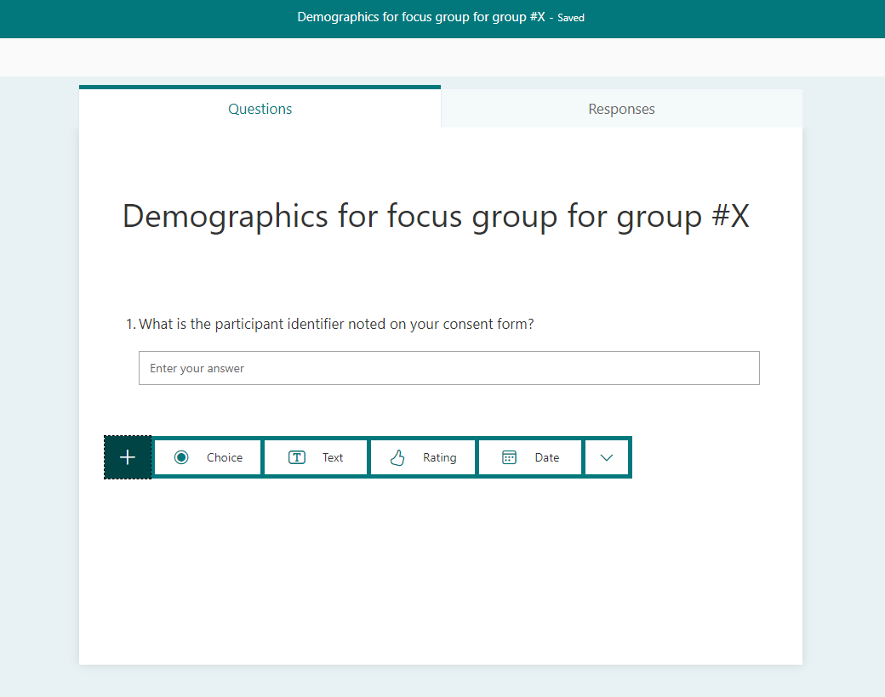
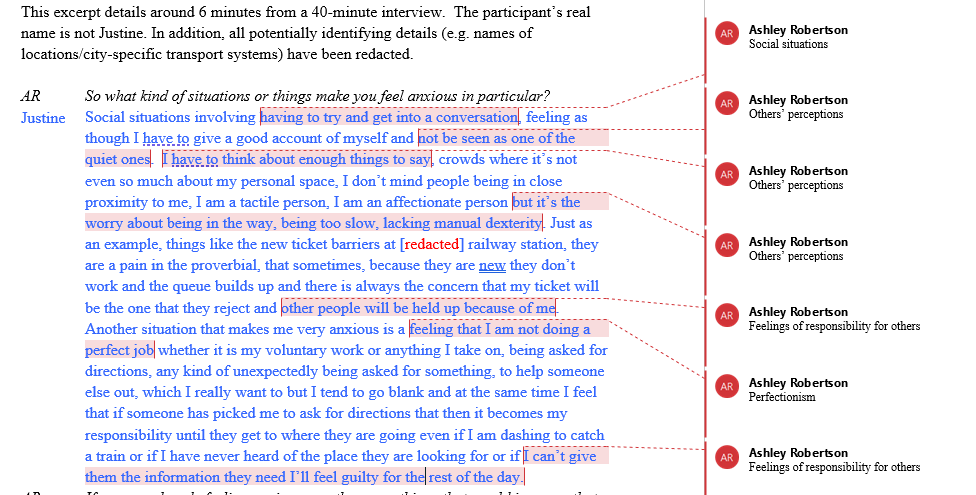
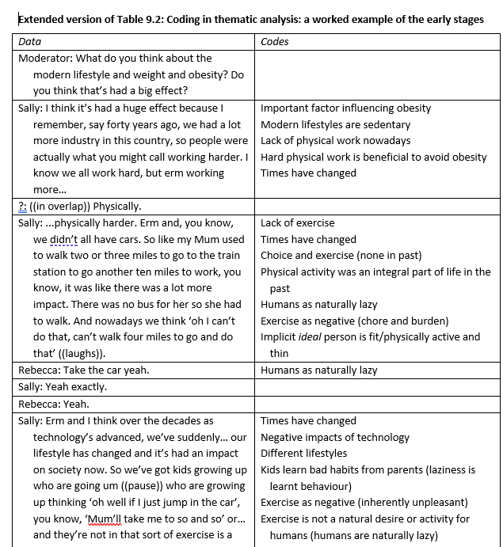
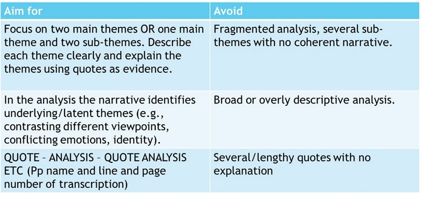

--- 
title: "RM2 F2F Qualitative Project Resources" # edit
#subtitle: "optional" 
author: "Wilhelmiina Toivo and Ashley Robertson" # edit
date: "2024-08-15"
site: bookdown::bookdown_site
documentclass: book
classoption: oneside # for PDFs
geometry: margin=1in # for PDFs
bibliography: [book.bib, packages.bib]
csl: include/apa.csl
link-citations: yes
description: | # edit
  RM2 F2F Qualitative project resources book.
url: https://wtoivo.github.io/RM2-F2F-quali-book # edit
github-repo: wtoivo/RM2-F2F-quali-book # edit
cover-image: images/logos/logo.png # replace with your logo
apple-touch-icon: images/logos/apple-touch-icon.png # replace with your logo
apple-touch-icon-size: 180
favicon: images/logos/favicon.ico # replace with your logo
---

# Overview {-}

This book includes all the resources you need to complete the qualitative project as a part of your RM2 course

<!--chapter:end:index.Rmd-->

# Labs

Test

In this chapter you will find the lab materials/activities. Slides will be linked in this chapter, but can be found on Moodle. Each lab focuses on supporting you with your qualitative project. As part of this project, you will complete two summative assessments: one as a group (30%) and one as an individual (50%).

The Labs will be on the following topics:

- Week 1: What is qualitative research?
- Week 2: Group work, Developing Research Questions
- Week 3: Ethics
- Week 4: Developing a focus group schedule
- Week 5: Running a focus group
- Week 7: Data processing and reflection
- Week 8: Evaluation in the Introduction and Discussion
- Week 9: Analysis (coding)
- Week 10: Analysis (themes)

## Week 1 Lab 1: What is qualitative research?

 - - - - 

Key resources: 

[Project timeline](https://gla-my.sharepoint.com/:w:/g/personal/ashley_robertson_glasgow_ac_uk/EYepOBxHkIxKuULVqBmvGiMBk7KH4FlUNGMLWlpYNc7d4Q?e=6rgfh2)

 - - - - 

In Lab 1, we will introduce you to qualitative research, and consider the differences between qualitative and quantitative. You will work together in groups to complete two activities. 

### Lab 1 Activity 1: Differences between qualitative and quantitative studies

Look at the table below, then discuss the questions underneath in your groups.

|Quantitative             |Qualitative           |
|-------------------------|----------------------|
|Numbers used as data     |Words (written/spoken) and images used as data.|
|Seeks to identify relationships between variables to explain or predict with the aim of generalising findings to a wider population|Seeks to understand and interpret more local meanings. Recognises data as gathered in a context. *Sometimes* produces knowledge that contributes to more general understandings|
|Generates "shallow" but broad data: not a lot fo complex detail obtained from each participant but lots of participants take part to generate statistical power|Generates narrow but rich data - "thick descriptions" - detailed and complex accounts from each participant, not many participants|
|Seeks consensus, norms or general patterns, often aims to reduce diversity of responses to an average response|Tends to seek patterns but accommodates and explores difference and divergence within the data|
|Tends to be theory-testing and deductive|Tends to be theory generating and *inductive* (working up from the data)|
|Values detachment and impartiality (objectivity)|Values personal involvement and partiality (subjectivity, reflexivity)|
|Has a fixed method (harder to change focus when data collection has begun)|Method is less fixed (can accommodate a shift in focus in the same study)|
|Can be completed quickly|Tends to take longer to complete because it is interpretative and there is no formula|

  + What might a 'typical' *quantitative* study look like? What kind of data might be collected? What would be the aim of the study? What might your sample look like?
  + What might a 'typical' *qualitative* study look like? What kind of data might be collected? What would be the aim of the study? What might your sample look like?
  + What type of research question might be best answered with a *quantitative* design? 
  + What type of research question might be best answered with a *qualitative* design? 

### Lab 1 Activity 2: Qualitative or quantitative?

Choose whether a quantitative or qualitative design is most appropriate for each of the following studies. Why did you choose each option?

  1. Angela is conducting a study exploring the experience of people currently experience mental ill health. She is interested in a) better understanding what people with mental ill health experience day-to-day, and b) exploring the support mechanisms that are in place.
  2. Ali is conducting a study where he is measuring whether the amount of sleep that children get is related to their cognitive performance in class. He asks the children to wear a sleep tracker to bed, so he can see when they are sleeping and when they are awake.
  3. Sally is conducting a study where she is interested in the effects of violence on TV on children.
  4. Charlie is conducting a study where they want to better understand motivations for smoking among teenagers.
  5. Elaine is conducting a study exploring whether the amount of studying done in preparation for an exam predicts exam performance.

## Week 2 Lab 2: Groupwork and RQs

 - - - - 

Key resources: 

[Topic Guide](https://wtoivo.github.io/RM2-F2F-quali-book/qualitative-project-preparation-group.html#topic-guide)

[Group Agreement Info](https://wtoivo.github.io/RM2-F2F-quali-book/qualitative-project-preparation-group.html#group-agreement-and-task-allocation)

[Group Agreement and task allocation template](https://gla-my.sharepoint.com/:w:/g/personal/ashley_robertson_glasgow_ac_uk/EX0j7-IboldEnapucgQ7h-YBgvV1_YeuUcNhWi9z_996oQ?e=BkLLbx)

 - - - - 

In Lab 2, you will form into the groups that you will  be in for the rest of the semester. You will be able to find your group in the spreadsheet at the bottom of the [Week 2 Moodle](https://moodle.gla.ac.uk/course/view.php?id=38155&section=3) (please note the spreadsheet will only become available once it has been released at the start of Week 2). In these groups, you will a) design, run and transcribe a focus group with a group in your lab as your participants, b) participate in another group's focus group, and c) write a qualitative group proposal. 

In today's lab, there will be some time spent getting to know each other, then we will ask you to develop a group agreement (see below). You should also discuss the [different topics](https://wtoivo.github.io/RM2-F2F-quali-book/qualitative-project-preparation-group.html#topic-guide) that you can choose for your project, seeing whether any stand out as preferred options among the group.

### Lab 2 Activity 1: Group Agreements and Task Allocation

We appreciate that group work can be challenging and we want to support you to have an enjoyable and educational group work experience. To that end, we would like each group to create a group agreement that all members sign. The purpose of this is for the group to come together and establish common ground and rules that each of the group members is committed to. 

After you have all introduced yourselves, download the [group agreement template](https://gla-my.sharepoint.com/:w:/g/personal/ashley_robertson_glasgow_ac_uk/EX0j7-IboldEnapucgQ7h-YBgvV1_YeuUcNhWi9z_996oQ?e=BkLLbx). Then look at the list of potential items to include. These are provided within the template document itself, as well as in **Chapter 2.2.1.** As a group, discuss which items you want to include in addition to the standard ones provided, and if there are any you would like to edit or add outside of this list. 

After this, you should allocate tasks for the **group proposal** among the members of the group. A starter list of tasks is provided in the template as well as in **Chapter 2.2.2**. The task allocation must be uploaded in the same document as the signed group agreement.

Work on a collaborative document on OneDrive to create your group work agreement and allocation of tasks for the group proposal. Once the group is happy with their agreement, *each group member* should sign it and submit it to Moodle individually (Formative Assessment Section). You can either all sign the same document and upload a copy each, or you can sign separately and upload the copy that only you have signed. Each person should submit their signed group agreement and task allocation before their lab in Week 3. 

Once the deadline has passed, we will be in touch with any groups where any members have not uploaded a group agreement and task allocation for the group proposal. 

### Lab 2 Activity 2: Research Questions

In your groups, have a look at the Topic Guide. There are three topics to choose from: Green Spaces, Belonging and Mental Health. 

Have a look over the topics - are there any that your group are particularly drawn towards at this stage? You might know immediately what you'd like to focus on, or might need to discuss all of them in your group. 

Once you've chosen a topic (you might not manage this in the lab, which is fine!), have a think about possible research questions. You will need to have a finalised RQ for your group proposal, which is submitted in Week 5. 

## Week 3 Lab 3: Ethics

 - - - - 

Key resources: 

 - - - - 

In Lab 3, we will cover ethics and you will complete two activities within your groups. 

### Information required for the lab activities

**Research Question (this is also relevant for our FG questions)**

*This might look like:* In qualitative research, we often ask about someone’s lived
experience, or their motivations, or a belief they have. This is quite different to
quantitative research.

*Why might this be an issue:* Qualitative research tends to be on topics where we ask
people to be vulnerable and open themselves up to us as researchers. If we don't frame
this correctly, our interview schedule might contain questions that are inappropriate.

**Data Collection**

*This might look like:* Data collection is much less likely to be anonymous, as typically in-
person or online focus groups or interviews are held. Samples are small, and
participants may already be known to the researcher.

*Why might this be an issue:* There are possible issues of confidentiality, anonymity
(these will be discussed further down) and bias. Our preconceptions might affect the
way we frame the questions, how we interact with participants in the focus group, and
how we interpret the data.

**Recording a focus group or interview**

*This might look like:* The majority of the time, focus groups and interviews are recorded
(either audio + video or audio only). This means that the 'raw' data - as it were - is
identifiable. In contrast, data for quant studies are often collected anonymously.

*Why might this be an issue:* Data should always be kept safe and secure. However, with
qualitative data, there is a real risk that individual people could be identified from a
recording of them. This  means that dealing with the recordings in a safe and secure
way are of utmost importance, and that participants cannot be identified from
transcripts.

**Anonymity**

*This might look like:* In quantitative research, we tend to report summary statistics from
groups, and therefore it’d be quite unusual to be able to identify a single participant
from the data. With qualitative, it’s a bit different. We collect people’s words and
experiences.

*Why might this be an issue:* It is easier to identify someone from the words they use,
and the situations and circumstances they describe.

**Confidentiality**

*This might look like:* In a focus group or interview, people might be very open with us,
and tell us things about their life, and the lives of others.

*Why might this be an issue:* We have a duty of care to keep anything that comes out in a
focus group/interview confidential (unless they disclose a crime or someone is judged
to be at risk). It’s also vital that the rest of the focus group members keep the
information confidential too.

### Lab 3 Activity 1: Mitatigation of the issues

Consider the issues in the section above. In your groups, discuss each one in turn, thinking about the various steps that could be taken to reduce or remove these issues.

The issues that should be discussed are:

- Research Question
- Data Collection
- Recording a focus group or interview
- Anonymity
- Confidentiality

### Lab 3 Activity 2: Fictional focus group example

Angela and John have run a focus group study to explore the experiences of UK university staff members during the pandemic. Below you will find their focus group schedule (the questions that they asked in the focus group), some correspondence they had about the study, and an excerpt of their data for the final write-up they are about to submit to a journal. 

In your groups, try to identify what ethical issues there are, and how they could have been mitigated.

<strong>Focus group schedule</strong>

<ol style="list-style-type: decimal">
<li>What has been your experience with teaching during the
pandemic?</li>
<li>How has this affected your personal life? What impact has your
increased workload had on that?</li>
<li>Can you describe some of the negative effects that this has had on
your mental health? Prompt: What has been the worst thing about the
pandemic for you?</li>
<li>How has your employer supported you during the pandemic?</li>
<li>How has your student contact differed from previous years?</li>
</ol>

<strong>Correspondence between the authors</strong>

<em>Email 1:</em>

“Hi Angela,

Please see attached a Google Drive link to the raw data with focus
group number 3. I’m just working on the anonymisation of FG4 on the
library computers and will send it to you asap.

Cheers,

J”

<em>Email 2:</em>

“Hi,

Thanks for the update! Actually my dissertation student is very
interested in the topic so I thought they would help with the data
analysis – can you share the raw data folder with
12345@student.gla.ac.uk also?

-Angela”

<strong>Data Excerpt</strong>

Participant 1: “For me, as I’m the course lead for first-year
philosophy, the workload was just simply too much to handle at times and
I felt so alone.”

Participant 2: “Yeah, I agree, umm, it was really hard to just keep
going with extra hours and that feeling of isolation”

Moderator: “What about you, Participant 3, how was your mental health
affected negatively?”

## Week 4 Lab 4: Developing Focus Group questions

 - - - - 

Key resources:

[Bank of questions for the focus groups](https://wtoivo.github.io/RM2-F2F-quali-book/qualitative-project-data-collection-and-processing-group.html#collecting-data-questions)

 - - - - 

In Lab 4, we will work on developing questions for your focus group. We have made a [bank of questions](https://wtoivo.github.io/RM2-F2F-quali-book/qualitative-project-data-collection-and-processing-group.html#collecting-data-questions) available to you. Please select any questions that you would like to use and then adapt them to suit your research question. 

If you have developed a research question that means you need different focus group questions to those in the question bank,then you may need to make up some new questions to go into your focus group schedule. 

If you develop new questions that have not been adapted from the bank of questions provided, please ensure you do the following:

1. Questions must be developed using the guidance provided to you in this lab
2. You **must** attend your tutor's office hours and ask for feedback on your questions. 

If, however, you only use questions from the bank that is supplied or make minor tweaks, you are not *required* to formally discuss these with your tutor (although you are welcome to do so if you have specific questions that you want to ask). You might, for example, want to check the order that you present the questions in. 

### Lab 4 Activity 1: Research Questions

Please have your Research Question ready for your tutor, and discuss it with them as they come round the groups. Do you have any other questions about the group proposal that you want to ask? Please work on the other two activities until your tutor makes it to your group.

### Lab 4 Activity 2: Appropriateness of questions

Look at the following focus group questions. For each, decide whether a) they are appropriate and b) whether they should be adapted or not, If you think they should be, how would you change them? 

<em>Research Question: How does students’ sense of belonging relate
to participation in team sport?</em>

<ol style="list-style-type: decimal">
<li>How many hours of group sport do you participate in each week?</li>
<li>What does being a part of a team mean to you?</li>
<li>What does belonging mean to you?</li>
<li>How has your sense of belonging improved since joining your sports
group?</li>
<li>I’m going to go round the group one at a time. I need each person to
tell me about a time where they’ve felt that they haven’t belonged to
their team, and how that impacted on them personally?</li>
<li>Please tell me, on a scale of 1-5 (with 1 being not at all and 5
being hugely) how much you feel like you belong to your sports
team?</li>
<li>Do you like being a part of a sports team?</li>
</ol>

### Lab 4 Activity 3: Rewording questions

Have a look at these poorly written fictional focus group questions. The research question is there to help you (you do not need to re-word this). 

<em>Research question: Exploring international students’ experiences
of their sense of belonging and homesickness</em>

<ol style="list-style-type: decimal">
<li>Have you ever felt homesick while studying abroad?</li>
<li>How has this negatively affected you?</li>
<li>How often do you feel like you don’t belong?</li>
</ol>

- Try to re-write these questions to improve them, thinking about the clarity and the quality of data they would give you
- Write your own question to add to the revised questions above, thinking about the guidance you’ve been given about developing good questions

## Week 5 Lab 5: Running a Focus Group

 - - - - 

Key resources:

[Checklist for focus group](https://gla-my.sharepoint.com/:w:/g/personal/ashley_robertson_glasgow_ac_uk/EaGHiB_KPM1Jgn22rGnqVJ8BeLmxD2D2dDtiEBC0bE0FZQ?e=nRvCZQ) 

[Task Allocation for focus group](https://wtoivo.github.io/RM2-F2F-quali-book/qualitative-project-preparation-group.html#focus-group-task-allocation-see-lab-5)

[Information Sheet template](https://gla-my.sharepoint.com/:w:/g/personal/ashley_robertson_glasgow_ac_uk/EXjnUsZm6aFGhI5mX0E3tqoB8aI3vJRZCP7h4eAAfTqi7g?e=wJVIEz)

[Consent Form template](https://gla-my.sharepoint.com/:w:/g/personal/ashley_robertson_glasgow_ac_uk/ETFRTON4cnROjUYI6WGc2wIBzjmRkzk8kpDdH79asr27BQ?e=TBJ4S7)

 - - - - 

In this week's lab, we will cover some key things that you will need to know in order to run a focus group. We also have some activities for you to do in groups. 

### Lab 5 Activity 1: Allocation of tasks

Look at the list of [focus group tasks](https://wtoivo.github.io/RM2-F2F-quali-book/qualitative-project-preparation-group.html#focus-group-task-allocation-see-lab-5) in the Group project: Preparation chapter of this book.

Allocate tasks between your group members (write this down and make sure everybody has a copy of it). If you are missing group members, make sure to catch up with them and discuss task allocation. 

### Lab 5 Activity 2: How would you manage these situations?

In your groups, discuss the following scenarios. What might you do if these happen when you run your focus groups? What might you try to help the situation?  

<ol style="list-style-type: decimal">
<li>Nobody answers the questions you have asked</li>
<li>The conversation goes completely off-topic</li>
<li>One participant dominates the conversation</li>
<li>One participant is seemingly uncomfortable and doesn’t say
anything</li>
<li>Participants don’t seem comfortable/confident answering questions in
English</li>
</ol>

Note down some suggestions among the group about how you might manage these situations and we will discuss as a class. 

## Week 7 Lab 6: Data processing and reflection

 - - - - 

Key resources:

[Reflection document](https://gla-my.sharepoint.com/:w:/g/personal/ashley_robertson_glasgow_ac_uk/ES-Vc-s5kxZGo8wqcvvfmawBjrTG_q6WpNtTT18StzwS8w?e=aY8Pmx)

 - - - - 

### Lab 6 Activity 1: Anonymise the transcript

Take a look at the short excerpt below. In your group, try to anonymise it, thinking about whether you would choose to redact or replace the information.  

<strong>Transcript:</strong>

Jane:…I grew up in Brighton and you see men holding hands all the
time in Brighton, and Tim came out when I was about 12 or 13 (pause) I
think he was 16 or maybe 15, he was definitely still at Michael Hall
because I used to get teased about being gay myself…

Interviewer: And, when did you come out?

Jane: I came out in the first year of university so I must have been
19 or 20, I had a gap year before going to Durham…my mum freaked a bit,
she was totally okay, but I think even for her – someone who lives in
Brighton and writes for the Guardian – two gay kids was a bit much… my
Aunty Julie, my mum’s sister, was absolutely wonderful though, and she’s
a lesbian…

Did you agree on all the points? If not, why not? Remember that there is no one 'correct' answer; it's not unusual to have different opinions about how you should approach it!

### Lab 6 Activity 2: Reflection on RM1 

Feedback is most useful when it is reflected on and incorporated into subsequent assessments. For this reason, we ask you to complete an activity where you reflect on the feedback you received in RM1, thinking about what you want to focus on for your RM2 report. 

- Complete [this document](https://gla-my.sharepoint.com/:w:/g/personal/ashley_robertson_glasgow_ac_uk/ES-Vc-s5kxZGo8wqcvvfmawBjrTG_q6WpNtTT18StzwS8w?e=aY8Pmx), reflecting on the RM1 feedback you received, and considering what you might focus on improving for your RM2 report.
- You will need your RM1 registered report feedback (both Stage 1 and Stage 2) and the Qualitative report AIS to complete this activity

## Week 8 Lab 7: Evaluation in the Introduction and Discussion

We often ask for students to demonstrate *evaluation* in their writing, i.e. going beyond paraphrasing and descriptive writing. Essentially, we are looking for you to develop critical, evidence-based arguments that demonstrate your thinking. 

In today's lab, we are going to focus on how you might incorporate evaluation into your introduction and discussion. This will not only support you for the RM2 report, but also any other submissions you have (including your dissertation). 

### Lab 7: Activity 1: Evaluation in Introductions

The purpose of your introduction is to provide a rationale for your study and answer the WHY question; why is your study worth doing? You want to sell your idea to the reader, using existing literature to show how you are building on the evidence that is there.

In Activity 1, read the following extracts from an introduction section. As a group, identify *two* aspects of evaluation that could be improved for this study.  

<strong>Extract 1</strong> A study by Lane and Karin (2011) looked at
zombie apocalypse survival confidence levels in undergraduate students.
The sample consisted of 25 participants (20 male and 5 female),
recruited through convenience sampling. The study employed involved a
survey comprising Likert-scale questions designed to measure
participants’ self-assessed confidence in various survival skills.
Additionally, participants were asked about their exposure to
zombie-related media. The data were subjected to t-tests and regression
analyses, and the authors’ found that the biggest predictor of zombie
apocalypse confidence was exposure to zombie-themed video games.

<strong>Extract 2</strong> It should be noted that the majority of
studies on zombie apocalypse survival confidence have looked at samples
that consist of mostly men (Lane &amp; Karin, 2011 but see also Grimes
&amp; Dixon, 2019), and that previous samples have been small.

<strong>Extract 3</strong> To date, there has been only one
qualitative study on the topic – Seok (2013) collected data through
semi-structured interviews, which were analysed using thematic analysis
and two themes, “Survival mode” and “Confidence through skills” were
identified. This study looked at undergraduate students; there is no
previous literature on postgraduate students’ perceptions of their
apocalyptic confidence. Therefore, this qualitative study investigates
the perceived confidence of postgraduate students in their abilities to
survive a zombie apocalypse.

### Lab 7 Activity 2: Evaluation in Discussions

The purpose of your discussion is to summarise your results, contextualising them and situating them within the broader research context.  As part of this process, it is important to consider the implications of your work, as well as the limitations and possible future directions. Discussions should be rooted in the evidence base, rather than based on personal opinion.

In Activity 2, read the following extracts from a discussion section. As a group, identify *two* aspects of evaluation that could be improved for this study. 

<strong>Extract 1</strong> In this study, our investigation into the
realm of confidence in preparing for the zombie apocalypse has revealed
nuanced insights into individuals’ perceptions of their readiness for
this so-far-unrealised scenario. Theme 1 was perceived media influence
of feelings of preparedness. Here, we found that participants were more
likely to feel prepared for the apocalypse when they watched zombie TV
shows, which is in line with Lincoln and Reedus (2014). In Theme 2, we
found that confidence was improved through perceived cooperation. This
does not align with the most recent evidence, namely Morgan et
al. (2023). These findings contribute to our understanding of how
individuals navigate the complex interplay between personal beliefs,
social interactions, and cultural representations when assessing their
preparedness for extreme and unlikely events.

<strong>Extract 2</strong> There were a number of limitations in this
study. Firstly, it is important to note that we were unable to
generalise as there were only four participants in the study. Secondly,
we are currently unable to tell whether confidence in zombie apocalypse
survival translates to real-world skills. Finally, a limitation is that
the questions did not consider how postgraduates might reduce their
vulnerability to zombie attacks.

<strong>Extract 3</strong> This study offers insights into broader
psychological phenomena and practical interventions. Governments around
the world should take these findings and incorporate them into their
disaster relief programs. This will enable policymakers and educators to
further enhance individuals’ capacity to critically evaluate their
preparedness, bridging the gap between perceived and actual abilities.
Moreover, this research illuminates the ways in which fictional contexts
can impact real-world perceptions, shedding light on cognitive biases
and media’s potential to shape individuals’ self-assessment (Masterson,
2020). As the world faces increasingly diverse and unpredictable
challenges, understanding how individuals approach threats from the
zombie apocalypse helps foster a holistic approach to readiness in an
ever-changing landscape.

## Week 9 Lab 8: Analysis (coding)

 - - - - 

Key resources:

[Trancript to code](https://gla-my.sharepoint.com/:w:/g/personal/ashley_robertson_glasgow_ac_uk/ETYhcd1SnIRCmeM-gBPyGAEBVyitlNYkOMhPVrih1m8N4w?e=HHZ0LQ)

 - - - -

In this week's lab, we are going to focus on coding (i.e. step 2 of Thematic Analysis). We have one activity to support you in the coding stage of your data analysis. 

### Lab 8 Activity 1: Coding

- Read over [this transcript](https://gla-my.sharepoint.com/:w:/g/personal/ashley_robertson_glasgow_ac_uk/ETYhcd1SnIRCmeM-gBPyGAEBVyitlNYkOMhPVrih1m8N4w?e=HHZ0LQ), becoming familiar with it. Take some initial notes.
- In your groups, code the data together. Note down anything that seems important and that you think encapsulates the data. Do you all agree on the codes or are there differences of opinion (remember it's okay if you don't all agree!)?
- Post the codes that your group has chosen [on mentimeter](https://www.menti.com/altq7f73uqs7)

#### Transcript

Extract from E_NM4 Interview <a
href="https://reshare.ukdataservice.ac.uk/855322/">LGBT staff networks
on UK Data Service</a>

RESEARCHER: So, how do you, how do you influence the organisation or
how do you try to influence the organisation?

CHARLES: Erm, the best person to go to in this organisation is,
Lillian.

RESEARCHER: Why’s that?

CHARLES: Because, erm, she’ll give you a cut and dry answer, a yes or
a no, erm, which is great, ’cause that’s what you want, you don’t want -
I don’t want to go to someone that, if I go to Leo with it, generally
it’s, what’s it gonna cost me? So, we have a budget of the group, but if
it’s above the budget, then it’s, what’s it gonna cost, and then it’s
always, there’s to-ing and fro-ing. Erm, if you go to the levels of
management within the Trust, it always gets passed to other people, erm,
one example of this is when we got the rainbow lanyard, erm, I, I said
to Leo I wanted to get some, erm, we’d got them for getting in the
Stonewall Top [ranking] the first year, so Leo agreed that he’d get
them. He bought them and then, they came into the organisation and then,
er, he said, oh, I’ve been speaking - he’d spoken to someone and they
said, oh, you’re gonna have to get approval for them to go out and be
used, so I think we were gonna put them out for LGBT History Month
initially, but then they just sort of stayed. Leo had gone to HR and HR
had said, oh, it’s the uniform policy, we don’t own that, you’ll have to
go to ops, operations, so Leo went to operations and they said, oh, we
don’t own that policy, it’ll be HR, you’ll have to go to them, so he
went back to HR and HR said, well, we’re not comfortable saying it
’cause it’ll have an impact on ops and it’ll have an impact on this, so
you’ll have to go to - and it just went round and round and round and
for like, ten days, Leo was like, I don’t know where to go with it, I
really don’t know what we do, no-one will take ownership. So, I, I
picked one of the lanyards up, walked into Lillian’s office and said, do
you like this, and she said, oh yeah, it’s great, can I have one, and I
was like, yep, there we go. I was like, the problem is, we don’t know
who owns the policy, who can we - and immediately she went, no, this is,
this is what it’s for, this is what it is, put them out, and I think,
you know, sometimes you just need someone who’s gonna make them
decisions and be like, yes actually, we’ll support it.

RESEARCHER: Yeah, yeah, no, I can see that, it’s kind of a straight
answer and, you know, not being sent, you know, around into a circle.
So, do you think, you know, when you’re thinking about what the network
is doing now, do you think the network should be doing something
else?

CHARLES: Erm, I don’t think we have the capacity to do any more. I
think, erm, it’d be great if we had enough people that, someone sat on
all of the meetings and all of the groups within the Trust, it had a, a
staff network member, erm, I’ve found that as the chair of the group, I
get invited to a lot of these groups now, erm, and I do try and attend
as many as I can, so I’m now on a health and wellbeing group and I’m on,
erm, there’s another one I’m on, erm, but there’s other that like, the
vehicle working group. I’d like to have someone sat on there so
actually, we could influence it, actually could we have an LGBT sticker
or can we have - do you know what I mean? Just, and it might be that
they have no input for long periods, but there’s certain points where
there might be that point where they can go, actually, that isn’t
suitable for LGBT staff. Erm, the - but I’d need more people to step up,
I’d need more support, erm, I know with, Camila, that’s just joined the
group, erm, she’s really keen and she’s really showing promise now,
which is great and sort of, can start seeing if she’ll attend some of
these meetings. But I’m aware that her manager at the minute is really
busy, and she’s getting lots of work and I’m not sure what the release
is gonna be like for her to go and do this stuff, ’cause that’s the
other issue.

## Week 10 Lab 9: Analysis (themes)

 - - - - 

Key resources:

[Zombie Apocalypse transcript](https://gla-my.sharepoint.com/:w:/g/personal/ashley_robertson_glasgow_ac_uk/EdAZ7naOqiFNtrfDFX-QanABpgJz6sJo9493G68rXKyCIw?e=yBhaqi)

 - - - - 

In today's lab (which is our last one in RM2), we have two activities to support you with developing themes using Thematic analysis. If there is time, you will also have the opportunity to get started on your analysis in Activity 3.

### Lab 9 Activity 1: Theme Names

Naming and refining your themes (stage 5) is an important step in communicating your analysis to your reader. 

Below, we have some theme names that are based on a [Zombie Apocalypse transcript](https://gla-my.sharepoint.com/:w:/g/personal/ashley_robertson_glasgow_ac_uk/EdAZ7naOqiFNtrfDFX-QanABpgJz6sJo9493G68rXKyCIw?e=yBhaqi). 

As a group, discuss these theme names. Do you think they are good/poor? Are you able to tell what type of data might be captured under each theme?

- Theme 1: Apocalypse confidence
- Theme 2: Survival
- Theme 3: The importance of media
- Theme 4: Zombie preparedness planning 
  - Subtheme 1: Negative aspects of planning
  - Subtheme 2: Positive aspects of planning
  
### Lab 9 Activity 2: Going deeper in your analysis

One of the characteristics of a strong analysis section is that the writer demonstrates an ability to go beyond paraphrasing/summarising. This activity is designed to help you understand what might be involved in doing so. 

Read the following two extracts from an Analysis section and discuss these questions:

1. Which of the two examples is better? Why?
2. What have the authors done that makes the analysis better?

<strong>Extract 1 - from a study about the impact of the COVID
pandemic</strong>

Sarah spoke of using her leisure time to plan and fantasise about her
wedding:

<em>“it’s enough of a fantasy… it’s meant to be stressful, but it’s
really just been fun. It’s like such a nice break from this humdrum life
we’re living in right now” (Sarah: lines 459-461).</em>

Organising a significant life event seems to be viewed as granting
Sarah an escape from her current monotony. While she refers to it as a
“fantasy”, potentially given uncertainty of the pandemic’s progression,
she appears to perceive this as constructive and realistic for her
future self. Alternately, Mandy’s leisure activity involved impossible
daydreams:

<em>“I started daydreaming more ridiculous stuff… I know it’s never
going to come true ’cause it’s not real, but it still entertains me”
(Mandy: lines 443-444)</em>

While Mandy seems to be under no illusion that her daydreams are
feasible, daydreaming impossible scenarios appears to provide more of a
release than realistic situations that are subject to ever changing
government regulations (e.g. travel bans) that may fall through.

<strong>Extract 2 - from a study about social media use during the
pandemic</strong>

Some participants said it was difficult to fall asleep at night,
including those who knew they should fall asleep but could not (<em>“if
I can’t stay up and can’t sleep”- Sarah</em>), or participants
subjectively thought that they did not need sleep or did not want to
fall asleep (<em>“I am not really able to sleep at night, or like, sleep
isn’t really needed.”</em> -Andrew)

Participants said that they used social media but that it was only
positive at certain points:

<em>I feel like TikTok was fun in the first lockdown during the
summer,’cause of all this summer content I guess, but after that it
really went downhill. I don’t know like, OK personally I deleted all my
apps about three weeks ago</em> (John)

John tells us here that he deleted all his apps, because they all
went ‘downhill’. Tik Tok was helpful during the first lockdown, but not
after it.

### Lab 9 Activity 3: Get started on your own analysis

If your group has finished the first two activities, feel free to move on to working on your analysis. 

- Pull up the data for your focus group
- You can work on finalising the transcript/anonymisation, or start or continue working on your thematic analysis
- If you'd prefer, you can also practise coding using the zombie apocalypse transcript
- Your tutor and PhD tutor will come around – ask any questions you may have about Thematic Analysis and the report 

<!--chapter:end:01-labs.Rmd-->

# Qualitative project: Preparation (Group)

Welcome to the Chapter where we give you an overview of what you will be doing for your group project in RM2 this semester, and provide you with some resources to help you prepare. 

## Overview

### Project components

The qualitative project for RM2 has both group and individual components, and you will gain experience of designing a study, collecting data, being a participant in another group's study, processing data, analysing data and writing your data up. All of these will build on the skills you learned in RM1, and will help prepare you to complete your own independent research project for your dissertation. 

The qualitative project is broken down as follows:

- In your groups, you will write a group proposal detailing the key literature for your project, as well as why it is important to conduct. This is a group assessment and is worth 30% of RM2. 
- In your groups, you will choose a topic, then finalise your research question. You will then choose questions you want to ask your participants. You will be allocated another group **within your lab** to act as your participants. In turn, you will be the participants for another group within your lab. 
- In your groups, you will hold a focus group, which will be held online using Microsoft Teams. You will then prepare your focus group transcript and anonymise it.
- From this point on, the remainder of the project is conducted individually, with you completing analysis and writing up your report (worth 50% of RM2) on your own. Please note that you **MUST** use thematic analysis (Braun & Clarke, 2006) for your analysis. You are not allowed to use any other forms of analysis (e.g. IPA). 

### Suggested Project timeline

We have developed a [*suggested* timeline](https://gla-my.sharepoint.com/:w:/g/personal/ashley_robertson_glasgow_ac_uk/EYepOBxHkIxKuULVqBmvGiMBk7KH4FlUNGMLWlpYNc7d4Q?e=svquBN) for the group and individual components. We advise that you use this to tackle the project throughout the semester, to avoid leaving yourself lots of work at the end. Do feel free to alter the suggested deadlines if you wish - the purpose is not to be restrictive, but instead to help you by detailing when you might want to complete tasks in order to pace yourself.

## Group Agreement and Task Allocation

We appreciate that group work can be challenging and we want to support you to have an enjoyable and educational group work experience. To that end, we would like each group to create a group agreement that all members sign. The purpose of this is for the group to come together and establish common ground and rules that each of the group members is committed to. You will also be asked to allocate tasks, firstly for the group proposal (in Week 2, alongside the Group Agreement) and then for the Focus Group in Week 5.

### Group Agreement (Lab 2)

Please download the [group agreement template](https://gla-my.sharepoint.com/:w:/g/personal/ashley_robertson_glasgow_ac_uk/EX0j7-IboldEnapucgQ7h-YBgvV1_YeuUcNhWi9z_996oQ?e=UIaj4k). Then look at the list of potential items to include. These are provided within the template document itself, as well as below. As a group, discuss which items you want to include in addition to the standard ones provided, and if there are any you would like to edit or add outside of this list. Then, allocate tasks for the **group proposal** and upload this document individually to moodle before your Week 3 lab. You will be asked, separately, to allocate tasks for the Focus Group in your **Week 5 lab.**

#### Group Agreement Items (see Lab 2)

Here is a list of items you may want to discuss with your group and add to the group agreement:

- We all agree to establish a common timeline for the project and discuss any deviations from the timeline together as a group
- We all agree to communicate with each other openly and honestly about the project and get in touch with the course leads in the event of an unsolvable group conflict.
- We all agree to respect each other's individual ways of working and will discuss these openly as a group. 
- We all agree to respect diversity in our group. This includes cultural differences, neurodiversity, different work/life situations and may manifest in different ways of working/approaching tasks. We agree to discuss our strengths as a group and divide tasks accordingly.
- I agree to stay in touch with the group and communicate as established by the group. If I am struggling and I do not feel comfortable sharing that with the group, I will get in touch with the course/programme leads for support
- We all agree to meet on a regular basis as established by the group. If I cannot make a meeting, I agree to communicate this openly with my group and get in touch to catch up about things I have missed.
- We agree to plan out the individual contribution of each team member in advance before group work starting and openly communicate any changes that may arise during the project.
- We agree to establish the best method of communication for our group that's inclusive and takes into account everybody's individual needs.

### Group Proposal Task Allocation (see Lab 2)

Please note that this is a *suggested* list of tasks to get you started. You may find that there are additional tasks you allocate within your group as part of the project. You may have one person on a particular task, with multiple people on others. There is no one correct way to do this, and it is fine if the task allocation changes at a later date. It is intended to be a live document that you update as you progress with the group project. 

#### Group Proposal Items

**Prep work** 

- Finalise your group agreement an submit to Moodle individually (EVERYBODY) 
- Identify, share and read studies related to your topic and qualitative/focus group methodology (EVERYBODY) 
- Develop and finalise your research question (EVERYBODY) 
- Identify which course materials to use for support for each section 

**Lead writing** 

- Summarise studies on the background of your RQ 
- Write section 1 (background to topic) 
- Read BPS code of ethics and identify potential issues for the study 
- Discuss the justification for your study and its methodology (EVERYBODY) 
- Draft section 2A (why use qualitative methods for this particular topic) 
- Draft section 2B (why Focus Groups) 
- Draft section 2C (why this specific sample) 
- Draft section 3 (ethics) 

**Editing and reviewing**

- Edit the group proposal to make it into a cohesive piece 
- Formatting and referencing (make consistent) 
- Check that in-text citations and reference list match 
- Agree on the final piece together (read the final version and agrees to it) (EVERYBODY) 
- Final proofread for spelling and grammar 

**Admin** 

- Create a shared citation library 
- Set up a Teams chat/channel and a shared oneDrive folder for your group 
- Make sure everybody has access and editing rights to shared documents 
- Keeping track of group communication (minutes of meetings, to-do lists etc) 
- Group management (coordination of meetings, scheduling) 
- Draft and Final Proposal submission 

### Focus Group Task Allocation (see Lab 5)

In lab 5, we will ask you to allocate tasks for running the focus group. Please see below for a list of tasks that are involved (there may be additional tasks you wish to allocate among your team).

#### Focus Group items

**Prep work and getting materials together**

- Set up a shared version of the ‘checklist’ to ensure that you complete all tasks required for the focus group. This checklist contains the same list of tasks as listed here, but it is important that you keep a record of what has been completed.
- Read over the [‘data collection’](https://wtoivo.github.io/RM2-F2F-quali-book/qualitative-project-data-collection-and-processing-group.html) chapter in the Qualitative book 
- Choose questions from the [question bank](https://wtoivo.github.io/RM2-F2F-quali-book/qualitative-project-data-collection-and-processing-group.html#collecting-data-questions), adapting them as required. If you decide to make any new questions, these must be discussed in office hours with your tutor before you collect data. 
- Pilot your questions (i.e. ask someone to look over them for clarity and to ensure they make sense) 
- Adapt the following documents for your study: 
  + Information sheet 
  + Consent form 
- Finalise the focus group schedule and develop two versions (one with probes/prompts and one without) 
- Decide on demographic questions and set up the questionnaire using Microsoft Forms 

**Organising the focus group**

- Find out which group will be your participants (this information is on the ‘group allocation’ spreadsheet released at the start of week 2). 
- Contact your participants and arrange a date and time for the focus group. This will be held online using Microsoft Teams. You should aim to hold it in Week 8 
- Practice setting up a meeting, including sending an invitation, recording, transcribing and accessing the recording and transcript after the meeting.  
- Send the Information sheet, Consent Form, and (if applicable) Demographics survey to your participants in advance of the focus group. Participants should complete the demographics and return the completed consent form  
- Send the focus group schedule to participants at least 24 hours in advance of the focus group 
- Agree who will be the facilitator and note-taker. Decide if the others in the group would like to attend or not (if yes, please ask the participants first and ensure mics/cameras are turned off for the focus group itself) 
- Agree the specific ground rules that you will discuss with participants at the start of your focus group 

 **Data Storage Preparation**

- Set up a shared OneDrive folder for all documents related to the focus group
- Store the following in your shared folder:
  + Focus group schedule version 1 (with prompts, for the facilitator) 
  + Focus group schedule version 2 (without prompts, for the participants) 
  + Ground rules 
  + Adapted information sheet  
  + Adapted consent form 
  + Completed consent forms 
  + Template transcript 

**Transcribing and Anonymisation**

- Obtain the transcript from Stream 
- Correct any errors in the automatic transcript 
- Agree on how you will anonymise the data  
- Anonymise the data 

## Topic Guide

As part of your qualitative project, you will be expected to write a review of the literature as part of your Introduction section. It is important that the Introduction has a clear rationale which supports your chosen research question.  

What follows here is an outline of various topics you should consider when you develop your research question, and which form the starting point for you project.  

One of the aims of qualitative research is to be critical of some of the assumptions made by mainstream quantitative studies and to highlight their limitations. In highlighting limitations, you should aim to develop research questions that address weaknesses identified and provide a rationale for using a focus group methodology. 

You should use this topic guide to help you plan your study, and support you with your research questions and rationale assignment. However, you are in no way expected to read everything in the reference section (or even within each topic). These references are provided purely to give you a starting point, and you are encouraged to go beyond the scope of what is provided here.

After the four topics have been presented, we will provide some information about your rationale, and also some key steps for moving forward.

**Three research topics:** 

1. Nature access, nature connectedness and wellbeing
2. Students and mental health
3. Belonging at University

### Topic 1: Nature access, nature connectedness and wellbeing

Philosophers, writers, environmentalists and ecologists have long argued that humans derive physiological and psychological benefits from spending time in natural environments, such as forests, beaches or mountains (Wilson, 1984). Wilson argued for a strong evolutionary basis for this effect: our species had spent hundreds of thousands of years (nearly all of its evolutionary history) living and thriving within natural environments, humans should have a deep rooted connection with nature that is beneficial to us. Since everyday survival depended on activities such as finding food, water or firewood, and avoiding predators, all of which required humans to be attentive and responsive to any cues the environment might offer, individuals who were more connected with nature would have had an important advantage in that context.

Over half of the world’s population lives in an urban, rather than rural, environment and this is expected to increase to 68% by 2050 (United Nations, 2018; World Health Organization, 2011). In Canada, more than 80% of people live in urban areas, and Canadians spend almost 90% of their time indoors (Howell & Passmore, 2013). In a survey of 1,000 United Kingdom citizens, only 55% of those over the age of 35, and 37% of those under the age of 35, reported feeling “connected to the natural world” (Royal Society for the Protection of Birds, 2010). Both time-criterion and nature- knowledge-criterion studies show that nature-based recreation is on the decline in many countries (Charles & Louv, 2009).

At the same time, research into nature connectedness shows that engaging with natural environments can have beneficial effects on a wide range of psychological and physiological aspects of wellbeing (Burns, 2005; White et al., 2019), and that these effects can be seen even with relatively minor interventions (Berto, 2005). In the last 30 years, environmental and positive psychologists have gathered considerable evidence that supports the idea that humans benefit from contact with nature ( Berto, 2014; Howell & Passmore, 2013), and that green space can provide a buffer against the negative health impact of stressful life events (van den Berg et al., 2010). The available research investigates a wide range of benefits, from physical health and longevity to happiness, cognitive focus and attentional capacity, and has been done using a wide variety of methods. Considering the preponderance of stress and mental health problems facing the developed world (Gullone, 2000; WHO, 2022), studying the effects of nature is an important task for psychologists. On a more personally relevant note, understanding the effects of green spaces and animals on wellbeing can give you another set of tools that can be used to enhance your own wellbeing and help cope with the stress of university life.

**Nature affiliation and access to nature**

There are two important related concepts in nature connectedness literature.

*Access to nature* means the extent to which a person is in contact with nature, which can be measured objectively by logging location or looking at area maps. A lot of epidemiological studies use objective measures of green space access to see if it affects population health, while experimental studies can use nature contact interventions to see how people respond.

*Nature connectedness/affiliation trait:* this means the personal characteristics that make a person appreciate nature more and is usually measured with self-report questionnaires. It has been defined as “individuals’ experiential sense of oneness with the natural world” (Mayer & Frantz, 2004). Smaller studies often look at how the trait of nature connectedness interacts with nature access to predict various aspects of wellbeing.

State of nature connectedness: this means the current, changing relationship with nature, something that is “dynamic, changing from day to day and moment to moment as a function of experiences with nature” (Weinstein, Przybylski, & Ryan, 2009).

**Research on effects of nature access and connectedness**

*Large scale epidemiological research*

One of the possible ways of investigating nature connectedness is by comparing similar populations with varying degrees of access to natural environments. One of such studies analysed five year survival rates for over 3000 Tokyo seniors, born between 1903 and 1918 (Takano, Nakamura, & Watanabe, 2002) and found that longevity was greater among senior citizens living in areas with walkable green spaces. Variables such as age, sex, marital status, socioeconomic status, and baseline physical ability were controlled. Having walkable green streets and spaces near the seniors’ residences showed significant predictive value for elderly survival over the 5 years of the study.

In Holland, researchers reviewed records for 250,782 citizens being treated by 104 general practitioners and confirmed a robust relationship between green spaces and health (Maas, Verheij, Groenewegen, de Vries, & Spreeuwenberg, 2006). The paper reported that “health differences in residents of urban and rural municipalities are to a large extent explained by the amount of green space” in the individuals’ direct living environment (p. 591). Additionally, the relation between green space and health was found to be stronger for lower socioeconomic groups and that elderly, youth, and secondary educated people in large cities seemed to benefit more from presence of green areas in their living environment than other groups. 

Finally, University of Glasgow researchers (Mitchell & Popham, 2008) looked at income-related health inequality within the English population below the retirement age, obtaining anonymised data from the Office for National Statistics and amassing data from over 40 million people. They found that populations living in the greenest environments also had lowest levels of health inequality related to income deprivation and had lower all-cause and circulatory mortality rates.

Overall, the available large scale epidemiological research shows a clear association between having access to green spaces in urban areas or living in a natural setting and various subjective and objective health outcomes. These associations remain relevant when controlling for education and income, and in fact become stronger for lower levels of socioeconomic status. This has implications for supporting student mental health in higher education (Hughes & Spanner, 2019), with universities recognising the impact of the campus environment and green space as part of a stepped approach to supporting student mental health and wellbeing (Universities UK, 2020).

**Correlational research**

There are numerous correlational studies that look at how nature access and nature affiliation affect different aspects of wellbeing. The studies that established the three measures of nature affiliation found significant correlations between their scales and life satisfaction (Mayer & Frantz, 2004), positive affect (Mayer et al., 2009) and autonomy, positive affect and personal growth (Nisbet, Zelenski, & Murphy, 2011). Herzog & Strevey (2008) also showed that undergraduate students’ self-reported degree of contact with nature correlated with positive affect and personal growth. 

**Experimental research**

Experimental research on nature access and connectedness is focused on presenting participants with nature-related interventions and observing whether these had a positive effect on a variety of measures of health and wellbeing. Mayer et al. (2009) carried out three experiments manipulating exposure to nature - spending 15 min in either a nature park or in an urban setting, watching a 10-min video clip of nature or urban setting and engaging in a nature walk or to watch a video clip of the same walk. In all three of these studies, the nature condition had no effect on negative affect, but participants’ positive affect was boosted compared to those in the control conditions. Berman, Jonides, & Kaplan (2008) randomly assigned undergraduate students to spend 50 min walking in either a park or an urban setting, and discovered that only the nature walk resulted in a mood increase. Weinstein et al. (2009) carried out 4 experiments looking at whether exposure to nature affected how we value intrinsic aspirations, which are goals that in themselves satisfy basic psychological needs (such as personal growth, intimacy, community) and extrinsic aspirations, which are pursued to derive rewards or positive regard from others (e.g., money, image, fame). In all four studies, participants exposed to nature endorsed more intrinsic and less extrinsic values, which is in turn related to helpfulness in social situations, and feelings of community cohesion. 

**Qualitative approach**

Despite a richness of quantitative studies on this topic, very few qualitative enquiries have been published to date. Combined with the relative rarity of qualitative approaches to topics not immediately neighbouring social psychology, this means that there is a lot of scope for qualitative research within positive psychology, and the field of nature connectedness in particular.

One interesting mixed methods study has been done on students using a green prescription activity of taking a walk in nature, facilitated by a mobile phone app (Boyd, 2022). The intervention and students’ experience of engaging with the natural environment were discussed in focus groups and analysed using a grounded theory approach. Key themes included students’ experience of and the design of university spaces, a desire for safe and sociable spaces, nature as a place of shelter from the city, and requests for more natural and wild landscapes. Interestingly, cultural and social factors, such as working hours and upbringing influenced students’ seeking out opportunities to interact with green spaces while on campus.

Another mixed methods study on the wellbeing of allotment gardeners (Webber, Hinds, & Camic, 2015) found that the gardeners’ subjective well-being and quality of life were higher than population means would suggest, and that this was related to the time they spent in their allotments and how connected to nature they felt. Analysis of open ended survey responses indicated 4 main themes in the data: having own space, feeling connectedness, benefits to physical health and engaging in meaningful activity. This study set forth with a very broad qualitative research question, and only had a limited form of data to work with, so the themes are very general.

A fully qualitative study was carried out on Toronto and Chicago office workers’ perceptions of green roof spaces (Loder, 2014). Loder carried out phenomenological, social constructionist analysis of semi-structured interviews, which covered constructs such as attitudes to nature and green roofs in particular, health and work environment. The analysis uncovered five themes: aesthetics of roof spaces, surprise and fascination with the greens spaces, symbolism of urban green spaces and the relationship between green roofs and well-being.

#### Nature and wellbeing: Potential project topics

- Experience of nature while studying or traveling abroad. How do we engage with nature when we’re not in our usual place of stay, and how does it affect our wellbeing?
- Accounts of practice: How do people living in cities engage with green spaces?
- What perceived benefits do the green spaces around the University campus bring? 
- How can university green spaces be designed as a wellbeing resource for students? 

These are just a few example questions. You are encouraged to develop these ideas or come up with new questions based on your reading.  

### Topic 2: Students and mental health

There has been increasing concern about the mental health of students at university. In a survey of over 2,000 students, suicide ideation was reported by 2%.  Anxiety and depression symptoms were also commonly reported (Eisenberg et al., 2007). Another study conducted over two time points found that mental health problems are persistent and that many people do not seek the help they need (Zivin et al., 2009). 

Interestingly, it has been shown that sleep disturbances in students, when treated, can also improve mental health status (Freeman et al., 2015), suggesting an intimate link between sleep and mental health. Guidelines have been published by the American Academy of Sleep Medicine as to how much sleep is recommended across different age groups. For teenagers aged 13-18 , 8-10 hours are recommended, for adults (aged 18-60), 7 hours or more on a regular basis is recommended for optimal mental and physical health (Badr et al., 2015). Indeed, getting an adequate amount of sleep is associated with lower anxiety, tension, depression and higher satisfaction with life (Pilcher & Walters, 1997). The topic of student’s mental health has received media attention recently with articles suggesting that there is a “mental health crisis” (Thomas, 2018).   

**Students and seeking support**

Universities provide support for students, and this support maybe come in many forms, from free counselling services to well-being advisors (Raunic & Xenos, 2008).  

In one study, it was reported that only 3% of students used their university counselling service, and only 5% of those who were characterised as vulnerable based on questionnaire scores, used the services (Cooke et al., 2006). This suggests that the majority of students did not make use of services available. 

There are many reasons why students may not choose to seek help, including being unaware of services, low socio-economic status, being from an Asian background, embarrassment about having to seek help and scepticism about the services (Eisenberg et al., 2007; Gulliver et al., 2010). 

Another issue around seeking support is that many who do chose to get help, have to wait long periods for appointments (Mowbray et al., 2006). In a recent article reported in the Independent, a waiting time of 4 months was cited for some universities. These delays to support, can lead to emergence of mental health crises situations. Unfortunately, in this the University of Glasgow had one of the longest wait times for counselling (Buchan, 2018).  

#### Students and mental health: Potential project topics

- What are student perceptions of the mental health services provided by Universities? 
- What are student’s views on how universities can support students and their mental health needs? 

These are just two example questions. You are encouraged to develop these ideas or come up with new questions based on your reading.  

### Topic 3: Belonging at University

There is extensive evidence that feeling a sense of belonging (also sometimes referred to as identifying with a group) is considered to be a basic psychological need (Baumeister & Leary, 1995). Feeling like we belong can foster a sense of personal control (Greenaway et al, 2015), increase meaning and purpose in life (Haslam et al., 2018) protect from existential anxiety (Sani, Herrera & Bowe, 2009), and promote reciprocal support (Levine, Prosser, Evans, & Reicher, 2005).  

Furthermore, research has found a robust link between feeling like you belong to a range of different social groups (including family, University, workplace, and friend groups) and positive psychological outcomes. These outcomes include a degree of protection from depression (Cruwys et al., 2014; Sani et al. 2012), anxiety (Sani et al., 2012; Wakefield et al., 2013), post-traumatic stress (Swartzman et al., 2016), paranoia (Sani et al.,, 2017; Greenaway et al., 2018), and cognitive decline (Haslam et al., 2010).  

Thinking specifically about University, having a sense of belonging is associated with academic success and motivation (Freeman et al., 2007). There is also evidence that it is related to students’ wellbeing, with higher levels of postive emotions, self-worth and social acceptance being linked with feelings of belonging to University (Pittman and Richmond, 2007; Wilson et al., 2015). Students who do not feel like they connect with their University may be more likely to disengage, increasing the likelihood of considering leaving university without completing (Pedler et al., 2022).  

Given these findings, it is important to understand what can help facilitate a sense of belonging at University, and what barriers might be in place to reduce the likelihood of feeling like you belong.  

**Facilitating a sense of belonging for students**

There has been a recent focus on how Universities can develop a sense of belonging for their students, e.g, Samura (2022) published an article in The Conversation discussing how we can meaningfully think about belonging at University. WONKHE (an organisation related to debate in Higher Education) and Pearson (an academic publisher) published a (non-peer-reviewed) report exploring ways in which institutions can help students develop a sense of belonging. They found that there were four key areas that were important: connection (e.g. developing friendships and peer connections), inclusion (e.g. diverse, inclusive content), support (e.g. ability to access appropriate support at the point of needing it) and autonomy (e.g. being able to contribute to the wider university experience) (Blake et al., 2022).  

Pedler et al. (2022) found that there are positive correlations between belonging, motivation and enjoyment at University. It also seems to be the case that a sense of belonging is related to specific actions/behaviours that support achievement in students (Gillen-O'Neel, 2021). Many of the studies in this area have looked at these through a quantitative lens, with fewer delving into why these relationships might occur, or why they might be important to students.  

#### Belonging at University: potential project questions

- What can Universities do to help facilitate a sense of belonging for their postgraduate students? 
- What do students perceive as barriers to a feeling of belonging at University? 
- What can postgraduate Psychology Conversion course students do to facilitate a sense of belonging to their University/programme? 

These are just a few example questions. You are encouraged to develop these ideas or come up with new ideas based on your reading.  

### Rationale for using qualitative methodologies

In research methodology “fitting the approach to the research purposes is the critical issue” (Rossi, Lipsey, & Freeman, 2003), therefore all decisions about methodology have to be made after careful consideration about their fitness for purpose. Since qualitative approaches to research design are suited to uncovering new ideas and exploring areas that have not been investigated before (Marshall & Rossman, 2014) your projects will use qualitative methods. 

The main purpose of a focus group is to draw upon the range of respondents’ attitudes and feelings; this could not be done using other methods such as interviews or observations. Compared to individual interviews, which aim to obtain individual attitudes and feelings, focus groups can be used to obtain a group consensus. More data can be collected in a shorter period of time.

When using qualitative approaches their emphasis is on describing a meaningful social world (Silverman, 2015). Quantitative and qualitative approaches produce different, but not incompatible data. Therefore, using qualitative methods does not detract from what already exists within the quantitative literature. 

Indeed, both qualitative and quantitative approaches can produce different data, which together explores the phenomenon. Let's think about it using a different example to those in the topics above. For example, past research in the area of poor quality sleep suggests that whie sleep quality is accepted as a clinical construct, it represents a complex phenomenon that is difficult to measure and define. It could be argued that “sleep quality” can be measured could contain quantitative aspects- for example duration of time sleeping or number of arousals. However, there are also more subjective aspects to sleep too, such as restfulness. 

### Overall guidance and next steps

Some of the topics may be sensitive for people, and therefore it is important to not be overly direct and also to be ethical in the way you ask questions. If you are asking about mental health, for example, don't ask your participants about their own mental health. Remember that you will be working with your peers, and they will be known to you. Instead, ask about their opinions to do with mental health. 

When designing questions, you can refer to chapter 3 as cited in Braun and Clarke (Braun & Clarke, 2013), as well as guidance cited in Agee (2009). In terms of next steps, you need to agree on a topic area, and potential research questions. Complete your summative assignment for the Group Proposal (Research Question and Rationale) by the due date. 

---
Acknowledgments

Topic 1: Maxine Swingler and Eva Murzyn
Topic 2: Ashley Robertson
Topic 3: Ashley Robertson
---

### References (sorted by topic)

#### Topic 1: Green Spaces

Berman, M. G., Jonides, J., & Kaplan, S. (2008). The cognitive benefits of interacting with nature. Psychological Science, 19(12), 1207–1212. doi:10.1111/j.1467-9280.2008.02225.x

Berto, R. (2005). Exposure to restorative environments helps restore attentional capacity. Journal of Environmental Psychology, 25(3), 249–259. doi:10.1016/j.jenvp.2005.07.001

Berto, R. (2014). The Role of Nature in Coping with Psycho-Physiological Stress: A Literature Review on Restorativeness. Behavioral Sciences, 4(4), 394-409. Retrieved from https://www.mdpi.com/2076-328X/4/4/394

Boyd, F. (2022). Between the Library and Lectures: How Can Nature Be Integrated Into University Infrastructure to Improve Students’ Mental Health. Frontiers in Psychology, 13. doi:10.3389/fpsyg.2022.865422

Burns, G. W. (2005). Naturally happy, naturally healthy: the role of the natural environment in well-being. In F. . Huppert, N. Baylis, & B. Keverne (Eds.), The Science of Well-Being. Oxford: Oxford University Press. doi:DOI:10.1093/acprof:oso/9780198567523.003.0016

Charles, C., & Louv, R. (2009). Children’s Nature Deficit: What We Know – and Don’t Know. Children & Nature Network, (September), 1–32. Retrieved from www.childrenandnature.org/downloads/CNNEvidenceoftheDeficit.pdf

Gullone, E. (2000). THE BIOPHILIA HYPOTHESIS AND LIFE IN THE 21st CENTURY: INCREASING MENTAL HEALTH OR INCREASING PATHOLOGY? Journal of Happiness Studies, (June), 293–321. doi:10.1023/A:1010043827986

Howell, A. J., & Passmore, H. (2013). The Nature of Happiness: Nature Affiliation and Mental Well-Being. In C. L. . Keyes (Ed.), Mental Well-Being: International Contributions to the Study of Positive Mental Health (pp. 231–257). Dordrecht: Springer Science+Business Media Dordrecht. doi:10.1007/978-94-007-5195-8

Hughes, G. S., L. (2019). The-University-Mental-Health-Charter. Retrieved from https://www.studentminds.org.uk/charter.html

Loder, A. (2014). “There”s a meadow outside my workplace’: A phenomenological exploration of aesthetics and green roofs in Chicago and Toronto. Landscape and Urban Planning, 126, 94–106. doi:10.1016/j.landurbplan.2014.01.008

Maas, J., Verheij, R. a, Groenewegen, P. P., de Vries, S., & Spreeuwenberg, P. (2006). Green space, urbanity, and health: how strong is the relation? Journal of Epidemiology and Community Health, 60(7), 587–592. doi:10.1136/jech.2005.043125

Mayer, F. S., & Frantz, C. M. (2004). The connectedness to nature scale: A measure of individuals’ feeling in community with nature. Journal of Environmental Psychology, 24(4), 503–515. doi:10.1016/j.jenvp.2004.10.001

Mayer, F. S., Frantz, C. M., Bruehlman-Senecal, E., McPherson Frantz, C., Bruehlman-Senecal, E., & Dolliver, K. (2009). Why Is Nature Beneficial?: The Role of Connectedness to Nature. Environment and Behavior, 41(5), 607–643. doi:10.1177/0013916508319745

Mitchell, R., & Popham, F. (2008). Effect of exposure to natural environment on health inequalities: an observational population study. Lancet, 372(9650), 1655–1660. doi:10.1016/S0140-6736(08)61689-X

Royal Society for the Protection of Birds (2010) The State of the UK’s Birds. Retried from https://www.rspb.org.uk/globalassets/downloads/documents/conservation-science/state-of-the-uks-birds_2010.pdf 

Takano, T., Nakamura, K., & Watanabe, M. (2002). Urban residential environments and senior citizens’ longevity in megacity areas: the importance of walkable green spaces. Journal of Epidemiology and Community Health, 56(12), 913–918. doi:10.1136/jech.56.12.913

United Nations, Department of Economic and Social Affairs, Population Division (2018). World Urbanization Prospects: The 2018 Revision, Online Edition. https://population.un.org/wup/Download/

Universities UK (2020). Stepchange: Mentally Healthy Universities. Retrieved from https://www.universitiesuk.ac.uk/what-we-do/policy-and-research/publications/stepchange-mentally-healthy-universities

van den Berg, A. E., Maas, J., Verheij, R. A., & Groenewegen, P. P. (2010). Green space as a buffer between stressful life events and health. Social Science & Medicine, 70(8), 1203-1210. doi:https://doi.org/10.1016/j.socscimed.2010.01.002

Webber, J., Hinds, J., & Camic, P. M. (2015). The well-being of allotment gardeners: A mixed methodological study. Ecopsychology, 7(March), 20–28. doi:10.1089/eco.2014.0058
Weinstein, N., Przybylski, A. K., & Ryan, R. M. (2009). Can nature make us more caring? Effects of immersion in nature on intrinsic aspirations and generosity. Personality and Social Psychology Bulletin, 35(10), 1315–1329. doi:10.1177/0146167209341649

White, M. P., Alcock, I., Grellier, J., Wheeler, B. W., Hartig, T., Warber, S. L., . . . Fleming, L. E. (2019). Spending at least 120 minutes a week in nature is associated with good health and wellbeing. Scientific Reports, 9(1), 7730. doi:10.1038/s41598-019-44097-3

Wilson, E. O. (1984). Biophilia. Cambridge, MA: Harvard University Press.

World Health Organization. (2011). World health statisitics 2011. World health statistics 2011. doi:10.1002/(SICI)1096-987X(199802)19:3<259::AID-JCC1>3.0.CO;2-S

World Health Organisation (2022). World mental health report; transforming mental health for all Retrieved from https://www.who.int/publications/i/item/9789240049338

#### Topic 2: Students and mental health

Buchan, L. January, 2018. Students wait up to four months for mental health support at UK universities. The Independent. Retrieved from: https://www.independent.co.uk/news/uk/politics/students-mental-health-support-waitingtimes-counselling-university-care-diagnosis-treatment-liberal-a8124111.html  

Cooke, R., Bewick, B. M., Barkham, M., Bradley, M., & Audin, K. (2006). Measuring, monitoring and managing the psychological well-being of first year university students. British Journal of  Guidance & Counselling, 34(4), 505-517. doi:10.1080/03069880600942624 

Eisenberg, D., Golberstein, E., & Gollust, S. E. (2007). Help-seeking and access to mental health care in a university student population. Medical care, 594-601.

Gulliver, A., Griffiths, K. M., & Christensen, H. (2010). Perceived barriers and facilitators to mental health help-seeking in young people: a systematic review. BMC Psychiatry, 10(1), 113. 

Lu, S. H., Dear, B. F., Johnston, L., Wootton, B. M., & Titov, N. (2014). An internet survey of emotional health, treatment seeking and barriers to accessing mental health treatment among Chinese-speaking international students in Australia. Counselling Psychology Quarterly, 27(1), 96-108.  

Mowbray, C. T., Megivern, D., Mandiberg, J. M., Strauss, S., Stein, C. H., Collins, K., . . . Lett, R. (2006). Campus mental health services: recommendations for change. American Journal of Orthopsychiatry, 76(2), 226.  

Raunic, A., & Xenos, S. (2008). University counselling service utilisation by local and international students and user characteristics: A review. International Journal for the advancement of Counselling, 30(4), 262-267.  

Thomas, K. August, 2018. Mental health at university: know where to find support. The Guardian. Retrieved from: https://www.theguardian.com/education/2018/aug/14/mental-health-atuniversity-know-where-to-find-support 

Zivin, K., Eisenberg, D., Gollust, S. E., & Golberstein, E. (2009). Persistence of mental health problems and needs in a college student population. Journal of Affective Disorders, 117(3), 180-185.  

#### Topic 3: Belonging at University

Baumeister, R. F., & Leary, M. R. (1995). The need to belong: Desire for interpersonal attachments as a fundamental human motivation. Psychological Bulletin, 117(3), 497–529. https://doi.org/10.1037/0033-2909.117.3.497 

Blake, S., Capper, G., & Jackson, A. (2022, October). Building belonging in Higher Education. WONKHE, https://wonkhe.com/wp-content/wonkhe-uploads/2022/10/Building-Belonging-October-2022.pdf  

Cruwys, T., Haslam, S. A., Dingle, G. A., Haslam, C., & Jetten, J. (2014). Depression and social identity: An integrative review. Personality and Social Psychology Review, 18(3), 215-238. 

Freeman, T. M., Anderman, L. H., & Jensen, J. M. (2007). Sense of belonging in college freshmen at the classroom and campus levels. The Journal of Experimental Education, 75(3), 203-220. 

Greenaway, K. H., Haslam, S. A., & Bingley, W. (2018). Are “they” out to get me? A social identity model of paranoia. Group Processes & Intergroup Relations, 1368430218793190. 

Greenaway, K. H., Haslam, S. A., Cruwys, T., Branscombe, N. R., Ysseldyk, R., & Heldreth, C. (2015). From “we” to “me”: Group identification enhances perceived personal control with consequences for health and well-being. Journal of Personality and Social Psychology, 109(1), 53. 

Haslam, C., Haslam, S. A., Jetten, J., Bevins, A., Ravenscroft, S., & Tonks, J. (2010). The social treatment: The benefits of group interventions in residential care settings. Psychology and aging, 25(1), 157. 

Haslam, S. A., McMahon, C., Cruwys, T., Haslam, C., Jetten, J., & Steffens, N. K. (2018). Social cure, what social cure? The propensity to underestimate the importance of social factors for health.Social Science & Medicine, 198, 14-21. 

Levine, M., Prosser, A., Evans, D., & Reicher, S. (2005). Identity and emergency intervention: How social group membership and inclusiveness of group boundaries shape helping behavior. Personality and social psychology bulletin, 31(4), 443-453. 

Pedler, M. L., Willis, R., & Nieuwoudt, J.E. (2022) A sense of belonging at university: student retention, motivation and enjoyment, Journal of Further and Higher Education, 46 (3), 397-408, DOI: 10.1080/0309877X.2021.1955844 

Pittman, L. D., & Richmond, A. (2007). Academic and psychological functioning in late adolescence: The importance of school belonging. The Journal of Experimental Education, 75(4), 270-290. 

Samura, M. (2022, May 6) 3 ways to make ‘belonging’ more than a buzzword in higher ed. The Conversation, https://theconversation.com/3-ways-to-make-belonging-more-than-a-buzzword-in-higher-ed-175731  

Sani, F., Herrera, M., & Bowe, M. (2009). Perceived collective continuity and ingroup identification as defence against death awareness. Journal of Experimental Social Psychology, 45(1), 242-245. 

Sani, F., Herrera, M., Wakefield, J. R., Boroch, O., & Gulyas, C. (2012). Comparing social contact and group identification as predictors of mental health. British Journal of Social Psychology, 51(4), 781-790. 

Sani, F., Wakefield, J. R., Herrera, M., & Zeybek, A. (2017). On the association between greater family identification and lower paranoid ideation among non-clinical individuals: Evidence from cypriot and spanish students. Journal of Social and Clinical Psychology, 36(5), 396-418. 

Swartzman, S., Sani, F., & Munro, A. J. (2017). The role of social support, family identification, and family constraints in predicting posttraumatic stress after cancer. Psycho‐oncology, 26(9), 1330-1335. 

Wakefield, J. R., Bickley, S., & Sani, F. (2013). The effects of identification with a support group on the mental health of people with multiple sclerosis. Journal of Psychosomatic Research, 74(5), 420-426. 

Wilson, D., Jones, D., Bocell, F., Crawford, J., Kim, M. J., Veilleux, N., ... & Plett, M. (2015). Belonging and academic engagement among undergraduate STEM students: A multi-institutional study. Research in Higher Education, 56(7), 750-776. 

#### General

Agee, J. (2009). Developing qualitative research questions: a reflective process. International Journal of Qualitative Studies in Education, 22(4), 431-447.  

Braun, V., & Clarke, V. (2013). Successful qualitative research: A practical guide for beginners: sage. 

Marshall, C., & Rossman, G. B. (2014). Designing qualitative research: Sage publications. 

Rossi, P. H., Lipsey, M. W., & Freeman, H. E. (2003). Evaluation: A systematic approach: Sage publications. 

Silverman, D. (2015). Interpreting qualitative data: Sage.

<!--chapter:end:02-preparation.Rmd-->

# Qualitative project: Data collection and Processing (Group)

## Preparation for collecting data

### Planning the focus group

We suggest scheduling your focus group for Week 8.

Two people should run the focus group  - one person should act as the facilitator and the other person should act as the note-taker. This is the minimum required to run the focus group. 

If other members of your group would like to come along to watch, this is okay (but please ask your participants if they are comfortable with this). If additional members do join to observe, they should not participate in the group, and should have their microphones and camera's turned off so as not to interfere with the process.

We anticipate focus groups will be around 30-45 minutes  (not including ice-breaker and setting things up at the start)  - yours may be shorter or longer than this, but please discuss with your participants if you are planning a longer focus group, and ask them if they'd be comfortable with extending it. 

Ethics information and the finalised version of the focus group schedule (just the main questions, not the probes/prompts) must be sent to your focus group members in advance, and they must return signed consent forms to you. Keep these safe  - they do not need to be passed on to the Course Leads. 

Please use the checklist and allocation activities that were given to you to complete in the [Week 5 lab](https://wtoivo.github.io/RM2-F2F-quali-book/labs.html#week-5-lab-5-running-a-focus-group). 

### Ethics

Please adapt the [Information Sheet](https://gla-my.sharepoint.com/:w:/g/personal/ashley_robertson_glasgow_ac_uk/EXjnUsZm6aFGhI5mX0E3tqoB8aI3vJRZCP7h4eAAfTqi7g?e=wJVIEz) and [Consent form](https://gla-my.sharepoint.com/:w:/g/personal/ashley_robertson_glasgow_ac_uk/ETFRTON4cnROjUYI6WGc2wIBzjmRkzk8kpDdH79asr27BQ?e=TBJ4S7) for your focus group. These do not need to be submitted for formative assessment. There are only a few, minor, sections in each form that need adapted in order to make them specific for your project. 

You must give everyone participating in the group the Information sheet and consent form before the focus group takes place. Completed consent forms should be returned to the group hosting the focus group before the group commences. These must be destroyed after hand-in of the project. 

Plan what the best approach for this will be among your group, and agree who will be responsible for this. 

Remember that everyone (both those participating and running) the focus group have a responsibility to maintain confidentiality of the discussion. 

### Collecting demographics

It might be a good idea to collect demographics information  - discuss with your group what might be best to collect. Remember to only collect what you need to help the reader understand the context of your focus group. Demographics information must be collected using Microsoft Forms.

Sign into Microsoft forms and click new quiz

(\#fig:img-newquiz)How to make a new quiz

Then click add new question and you will be able to select the type of question. There are a number of options; it's most likely that choice (multiple choice) or text (open textbox) will be what you will use.

(\#fig:img-addingquestions)Adding questions

Your first question should ask for the identifier. When you give the participants the consent form, there should be a number that you assign to them. This helps you link up the person and the demographics but without asking them to provide their name. 

(\#fig:img-demographics)Linking demographics

From here, you can add in the agreed questions from your group.

There are a few things to note:

Please do not collect names automatically - this can be turned off by
going to the three dots to the right of Share (at the top right), then
Settings, then untick ‘record name’ You will see your responses come in
via the ‘responses’ tab. These can be downloaded in excel format To
share, click share and then you can copy a link that you can send out to
your participants.

### Focus group structure

There are a number of stages to a focus group, and it's not always exactly the same, but we would advise the following structure for your focus group:

**Stage 1:** Setting the scene. The topic of the project should be introduced by the facilitator, and everyone agrees to take part. It must be made clear to the people in your focus group a) that they do not have to answer any questions that they do not feel comfortable with, b) highlight that the session will be recorded, and they have a choice to have their camera on or off, but that the mic must be used, c) what will happen with the recordings (i.e. that they will be kept safe on University-approved servers and the transcript anonymised), d) that everyone has a responsibility to maintain confidentiality of the topics discussed in the group and e) that they are free to leave the session at any time. Run through the Information Sheet and Consent Form here, and discuss any ground rules you have. I would also raise the point here that there are a few questions to get through, and therefore you might have to step in to help manage time. 

**Stage 2:** Recording. Remember to press record!! This is very important. 

**Stage 3:** Introductions. Go around the 'table' and ask everyone to introduce themselves. Start with yourself and the note-taker first. Everyone should state their first name clearly. 

**Stage 4:** Ice-breaker. Ask a warm-up question or ice-breaker. The aim is to allow participants to introduce themselves, ensure everyone understands the procedure, and to encourage people to feel comfortable talking. Previous projects have used photos, cartoons, and media, or asked participants to generate meanings of the terms used in the discussion (e.g., “poor sleep”,”well-being”) to get people talking.

**Stage 5:** Discussion. This is where you ask your main questions, and follow-up questions. It is a good idea to prepare around five or six main questions, and perhaps highlight three or four that are most important to focus on. The discussion may follow a different order to that on the focus group schedule  - this is fine. 

**Stage 6:** Facilitating the discussion. The facilitator should be prepared to help steer conversation back on track, and balance discussion so that everyone gets a chance to contribute. Have a few specific prompts that relate to each question and/or some general prompts to keep the discussion flowing.  What are you going to do if no-one participates? Or if one person is contributing?  For example… “has anyone else had a similar experience? ..Does anyone have a different view?” At the same time be ethical and avoid targeting people. Give participants the opportunity to describe their interpretations and take ownership.  E.g.,  “How would…make you feel”, “Have you ever noticed that…” “Think back to when…”,  “What was most important to you about…?” 

**Stage 7:** Ending the discussion. It's good to end the discussion by going round the group and asking each participant if they have anything they want to add to the discussion/sum up their thoughts on what was discussed.Remember to allow focus group members the chance to confirm/withdraw consent for their anonymised contributions to be used.  Also remind them that the discussion cannot be reproduced/recorded for any other purpose than for the qualitative report.

Please discuss some 'ground rules' at the start with the group, and also go through the Information Sheet and consent form at the start, to ensure everyone is aware of their responsibilities.

### Facilitation and note-taking

#### Facilitation/moderation

The facilitator (sometimes also known as the moderator) will be the person taking the lead during the focus group. They will be the one asking the questions of the participants, and the one facilitating the discussion. As you are aiming to mimic a naturalistic conversation, you have to build rapport. Ensure you allow everyone time to introduce themselves, and contribute to the ice-breaking phase by saying a bit about yourself. 

A good interviewer shares the perspective of the people they are talking to throughout the focus group. The interviewer should not be listening out for good quotes and should not be thinking about what to analyse. The role of the interviewer is to listen to the participants, and understand their points of view.

#### Note-taking

It is a good idea to have a note-taker there. Hopefully there will be no IT issues that mean that the recording doesn't work! Therefore, the note-taker should remind the facilitator about recording if required, and note down any impressions/initial thoughts around themes/good quotes. This can be helpful when you come to analysis. Was anything unexpected? Did participants focus on a particular aspect of a question over others? Was there anything that the discussion kept coming back to? Also, you could note down how well the questions worked - were there any that participants didn't understand? 

#### Facilitation: how to manage the group

There is likely to be variety in the class in terms of how to manage group dynamics in your focus group. Here, we have some tips for those who might find them useful.

**Balance contributions from those who are quieter and those who are more dominant in a group situation**

- The ice-breaker/easy opening questions are perhaps most important for quieter members of the group, to help make them feel more comfortable.
- It might be a good idea to use the 'Raise hand' feature on Teams  - this would allow quieter members to show that they want to contribute, but without trying to gauge when to jump in the conversation. You can then take points in order of when they raised their hands. 
- If some people have contributed to part of the discussion and others haven't, open it up to the rest by asking if anyone who hasn't responded yet has anything to add. However, don't put people on the spot by asking them directly. 

**If the discussion is stuck on one topic**

- Remind the members of the group that there are a number of different questions to explore, and that you are mindful of time, so it might be best to leave that topic for now, and you can return if there's time at the end. 

**If you are unsure what someone meant**

- Seek clarity during the focus group if you are unsure about what a participant meant during the discussion. 

### Practical considerations

You don’t have much control of the environment, as we are all doing our focus groups online using Microsoft Teams. It is not possible to do them in person due to logistical restraints (recording equipment and booking space) and you cannot use platforms other than Microsoft Teams due to logistics (Zoom is limited to 40 mins) as well as University requirements around GDPR.  

You will be recording the visual and audio content of this focus group. Practice using the Teams environment with the rest of your group in advance. See [this video](https://echo360.org.uk/media/ac9666b4-d793-4843-b3fe-070098e57110/public) for help. 

Please press record before you start the focus group! You do not want to end the focus group and find out that you didn’t press the right button and the whole thing is gone. Just in case, a member of the group could be taking notes. This should never be the interviewer, as this would distract them from their task of understanding what is being said.  

After the focus group, consider the following questions: 

- Do you think your research question has been answered? If not, why not? 
- If participants went off-track, is that because there was a flaw in your questions, or because they hit on a topic that was more interesting to them? 

Either way, you can write up a really strong project by being reflexive and considering what you could do differently in future.

#### Setting up and recording the online focus group

  - Pilot the focus group schedule on friends first
  - Are there any questions that need refined?
  - Do a test recording beforehand using Microsoft Teams and Microsoft Stream (transcription software). This should be done early enough that you can contact one of the Course Leads if there are any issues. 
  - See the 15 minute video here for how to set up and record a Teams meeting and access the transcript. 
  - Did everything work okay in the test? Is there anything you are uncertain of? If there were any issues during the test (e.g. if you weren't able to access Stream), contact the Course Leads ASAP and let them know. 

#### Downloading the transcript

You can access the transcript on the teams chat that has been set up automatically
when you record. Stream. You can either download it as a word doc or vtt text file.

**Method 1**: Go to the chat for your recording and then select the three dots next to
'transcript'. You can choose to download the transcript either as a word doc or a vtt. We
recommend the word doc if it's available, but if not then the vtt will be fine.

(\#fig:img-download1)Downloading the data method 1

**Method 2**: Click the link for the video in the chat. It might only be the person who
recorded it who has access automatically, or it might be everyone in the chat. Click on
'Transcription'. Please note that it will only be the .vtt file you get using this method.

(\#fig:img-download2)Downloading the data method 2

**Method 3**: If you log onto Stream directly, you can access all recordings - click on the
relevant one and then follow the steps above (in Method 2) to access the transcript

(\#fig:img-download3)Downloading the data method 3

#### GDPR compliance

**GDPR: general data protection regulation.** It is the most up to date data protection law.

For your project it is important that:

- Data will be retained until after completion of the project on a password-protected encrypted drive and a secure database accessible only to the research team.
- After this period (end of academic year 2020-21), any paper documents will be shredded and disposed and electronic files will be deleted. 

**Storing and Accessing Data Securely**

- Make a copy of the recording from Stream onto a secure file sharing network (i.e. One Drive via Office 365). 
- Delete the recording from Stream as soon as you have done this (double-/triple-check you have saved the recording properly beforehand!). 
- Make sure that you only share the anonymised transcript with the group via One Drive.
- **Do not share** via social media, Google Drive or personal email which is not secure. 
- See the [University guidelines](https://www.gla.ac.uk/myglasgow/it/informationsecurity/confidentialdata/) on handling confidential data 

### Processing data: Transcribing

Transcribing is where you take an audio recording and make a version of this that is written down. This is then what we use as our data when we analyse qualitative research (on the whole, anyway!).

#### Overview of transcribing  for your project

For your RM2 project, you will be recording your groups online. This means that it should be possible to use the auto-generated transcript. The auto-generated transcript normally take a little while longer to generate than the recording - it is normal for it to take up to 24h to arrive. If you use the auto-generated transcript, then it should be relatively easy to obtain a transcript for the whole focus group.

If the auto-generated transcript does not work for any reason, then it is fine to just transcribe a 10 minute portion of the focus group from the recording by hand. Ideally, this should be a whole 10 mins (e.g. not 2 mins at the start, 5 in the middle and 3 at the end).

Please see the steps outlined in 'Setting up and recording the online focus group' (part of ['Practical considerations'](https://wtoivo.github.io/RM2-F2F-quali-book/qualitative-project-data-collection-and-processing-group.html#practical-considerations) for information about how to download your transcript from Stream. 

This section will instead contain details of how you should move the content over from the autogenerated text file to the transcript, and what we'd typically expect to see. 

#### Transcribing and editing your transcript

[Here is an example of a template](https://gla-my.sharepoint.com/:w:/g/personal/ashley_robertson_glasgow_ac_uk/ETGUHXlV0LJKoJQnFID6WUYBUjRn3BTal_kNoXW6F5296A?e=vR9hvS) that you might find useful. You are not required to use this, but you are welcome to do so.You will have to download your own copy as you will not be able to edit the original.

At the top, complete the details of all those who attended the focus group. We'll anonymise later, as it's easier to do this all at once rather than as we go along. 

It's advisable to have a time stamp regularly (I normally do one per minute), so that I can easily find the right part in the original recording if I have to. However, if you do not want to put this in, you do not need to. There are line numbers in the template - it is good practice to include these, but it can be time-consuming to do so. If you would prefer to remove the line number column, this is okay.

With each new speaker, take a new line in the table. You will need to add more lines to the table  - do this by inserting rows at the bottom. Only move to a new cell with each new speaker. 

The next step is to go through the transcript and compare it to the recording. Are there any parts that the auto-gen transcript that are incorrect? Replace these in the transcript with what should be the case. 

### Processing data: Anonymisation

**Step 1:** Decide in your groups what needs to be anonymised. Some examples:

- Speaker names?
- Names mentioned within the transcript?
- Locations?
- Job titles?
- Unusual situations (e.g. I had a participant who had an experience that they spoke about and had been in the newspapers...we had to change the details of this to ensure it was anonymous).

**Step 2:** Are you going to remove the information completely or replace it? 

If we had a transcript with the following information:

"So, yeah, John and I went to uni together in Leeds, and we met up with Sandy for the first time there. All three of us went a trip to Broughty Ferry."

*Option 1: We have the option of replacing:*

"So, yeah, Mike and I went to uni together in Manchester, and we met up with Karen for the first time there. All three of us went a trip to Montrose."

If you replace, keep it consistent throughout the transcript (e.g. every time John is mentioned, it should be replaced with Mike; each time Leeds is mentioned, it should be replaced with Manchester).

The easiest thing to do is have a key (this is just a document where you have noted what all the replacements are) - in this, just state what you are using for each unique replacement. Once you've replaced everything that needs replaced, you can delete the key.

You should have a clear rationale for what you are replacing, and should be upfront with the reader in your methods section if you choose this.

*Option 2: We have the option of redacting:*

"So, yeah, (brother) and I went to uni together in (city in England), and we met up with (friend) for the first time there. All three of us went a trip to (small town in Scotland)."

You should always replace the speaker names (i.e. denoting who is speaking in the transcript), but you can redact the actual words spoken if you choose. 

**Step 3:** Discuss in your group, and arrange which approach you want to take. Decide who is going to anonymise the transcript. 

## Collecting data: questions

For this qualitative project, we have a bank of questions from previous students on the different topics for you to use. You can change the questions you choose slightly to fit the exact research question that you are asking. 

If you are doing a topic where the questions don't quite fit, this is okay, but you will need to run all questions past your tutor in their office hours. You should also make sure that you develop any questions using [the guidance in the section below](https://wtoivo.github.io/RM2-F2F-quali-book/qualitative-project-data-collection-and-processing-group.html#how-to-structure-your-focus-group-schedule) as well as in [Lab 4](https://wtoivo.github.io/RM2-F2F-quali-book/labs.html#week-4-lab-4-developing-focus-group-questions)

The [list of questions is available as a word document](https://gla-my.sharepoint.com/:w:/g/personal/ashley_robertson_glasgow_ac_uk/ERxesncQ2BFPiBidPYUUOicBZa3byE2d1B2Ill9KkyPDmA?e=d5Ah2t), as well as listed below.

### Question bank

#### Green Spaces

- What green spaces on the university campus do you use? If you don't use any green spaces, why not? 
- How does spending time in green spaces affect your stress levels? 
- Can you think of a time where being in a green space influenced your mood? 
- How does spending time in green spaces affect other aspects of your life? 
- How do you feel students benefit from green spaces on campus?  
- Can you think of a way the weather/environment could impact this? 
- What would make you use green spaces more? 
- What do you believe the university could do to improve the benefits of green spaces on campus? 
- How do you tend to feel before going on walks? 
- Thinking back to a recent walk, what changes (if any) did you notice in your mood? 
- In what ways was the outcome of the walk different to what you expected beforehand? 
- Have you previously used time outdoors as a way to relieve stress? If so, please elaborate. 
- Do you think that going outside to relieve stress would always be effective? If so, please tell me why you think this. 
- Do you think you will incorporate walks or time in green space more into your routine? Why or why not? 
- With the existing green spaces that there are, is there anything you would want to change to make them maybe more attractive for using them? 
- what are your motivations are for engaging with green spaces? 
- Do you think that having grown up in a specific environment has shaped how you seek out green spaces when you're in a city? 
- Are there any specific barriers that you have in your own life when it comes to engaging with green space, whether that's like green spaces in Glasgow or green spaces outside of Glasgow? 
- How does seeing images of nature on social media make you feel? 
- Can you think of a situation where social media encouraged you to go into nature? 
- when you spend time in nature, do you find yourself using social media or thinking about using social media? 
- Are there any specific aspects of nature (e.g. plants, scenery) that you find helpful for your mental well-being?
- Do you spend time in nature? - and how can you describe your general experiences with spending time in nature?  
- How do you feel after spending time in nature?   
- Do you purposely use nature to improve your mental well-being and if so, in what ways?  
- Can you describe a specific instance when you felt stressed or overwhelmed and how you used nature as a mechanism to recuperate your mental well-being?    
- Considering the context of time (short and long term), how has the experience of using nature as a mechanism of recuperation impacted your overall mental well-being? 
- Do you have any green spaces that are kind of prominent in your daily life? 
- How would you say you cope with stress with uni work or just general stresses in life? 
- How do you perceive spending time in green spaces to impact your stress levels? 
- Would you say green spaces around campus or around your area, affect any other aspects of your life? If so, how? If not, why not?
- If you were to picture an ideal green space you could use within the campus, what would that look like? 
- How do you feel that the weather might have an impact on you wanting to use green spaces? 
- How do you feel students might benefit from green spaces on campus? 
- what do you believe the university could do to improve the benefits of green spaces on campus? 
- when you're feeling really stressed what kind of things would you try and do to make yourself feel better? 

#### Mental Health and Wellbeing

- What does mental wellbeing mean to you?   
- How would you define wellbeing? 
- What does good mental health look like to you? 
- What does stress mean to you? 
- What do you think causes stress in postgraduate students? 
- Which factors do you think affect students’ experiences of stress?  
- How do you think stress affects (postgraduate) students? 
- Can you describe what has contributed to your psychological wellbeing during postgraduate study? 
- Has your psychological wellbeing changed between your undergraduate and postgraduate degree? If so, how? If not, why do you think not? 
- How do you think doing a postgraduate course might affect students’ mental health and wellbeing?
- How might doing a conversion course in particular impact on students help-seeking behaviours?  
- How do you perceive the mental health and well-being status of conversion course postgraduates?  
- What are some of the factors you think influence student mental health? Think about both positive and negative influences. 
- Do you believe that your university course has had an effect on your wellbeing? If so, how has it affected you? If not, why not? 
- What are some of the mental health challenges you think students might face? 
- What do you do to take care of your mental health? 
- What do you think students do to manage their mental health? 
- What would you consider to be mental health management strategies? 
- Why do you think some mental health management strategies work well while others do not? 
- What makes an effective coping mechanism? 
- What would you do if a peer came to you with their mental health issue? 
- What advice would you give for students to maintain good mental health during their studies? What would you say to avoid in order to maintain good mental health? 
- What do you think comprises a good or robust mental health service? 
- How do you think universities could improve mental health services for students? 
- Can you describe the mental health services at your institution? 
- Why do you think mental health services offered by universities are important? 
- What can be done to encourage people to seek help when they need it? 
- Why do you think students may not engage with the university mental health support available to them? 
- What do you think might prevent postgraduate students from seeking help for mental health? 
- What do you think makes students engage with university wellbeing and mental health services? 
- Do you feel that the university is providing appropriate resources and assistance to help you manage your wellbeing during your studies? If yes, how are they doing that? If not, why not? 

#### Belonging

- What does belonging mean to you? 
- What does a sense of belonging at the University mean to you? 
- How do you understand a sense of belonging? 
- Why do you think a sense of belonging at university is important? If you don’t think it’s important, why not? 
- Have you actively tried to improve your sense of belonging at the university? If yes, how? If not, why not? 
- What motivates you to develop a sense of belonging at the university? 
- How does the social aspect of being a student at university affect your sense of belonging?  
- Can you tell me about any non-academic activities you’ve participated in [while studying the postgraduate conversion course], and whether it affected your sense of belonging within your course/university? 
- What aspects of the academic side of university (for example, the way courses are structured, course content, group work etc.) help you to feel like you belong? 
- What physical aspects of university do you think help facilitate or prevent a sense of belonging in students (for example: study spaces, library, travelling to university, halls etc)? 
- Are there specific places where you feel a sense of belonging within the university environment? (for example, in a certain class, building, extra-curricular activity etc.). If yes, what is it about these places that makes you feel like you belong? If not, why not? 
- What do you think makes students feel like they belong at university? 
- What things do you think may prevent students feeling a sense of belonging at university? 
- What has helped you feel like you belong at university? 
- Could you tell us about a time when you felt a sense of belonging at the university? 
- Could you tell us about a time when you felt disconnected from the university? What made you feel that way? 
- How has your sense of belonging at university changed from doing and undergraduate degree to doing a postgraduate degree? If it hasn’t changed, why do you think not? 
- Did you find it easier/harder to develop a sense of belonging as an undergraduate student? If so, why? If not, why not? 
- How do you think sense of belonging might affect students’ university experience? 
- How can universities improve a sense of belonging for students?   
- Can you give us any examples of the impact that you think belonging can have on a person’s wellbeing? 

## How to structure your focus group schedule

Preparation is essential for the focus group process to run smoothly. This includes taking the time to think about and try out your focus group schedule. 

At this stage we are looking for an example of an icebreaker, and the main questions you want to ask your participants (with prompts/probes, if appropriate). You should also have an exit/wrap up question. 
 - Prompts are additional questions to remind your participants of the key points – you would only need to use these if they don’t answer part of the question in their answer.
 - Probes are supplementary questions that you can ask to get more information: e.g. to clarify or justify something, or to give an example.  
 
You should choose around five to six main questions for your focus group from the question bank. If you need to alter these slightly so that they make sense, this is fine. However, if you modify them significantly or you make up new questions, you must go to your tutor’s office hours to discuss your questions with them before you use them in your focus group. 

### Warm up Question

Start off with a warm up question. The aim is to allow participants to introduce themselves, ensure everyone understands the procedure, and to encourage people to feel comfortable talking. Previous projects have used photos, cartoons, and media, or asked participants to generate meanings of the terms used in the discussion (e.g., “poor sleep”,”well-being”) to get people talking. In other focus groups, students have asked people to describe the place they would most like to visit or what their favourite meal from their home country is. It should be a question that generates discussion and is something that is easy to answer. 

### Main Focus Group Questions

Choose 5-6 questions on your topic from the list in [the question bank](https://wtoivo.github.io/RM2-F2F-quali-book/qualitative-project-data-collection-and-processing-group.html#question-bank). You may need to modify these slightly to get them to work for your topic. Remember that, if you need to make a new question up, you can do so. However, you will need to run it past your tutor to make sure it is appropriate.  

Bear in mind that you may not cover all aspects of your research question in one focus group - the discussion may wander off track or focus on one aspect. Consider which part of the research question you think is most important to get people to answer. Start with this and be prepared to come back to it at the end if you need to. If you have more sensitive questions in your research schedule, they should be included later on, so people answer them when they are more comfortable. 

Some tips for developing questions:
- Avoid asking questions that ask two or three things in one sentence (e.g., about behaviour and impact on mood). Break it down into simpler questions.
- Try to avoid asking questions that can be answered yes/no, unless you then follow up with a question opening things up. Although yes/no questions are useful for gathering information, they are not helpful for generating a discussion. Your questions should be open. 
- Add in probes/prompts to elicit further information if required. 
- Remember to ask people about their perspectives/perceptions/experiences/opinions/views

### Closing question

The aim here is to give people an opportunity to add anything that might have been missed in the discussion/to wrap things up. Examples might be ‘Does anyone have anything else that they would like to add before we finish the focus group?’ or ‘Thank you for your participation – is there anything that anyone would like to add before we wrap things up?’ 

 

<!--chapter:end:03-data-collection-processing.Rmd-->

# Qualitative project: Data analysis (Individual)

## Data analysis

This chapter has information to support you with Thematic Analysis. This chapter, alongside with Ashley's lectures, will talk you through the six steps required for TA; we advise using Braun & Clarke (2006) to structure your data analysis. This can be [accessed through the library](https://tinyurl.com/ybrsf5eg). There is also a good overview in Clarke & Braun (2013), which is on the reading list.

**Overview of the steps of TA**

  1. Familiarisation with the data
  2. Generating initial codes
  3. Searching for themes
  4. Reviewing themes
  5. Defining and naming themes
  6. Producing the report

## Coding (steps 1-2)

Here, we'll focus on Steps 1 and 2 of the process. These can be found on pages 87-89 of the Braun & Clarke (2006) paper. We also covered how to do the analysis in the Thematic Analysis lecture.

### Step 1: Familiarisation with the data

  * Transcribing (or sorting/anonymising your transcript) helps you to become more familiar with your data
  * Read over the transcript, but do it in an 'active' way. This means reading while searching for meanings and patterns
  * Note down anything of interest that comes up

**Practical steps:**

Read through your transcript and take notes and/or make comments in the margins. Generate a list of ideas: what is interesting about the discussion?

### Step 2: Generating initial codes

  * Codes identify a feature of the data that seems interesting
  * The process of coding involves going through the transcript and thinking about the data, and picking out what seems interesting/important.
  * Coded data is specific (themes, which come later, are broad) -you will likely end up with quite a lot of different codes.
  * Code for as many patterns as you can at this point  - it won't all make it to the next stage, but it's good if you pick up as much as you can at this stage.
  
**Practical steps:**

Insert labels beside quotes - what is interesting about the quote? What does it tell us in relation to your research question?

### How to actually do the coding (logistically)?

There are many different ways to approach this - find the way that works for you! There are also different software to conduct thematic analysis (such as NVivo); you are welcome to use these if you wish, but due to the introductory nature of this course we don't have guidance for using them, so you need to do learn it independently, should you want to use one.

Option 1: Hand-coding

(\#fig:img-handcoded)Example of a hand-coded transcript

Option 2: Code using Word, by adding comments

(\#fig:img-commentcoded)Example of a transcript coded using comments on Microsoft Word

Option 3: Construct a table for your codes and quotes. This is an example from Braun & Clarke (2013)

(\#fig:img-tablecoded)Example of a transcript coded using a table

## Developing themes (steps 3-6)

Here, we'll focus on Steps 3 to 6 of the process. These can be found on pages 89-93 of the Braun & Clarke (2006) paper. We also covered how to do Step 3 in in the lecture for Semester 1 Week 11, while Steps 4-6 were  Semester 1 Week 12. For these activities, you are welcome to do them individually or in pairs/small groups  - whichever you prefer!

### Step 3: Searching for themes

  * In this stage, you should sort the codes into potential themes. Here, you will start to analyse your codes, and consider how they might combine to form an overarching theme.
  * It might be helpful to visualise this in some way, and see how the codes fit together.
  * You may have codes that don’t seem to fit anywhere, others will fit neatly into themes, others might be in sub-themes
  * You end this step with a collection of candidate themes (and/or sub-themes)

**Practical steps:**

  * Start to group your initial codes into broader themes.
  * Can you see a pattern across different codes?
  * What are the similarities across codes?
  * End this stage by collating all the coded quotes relevant to each theme.
  * Themes can be descriptive or interpretative (see Braun & Clarke, 2013, Ch 11). 
  * Using tables or mind maps at this stage can be helpful
  
### Step 4: Reviewing themes

This step involves two levels of reviewing and refining

*Level 1*

Reviewing at the level of the coded extracts. Read all the collated extracts for a theme…do they form a coherent pattern?

If they do, then move on to Level 2.

If they don’t, is it the case that a) the theme itself is problematic or b) the theme is fine, but some of the data doesn’t fit?

*Level 2*

Look across the entire dataset and consider the validity of your theme(s) – does it accurately reflect the meanings in the dataset?

**Practical steps:**

  * This involves checking that the themes ‘work’ in relation to both the coded extracts and the full data-set.
  * Reflect on whether the themes tell a convincing and compelling story about the data, and begin to define the nature of each individual theme, and the relationship between the themes.
  * It may be necessary to collapse two themes together or to split a theme into two or more themes, or to discard the candidate themes altogether and begin again the process of theme development.
  * Not every participant will make specific reference to every theme - that is ok - but think about how each person is represented in the analysis.
  * It can be helpful at this stage to group the relevant quotes together that represent each given theme

### Step 5: Defining and naming themes

  * During this step, you should define and refine the themes.
  * Define and refine = identifying what this theme is about, what aspect of the data is captured by each theme?
  * For each theme, you need to conduct and write a detailed analysis
  * In your report, you will report one theme with sub-themes or two themes (no subthemes) – do they explain different things without overlapping too much?

**Practical steps:**

  * This involves being able to explain each theme: 'What story does this theme tell?’ and ‘how does this theme fit into the overall story about the data?’.
  * Identify the ‘essence’ of each theme and construct a concise, punchy and informative name. Usually, you would aim for two themes for the qualitative report
  
### Step 6: Producing the report

  * The analysis should provide a concise, coherent, logical, non- repetitive and interesting account
  * The write up must provide sufficient evidence of the theme(s) (this is where the quotes come in!)
  * The extracts you choose should clearly illustrate the theme

**Practical steps:**

  * For the RM2 qualitative report, you should report either two themes (no subthemes) or one theme with 2-3 sub-themes. This is to allow you to balance depth and breadth.
  * Each theme should include approx. three quotes to illustrate it in the write up. Think about which quotes best illustrates your them.
  * If you are doing a qualitative dissertation, you will have scope to go further with your analysis; it is a good idea to discuss your data with your supervisor throughout the analytic process.
  

## Developing a narrative

When doing your thematic analysis, it is important to develop a narrative and go beyond paraphrasing/summarising your data.

Thematic Analysis requires an active approach from an analyst. It is your role to make sense of the data and to present this in a coherent, understandable and accessible way to the reader. You will take these 'patterns of meaning' and make sense of/interpret them, and convey these to the reader.

One point to note: Remember that **themes do not emerge**  - this suggests that they are lying in wait for you to discover them, and that the same themes would come up regardless of the analyst. This is not the case  - your experiences and interpretations will affect the themes you end up with.

When you present your data in the analysis section, you will have a) your list of themes and b) your quotes. It is your job to combine these with analytical commentary, in order to tell the story of your data. It's not enough to present the themes and then back these up with quotes  - your job is to add in a narrative that brings the themes and the evidence (i.e. quotes) together.

**Semantic and latent analysis**

Thematic Analysis allows you to explore *semantic* or *latent* themes (or both) in your analysis:

*Semantic:* captures explicitly-expressed meaning and stays close to the language of the participants/overt meaning of data, realist. This tends to be somewhat deductive. Semantic approaches still go beyond summarising/paraphrasing.

*Latent:* focuses on a deeper, more implicit meaning of the data. What are the underlying meaning, ideas, concepts? This tends to be a bit more inductive.

**Things to be aware of in developing a narrative**

1. Remember to introduce your theme to the reader – what is it about? Don’t start a theme with a quote. If you have sub- themes, still introduce the overall theme briefly before you discuss your first sub-theme
2. Explain to the reader why you’ve chosen to include each quote. Why is it important enough to be included? What does it tell us about your data?
3. Focus on depth rather than breadth – it is important that we get a real sense of your theme. In the RM2 report you only have 3000 words in total, and so will have to choose what you discuss
4. Show the reader who each quote comes from  - we should be able to match this up with the demographics table/list of interviews in the Methods section (which then gives us some context). You can do this by using pseudonyms and linking this to the table by using the same names there too.
5. Think about where the opportunities are in your data to go beyond description. Is there anything you can infer? If so, remember to be clear with the reader that this is your interpretation. Your reader should be able why you have interpreted the data this way from the quotes you've chosen.

## Themes vs. codes

This is an **optional** activity to help you discriminate between themes and codes. 

Read [this handout](https://gla-my.sharepoint.com/:w:/g/personal/ashley_robertson_glasgow_ac_uk/ESNH19f8vxJFoNgOMxZjP_wB1y-fKWuxVythoLPYLAHJdA?e=CPhrx4). This is an activity from Braun & Clarke (2022), which has data collected via online survey. The initial RQ was 'What are New Zealand men and women’s views of men’s body hair?'.

- Decide whether each label is a **code** or a **theme**
- There is no absolute distinction, but:
  + codes will tend to capture *one* insight or observation
  + themes will capture several insights/observations. Themes should also capture a pattern of shared meaning
- Reflect on why you decided whether it is a code or a theme. What made you decide this? 

### List of the labels to be categorised as either a code or theme

<ul>
<li>‘Natural’ gender difference</li>
<li>Men’s body hair is natural</li>
<li>Looks wrong when men remove hair</li>
<li>Animal metaphor</li>
<li>Men’s body hair is unpleasant</li>
<li>Imperative to remove hair</li>
<li>‘Ideal’ amount of hair</li>
<li>Back hair is ALWAYS excessive</li>
<li>Men’s ‘excess’ body hair needs to be managed</li>
</ul>

**Need to add in a hidden box here with the answers in it**

## Checklist for a good TA

This checklist is taken from Braun & Clarke (2006)

1. The data have been transcribed to an appropriate level of detail, and the transcripts have been checked against the recordings for accuracy
2. Each data item has been given equal attention in the coding process
3. Themes have not been generated from a few vivid examples (an anecdotal approach), but instead the coding process has been thorough, inclusive, and comprehensive
4. All relevant extracts for each theme have been collated
5. Themes have been checked against each other and back to the original data set
6. Themes are internally coherent, consistent, and distinctive
7. Data have been analysed – interpreted, made sense of – rather than just paraphrased or described
8. Analysis and data match each other – the extracts illustrate the analytic claims
9. Analysis tells a convincing an well-organised story about the data and topic
10. A good balance between analytic narrative and illustrative extracts is provided
11. Enough time has been allocated to complete all phases of the analysis adequately, without rushing a phase or giving it a once-over-lightly
12. The assumptions about, and specific approach to, thematic analysis are clearly explicated
13. There is a good fit between what you claim you do, and what you show you have done – i.e. described method and reported analysis are consistent
14. The language and concepts used in the report are consistent with the epistemological position of the analysis
15. The researcher is positioned as active in the research process; themes do not just ‘emerge’

## OPTIONAL: Research skills session - Preparing for data analysis

Ashley has recorded **optional** research skills sessions on different aspects of qualitative research. These sessions take a little bit deeper dive into some of the topics and may be particularly useful if you are planning on doing a qualitative dissertation next year. 

[Watch the video here](https://echo360.org.uk/media/d4df06eb-4cf1-4ae0-bf8b-cf280d9da7e0/public)

### Thinking about reflexivity

We ask you to think about your own position in the research as part of your RM2 report (there is a section in the methods!).

This can be quite tricky to do, but is very important for qualitative research. Some suggestions to get you started:

  * Think about the topic you are doing for your research and your position in it. Where would you place yourself in relation to it? What are your own views on the topic? Do you feel quite strongly about it or not?
  * Write as you reflect. Writing – be it using pen or pencil on paper, typing on a keyboard, dictating to some voice capture device, or some other mode – is an important tool for developing reflexive depth. It is good to do this at various stages of the research process.
  * Start with your own experiences, understandings and views, but then also try to interrogate those (i.e. why do you have these particular understandings, views etc.?)

Some questions that you might ask yourself:

  * What do I expect to come up in the data? How does this relate to what we found?
  * What broader experiences have I had that might influence how I'm thinking about this?
  * What are my values (i.e. what is important to me)? What about my beliefs? How might these have infuenced my thinking?
  * How might all of these be connected to my identities and the communities I am a part of?
  
### Becoming familiar with the data

It's important to become familiar with the data in the process of doing the analysis. Read through your data and make the following notes:

  * Things of potential interest
  * Ideas that you might want to explore further when you are coding
  * Your responses to the data (e.g. how do you feel when you read it?)

Try to unpick any assumptions you have that underpin your initial reactions and observations:

  * What was familiar?
  * What was unfamiliar/surprising?
  * Why are you reacting to the data in that way?
  

### Some common problems with thematic analysis

  * Thematic analysis that fails to address the research question.
  * Unconvincing or under-developed analysis: 1) Too many or too few themes 2) Too much overlap between themes or themes are unrelated 3) Themes are vague or not internally consistent or coherent
  * Little or no analytic work has been carried out (for example, using data collection questions as ‘themes’).
  * Mismatch between data and analytic claims (e.g. going beyond what your participants say)
  * Too few or too many data extracts (and little or no analytic commentary).
  * Paraphrasing rather than analysing and interpreting data
  * Arguing with the data – pointing out the ‘errors’ in a participant’s account.

### Strategies for ensuring quality in your analysis

**Reflexive journalling**

  * Reflect on your experiences throughout the whole research process (not just at the end!)
  * Think about your emotional responses to the data
  * Try to reflect on your assumptions that you already have about the topic
  
**Talk about your data with others**

  * Discuss your analysis with other people - it helps to clarify your analytic insights
  * Do stages 1-2 in pairs if you want
  * Discuss your findings in groups
  * Come along to office hours
  * Present your analysis (even if its preliminary), this can help solidify where we are going with it

**Give yourself time**

  * Try not to leave the analysis until the last minute
  * Give yourself time to step away and breathe
  * Perhaps work on other sections of your report at the same time, so that you have a mental break from analysis
  
**Make sure themes are themes (and be careful when naming them)**

*Connelly and Peltzer (2016, p.55): "When a researcher designated a 1-word theme, such as 'collaboration', what does that mean in relationship to the experiences of the informants as interpreted by the researcher? Using only 1 word as a theme, there is no way of knowing, for example if the experiences of collaboration were positive or negative, or whether collaboration is important to the nurses. One-word themes do not convey what the researcher found out about collaboration"*

<!--chapter:end:04-analysis.Rmd-->

# Summative assessment: Group proposal

The group project for Research Methods 2 involves a summative assessment, worth 30%. This is a group assessment, with a group mark returned for the proposal. For the group proposal, we ask that you work together to justify the study that you have chosen to conduct. As part of this, you will be expected to finalise a research question, provide background about the study, present your rationale and then consider an ethical implication relevant to your study. 

Please ensure that you download a copy of the [template provided](https://gla-my.sharepoint.com/:w:/g/personal/ashley_robertson_glasgow_ac_uk/ET1LYxgoh45MmKwGd8RDvd4BSwnVG6OS83xf3NM6YkEn3g?e=o4B5Gt) to structure your group proposal.

You can find specific details about how the proposal is assessed (including the word limit and deadline) in the [Assessment Information Sheet](https://sway.office.com/24HjN5qL393jGIG2?ref=Link). You can also find the Intended Learning Outcomes in this document, which specify what markers are looking for in your submission. You will receive feedback on your group proposal, as well as some suggestions for your qualitative report. You can find more information about the feedback you will receive on the [Feedback Information Sheet](https://sway.office.com/XHL26aTK3Ack9KsA?ref=Link).

## Components of the Assessment 

### Research Question (not included in word count)

- **Clearly linked to your rationale:** Make sure that your question is clearly linked to your rationale. It must be clear for the reader why you have chosen this research question, based on the information presented in the rationale. 
- **Communication:** Keep your research question simple and specific. If you have a very broad question, it can be helpful to break the question down into smaller sub-questions   
- **Type of question:**  We want the RQ to tap in to more than ‘descriptive’ experience but also offer scope to explore the ‘how’ and ‘why’ of psychological experience–Is the question asking about experiences, understanding, accounts of practice, or influencing factors?  
- **Practical constraints:** Can the question realistically be explored using an online focus group methodology and a thematic analysis? You may not cover all aspects of your question in one focus group, so consider which aspects of the research question(s) you want to prioritise.   
- **Flexibility:** Research questions are more flexible than hypotheses - it is acceptable for the focus of the RQ to be refined during/after data collection.  

### Background to topic (suggested word count = 250 words)

The aim for this section is to provide an overview to the topic for the reader. Remember that you will know much more about the topic than the person reading it - you should aim your proposal at someone who knows about psychology but who does not have in-depth knowledge of the topic at hand. 

We suggest around 250 words for this section, which means that you should aim to provide context for the reader, but not go into lots of depth. What do you think the reader needs to know about the topic in order for you to convince them of the importance of the study in the rationale section? Are there any important theoretical considerations that should be included? 

### Rationale for the study (suggested word count = 500 words)

The aim is to provide a justification for your research question : we want you to give a rationale to your methodology and topic. Why is your study worth doing? Show how your study builds on existing literature and back up your arguments with relevant evidence.

**Why study this topic/research question using qualitative methodology?**

- Explain why qualitative methods are suited to study your particular research question
- Here, you may want to critique the existing studies that have taken a quantitative approach to your topic - what information/aspect of the topic are they missing? 
- How does qualitative research help further our understanding on the particular topic?
- What features of qualitative research help us answer your RQ?

**Why use focus groups?**

- Why are focus groups a good methodology to study your particular research question?
- What features about focus group help you answer your RQ?
- Here, you may want to critique previous studies using different qualitative or quantitative approaches to your topic; what information are they missing? How is your study addressing this by using focus groups?

**Why look at this specific sample?**

- Why is your sample worth studying?
- How does it differ from other samples that have been studied in your topic?
- How would studying your sample help us understand the topic better?
- Here, you may want to critique previous studies that have used different samples – what information are they missing? How is your study addressing this by using your specific sample?

### Ethical Considerations (suggested word count = 250 words)

When we are conducting research with human participants, it’s really important to think about the ethical implications of your work. In this section of the proposal, you should identify ONE potential ethical issue relating to your study, and explain how your group is going to address it.

- Read the [BPS code of ethics](https://cms.bps.org.uk/sites/default/files/2022-06/BPS%20Code%20of%20Human%20Research%20Ethics%20(1).pdf) and identify one ethical issue with your study
- Make sure the ethical issue you identify is relevant for the methodology and aims of your specific study
- Explain how you would address it when you are running the study
- Make sure to cite the BPS code of ethics when you explain the issue and how to address it. Also cite relevant literature to back up your arguments
- Look at the materials from lab 3 to help you with this part of the proposal. 

## Assessment Checklist

Before you submit, check the following:

Do you...

- Source literature that is directly related to the topic of the research question? 
- Develop a coherent research question that relates well to the group proposal? 
- Provide a clear overview of the general topic related to your study? 
- Present a clear rationale for the specific study that you have chosen to conduct?  
- Identify one ethical issue, saying how you would mitigate it?
- Link to the [BPS Code of Conduct](https://cms.bps.org.uk/sites/default/files/2022-06/BPS%20Code%20of%20Human%20Research%20Ethics%20(1).pdf) and the literature base as appropriate?
- Ensure that everyone has reviewed the full document to ensure it is a coherent whole?
- Ensure that everyone has agreed on the final draft before submission takes place?

<!--chapter:end:05-group-proposal.Rmd-->

# Summative Assessment: Qualitative report

## Report Writing Guide

This section is intended to help you in the write up of your qualitative project report.  When writing your report, remember to use the other resources available to you:

- [Assessment Information Sheet](https://sway.office.com/YWnPEkrMf7zV5RDu?ref=Link) 
- [Feedback Information Sheet](https://sway.office.com/cFEJyYoDgSaz2oTt?ref=Link)
- The feedback your group received on your group proposal
- The feedback you received from RM1
- [Braun & Clark (2006) paper](https://www.tandfonline.com/doi/abs/10.1191/1478088706QP063OA)
- [Constructing a narrative in TA video](https://uofglasgow.zoom.us/rec/component-page?action=viewdetailpage&sharelevel=meeting&useWhichPasswd=meeting&clusterId=us02&componentName=need-password&meetingId=Csf5XCNoFQf2J3jLF4e_J_r1gkfbAZpR4pVatJouMY8TcOsJSv_TxegIL_cIk_eG.H1YwSf33hRnck_se&originRequestUrl=https%3A%2F%2Fuofglasgow.zoom.us%2Frec%2Fshare%2Fs8qpzBlywcjCIntVoq662nde6lHp690IR5yNk7uF-AnqiutBPz7YlGnO8pwJT-np.DAknYyUZ6GHPw1bK%3FstartTime%3D1614861285000). The password is Narrative1!
- [Published articles which use a Thematic Analysis](https://rl.talis.com/3/glasgow/lists/BD0B1666-4680-8962-715B-1D02A0EB769B.html?embed=1&lang=en&lti_relink_url=https:%2F%2Fglasgow.rl.talis.com%2Flti%2Flaunch.html%3Foauth_consumer_key%3D108BC128-BDFA-D97F-D691-9F6B0DBC6F77%26roles%3DInstructor%26context_id%3D38155%26context_label%3DMSc%2528Conv%2529%2BResearch%2BMethods%2B2%2B%2528PSYCH5089%2529%2B2023-24%26context_title%3DMSc%2528Conv%2529%2BResearch%2BMethods%2B2%2B%2528PSYCH5089%2529%2B2023-24%26resource_link_id%3D79832%26custom_node_code_regex%3D%252F%255E%2528.%252A%2529%2524%252F%26custom_node_code_replacement%3D%2524%257B1%257D%26relink%3Dtrue%26embed%3Dtrue%26signature%3Dfed281cd3416c9b73ec0bc9d9ad4a53b1b17e50dc27ddd48d9b662ada8e2f9eb)
- Helpful resources for APA formatting are [OWL Purdue](https://owl.purdue.edu/owl/research_and_citation/apa_style/apa_formatting_and_style_guide/index.html)
- Materials from [the labs](https://wtoivo.github.io/RM2-F2F-quali-book/labs.html) and [APA Style](https://apastyle.apa.org/style-grammar-guidelines)
- We have developed a resource of [Frequently Asked Questions](https://wtoivo.github.io/RM2-F2F-quali-book/frequently-asked-questions.html) from previous cohorts
- [Student Learning Development](https://www.gla.ac.uk/myglasgow/sld/) have useful information about writing for students

If you have further questions, post on Teams and/or visit your tutor's office hours.  All the best in writing your report.

### Suggested word count

We suggest the following for each section. Adhering to this exactly is not a mandate or requirement (i.e. it is the overall word count is the important one) but it does give an indication of where we do and do not expect to see lots of detail.

- Abstract: 100-150 words
- Introduction: 700-800 words
- Methods: 350-450 words
- Analysis: 750-900 words
- Discussion: 750-850 words

However, we strongly encourage you not to have an overly long abstract, as this can make things unecessarily tight for the rest of the report.

## Title

The title should reflect the research question(s) and define your sample (e.g., UG students experience of…). Be specific should include: 

- Who
- What 
- How 

*Example* 

**A Thematic Analysis** (how) of the **panic attack experiences** (what) of **primary aged children in inner city Schools in the UK** (who)

**Barriers and enablers to modifying sleep behaviour** (what) in **adolescents and young adults** (who): **A qualitative investigation** (how)

## Abstract (suggested word count: 100-150 words)

In an academic journal, the function of an abstract is to allow the reader to decide whether or not to read the full article.  Aim to summarise all sections of the report in 150 words, including;  1) area of research 2) aim of the study 3) brief methodology, 4) approach to analysis , 5) main findings, and 6) main 'take-away'/ headline findings and implications. Outline your main themes as findings instead of statistics  - as would be typical in a quantitative report. Keep in mind that you are summarising your research for a non-expert and you want to “entice” them to read more.

## Introduction (suggested word count: 700-800 words)

---
A resource for helping you to develop evaluation in your Introduction can be found in the [Week 8 lab materials](https://wtoivo.github.io/RM2-F2F-quali-book/labs.html#week-8-lab-7-evaluation-in-the-introduction-and-discussion)
---

The aim of the introduction is to provide the reader with the necessary background to interpret your rationale for further research  -  this is true whether you are using qualitative or quantitative led enquiry. You are expected to provide a detailed, critical literature review of relevant, published research  (quantitative and/or qualitative) for this topic/area. Identify the key issues and debates, and use these to develop an argument for your study. As with any introduction to an APA research report, you should develop the introduction using the' funnel approach'. You start with a broad overview of the topic and get more and more specific, until you arrive at the rationale for 'your' research and of course the research question(s).

Remember you have a limited number of words to say all of this, so your literature review should focus on relevant and recent articles in the area that have influenced your choice of research question.  Do try to locate the most recent examples of qualitative research in this well defined topic area - take the reader to the last example of relevant research and say how you plan to 'build' on this research - helping to create a great rationale! The [topic guide](https://wtoivo.github.io/RM2-F2F-quali-book/qualitative-project-preparation-group.html#topic-guide) cites a number of relevant studies.  Identify the most relevant studies, and you are also expected to find your own research articles related to your research question. Remember to reference all sources of information in the text (for example, government reports, websites, media reports).  

Next, remember to outline any limitations of previous studies - critique (however, make sure the limitations you discuss are actually something your study can address - otherwise your rationale will not be very strong)! Instead of just describing previous studies, try to evaluate them. What do the findings mean? Are there any contrasting findings? If so, why?  This should lead clearly to a justification of your own study; how will your study address these issues?  This should not be done independently of your literature review. When you are outlining the research and theory you should be developing a clear rationale for your research question. 

Finally, explain your study and clearly outline your research question/s.

In sum:
- Review and evaluate previous theories and research relevant to the topic.
- Provide a clear justification and explanation of your study, linked to your research questions
- The main and subsidiary research questions have been outlined clearly and offer good alignment with qualitative methods (in this case a thematic approach).

Remember that the point of this section is exactly the same as a quantitative report: you are demonstrating what work has been done in the past, to build up an argument as to why the current study has been conducted. 

## Method (suggested word count: 350-450 words)

The aim of the method section is to clearly report how your study was conducted – the reader should be able to re-run your research from the details provided. In this case, report details of your focus group and the qualitative analysis you used.  True 'replication' is difficult due to central role of researcher in influencing some aspects of the research such as analysis.  This is not an experiment.

### Participants & Recruitment

How many, who were they? Include their age, gender and nationality if known. How were they sampled? Why were your participants right for the study? In this study, participants were sampled from a group of PG students as part of their course requirements.  A table of relevant participant characteristics is recommended - please see the example in [this document](https://gla-my.sharepoint.com/:w:/g/personal/ashley_robertson_glasgow_ac_uk/EQcRFFUCP9xNj7kIGp0G2ykB4BW_w2va1gJyie43CRhDpw?e=AvfQMT)

APA Styles has more information about how to report [tables in APA format](https://apastyle.apa.org/style-grammar-guidelines/tables-figures/tables)

### Data Collection

What materials did you use to run the focus group? What information was given to participants? How was the focus group recorded, and how long did it take? Tell the reader about your approach to this, did you follow rapport building guidelines? Refer to the focus group questions in the appendices.    

### Ethics 

Include a brief account of the ethical procedures and consider both 'formal ethics' (getting consent) as well as more nuanced 'non-formal' such as the rapport building, consent as a process and reflective practices of researcher (this may warrant its own sub-heading).

### Reflexivity 

In the method section, you should also include a ‘Reflexive Analysis’. In qualitative research it is important to acknowledge the role of the researcher in interpretation of the data (Elliot & Fischer & Rennie, 1999).  This is where you question your own motives and attitudes in doing this project. Obviously we told you that you had to do it. But what assumptions did you hold prior to beginning the research? Had you considered issues around the topic previously? Did they match what the focus group say? Or did you disagree with them? And if so, how did this impact on your analysis? As different people would interpret the data differently, it is useful for you to expose your own attitudes at this point so that others can see how you have impacted on the analysis. See Braun & Clarke (2013, pp36-37, 303-304).  Reflexive analysis should be concise for this project, perhaps around 3-4 sentences.  

### Data Analysis  

In this section, report the following: 
- Details on how was the data prepared for the analysis (e.g., did you use any software for transcription? What about approach to transcription? How did you anonymise the data  - did you replace or redact identifiable information, were participants given pseudonyms etc.?) 
- Details on the analysis you are using 
- Briefly outline the your theoretical approach (look back at the lecture on theoretical perspectives for help with this if needed)
- Outline the different stages of the analysis. Qualitative analysis is accused of being fluffy/opaque sometimes. BE SPECIFIC about the stages of analysis. It's good practice at this stage to refer directly to a methodologists guidelines (e.g. Smith IPA, B and C for TA etc). Literally outline it as STAGE1: STAGE 2: etc.  For the project, 2-3 sentences outlining the stages is sufficient (i.e. here, we mean in total, NOT per stage).  A high quality account of the approach to analysis should offer transparency - try to 'open up the box' to be clear about what goes on between noting codes and arriving at themes.  Remember that the researcher observes themes in the data  - they do not *emerge*

## Analysis (suggested word count: 750-900 words)

Your analysis section is the part of the project where you show the evidence you have collected. It is similar therefore to a Results Section in a quantitative report.  It is useful to use sub-headings here.  Each sub-heading should state the name of each theme/sub-theme. You may wish to number these sub-headings if you have quite a few themes and sub-themes - this can make it easier to follow.

The aim is to make your analysis as transparent as possible, so that anyone can see how you have arrived at your interpretations from your transcript. Quotes and the narrative you develop in this section should be supported using sections taken from the transcript. Start by giving an overview of the main themes in a paragraph (there should be no quotes at this time), then present your first themes, inserting supporting quotes at appropriate points.

Guidelines for presenting quotes from participants in APA format can be found in [the relevant section in APA Styles](https://apastyle.apa.org/style-grammar-guidelines/citations/quoting-participants). Further guidance is included in [this document](https://gla-my.sharepoint.com/:w:/g/personal/ashley_robertson_glasgow_ac_uk/EQcRFFUCP9xNj7kIGp0G2ykB4BW_w2va1gJyie43CRhDpw?e=AvfQMT). 

PLEASE NOTE: most qualitative analyses require you to provide some analytical commentary after each quote. See the Constructing a Narrative in TA video (link is at [the top of this page](https://wtoivo.github.io/RM2-F2F-quali-book/qualitative-report.html#using-this-report-writing-guide)) and the Braun & Clarke (2013) text [chapter 11](https://elevate.talis.com/glasgow/player/modules/5f55ffaa3f2b343bc876562b/textbooks/5f5607666d79536ec4fbb953?page=10) for examples for analytical commentary

Due to the word limit we recommend that you:

- Choose a maximum of 2 themes to include in the Analysis Section. You may have found more in the analyses, but the scope and word limit of the project allows you to develop a narrative and evidence for 2 main themes with no subthemes. One alternative would be to report one theme with 2-3 subthemes. You may identify more themes than this, which is fine, but please stick to the guidelines here when reporting them.
- Introduce and explain each theme briefly using sub headings
- Include key quotes to support each theme (include the Pseudonym/participant number). You are likely to have a mix of longer and shorter quotes. A ballpark number might be 3-5 quotes for each theme. 
- If you want to use a quote that is too long – or includes unnecessary detail – you can remove part of the text and replace it with ellipses. 

(\#fig:img-analysis)What to aim for and avoid for analysis

## Discussion (suggested word count: 750-850 words)

---
A resource for helping you to develop evaluation in your Discussion can be found in the Week 8 [lab materials](https://wtoivo.github.io/RM2-F2F-quali-book/labs.html#week-8-lab-7-evaluation-in-the-introduction-and-discussion)
---

The aim of the discussion is to summarise and explain your overall findings and consider how they help inform the research questions.  It will be necessary to consider the findings in relation to previous research and theories (that are referenced in the Introduction).  You should also discuss any practical implications of your findings, methodological limitations, and suggestions for further research.

Start by briefly summarising your RQ/s and the themes that you have observed. How do your findings add to, or fit with previous research?  You can either take each main theme as a big discussion or break it down to sub-theme theme level. Be critical. Bring in the literature you discussed in the introduction, and new literature if need be. Do your findings agree/disagree with previous studies? Do your findings challenge existing research in any way? Did your methodology (using focus groups) uncover something that the other studies couldn’t get at? Basically... what is your contribution?

### Implications

In addition to theoretical implications you would normally discuss in a quantitative report in psychology, there is also scope for discussion of the implications.  Remember to only discuss implications that you can realistically relate to your own findings, and to support your arguments with evidence. Try to over some specifics and not vague/general implications.

### Limitations

Obviously you only spoke to one group of people and these were a fairly homogenized group, so a wider and larger sample would potentially bring richer, more in-depth data. However, avoid evaluating your study purely on quantitative standards such as validity and reliability and sample size. We strongly suggest that you do not use lack of generalisation as a limitation.  This can be contradictory to the philosophy of the method of analysis.  Evaluate the strengths and weaknesses on qualitative grounds, e.g., were focus groups the best way of eliciting the information you were looking for?  For guidance on evaluating qualitative research against a set of guidelines see Yardley (2000) & Braun & Clarke (2013, Ch 12).  

Think of your research project as an apprenticeship. We are not looking for you to do the perfect research project at your first attempt so don’t be shy about pointing out the things you could have done better. But be constructive. It’s not so much about telling us what you did wrong, as telling us what you have learned and how you would improve this study if you got another chance.

(\#fig:img-discussion)Narrow-to-broad structure of a discussion

### Suggestions for future research

If you had unlimited access to resources, how would you improve on your study? If you had the chance what kind of research questions would you like to ask? Why do you suggest the specific things that you do? Is there evidence to support the suggestions that you have?

## References

References both in the main body of text and in the reference list are structured in exactly the same way as in a quantitative report using APA style. 

## Appendices

An appendix (plural: appendices) is a supplementary document which forms part of a main document but is not essential for its completeness, containing supporting information, and usually appearing at the end. 

The appendix can often hold a lot of information.  In the qualitative report we ask you to Include the following in the appendices of the report: 

- your focus group schedule
- a sample of initial coding of the transcript

Your group will be asked to upload the transcript to Moodle before the submission of the report but it should *not* be included as part of the appendices.

## Further reading 

The RM2 reading list has examples of how qualitative research is presented and written up.  [The APA Reporting Standards for Psychological Research](https://apastyle.apa.org/jars/qual-table-1.pdf) provide comprehensive guidance on how to meet APA style journal article reporting standards in a qualitative article.  These APA guidelines are very detailed and go beyond the scope of what you need to report in the qualitative report, but do provide insight into how to report methods and analysis in a transparent way.

For those who want to really dive into thematic analysis, you can find further resources [here](https://www.thematicanalysis.net/resources-for-ta/)

If in doubt consult the guidance in this book, the assessment information sheet for the course and ask on the Teams channel. 

---
For information, the authors of this qualitative report writing guide are: Maxine Swingler, Gillian Hendry, Kate Reid. It has then been adapted by Ashley Robertson and Wilhelmiina Toivo for Research Methods 2.

Attribution 4.0 International (CC BY-SA 4.0)

If you have any questions about this resource contact maxine.swingler@glasgow.ac.uk

<!--chapter:end:06-qualitative-report.Rmd-->

# Frequently Asked Questions

Ashley and Wil have developed this to group together frequently asked questions we've had about the qualitative project over the past few years. Please check this resource to see if your question has already been answered before posting on Teams. 

This resource contains questions from different stages of the project, so not all will be relevant/make sense to you at the very start of the course. 

## General Qualitative project questions

**1. Is diversity of participants important in qualitative studies? I am a bit confused because my intuition would say yes but then it's very hard to have diversity if you only use a few participants?**

I would say that it's more important that your sample shares certain characteristics for qualitative, rather than it being diverse. We are looking for depth in qualitative rather than breadth, and if your group shares certain experiences, then you might be more likely to get a deep understanding of a particular phenomenon. It's sometimes the case that you might ask different groups about the same topic (e.g. clients, psychologists, relatives) as they will have different perspectives about the same thing. This could be one way of getting diversity in a qualitative study. 

**2. How will the qualitative study be different from our quantitative report that we did last semester?**

There are a number of similarities in terms of structure (i.e. you will have an Abstract, Methods, Analysis (same as results) and Discussion) of the actual report itself. It will be mainly different in that you are collecting your own data by running a focus group, and you will conduct thematic analysis rather than statistical analysis on your data.You will also write the report after collecting the data, rather than as in a Registered Report format. 

**3. Will we be using R Studio for the study?**

No, you do not use R Studio for qualitative analysis. We do use similar terms at points (e.g. coding), but coding in qualitative analysis is *very* different to quantitative. You will learn about the process of analysis in the lectures and the labs throughout the semester. 

**4. Are we allowed to use mixed methods for our study or does it have to be "pure" qualitative?**

The study must be qualitative only, and must follow the guidelines that we present to you as part of the course. You will generally collect demographics, and these must be dealt with in a qualitative, rather than quantitative, way. 

**5. How much freedom do we have after submitting our proposal when it comes to data analysis?**

The main aspects of the report that are fixed are the data collection and data analysis methods, so you are asked to do a focus group and then analyse it using thematic analysis. So, you can't use interviews, for example, or analyse it using IPA.  However, you do have a fair bit of flexibility, in that you can choose which theme/s to present in the results section. You can  present one larger theme, and look at a two different sub-themes or you can present two themes with no sub-themes. Also, if your focus group ended up talking less about your research question and perhaps went in a direction that's a little different to what you expected, you are allowed to tweak the RQ afterwards, and your analysis can be on what was covered in the focus group itself. 

**6. How should I manage my time on RM2? There are a few different ways to prioritise things**

We have developed a [suggested timeline](https://gla-my.sharepoint.com/:w:/g/personal/ashley_robertson_glasgow_ac_uk/EYepOBxHkIxKuULVqBmvGiMBk7KH4FlUNGMLWlpYNc7d4Q?e=svquBN) for the project, which breaks down tasks for each week. This would serve as a good start for you to manage your time effectively, and you can alter it as required. We have placed this timeline at the top of the different sections within this book, so it is prominent.

## Group Proposal

**1. Do we have to consider ontology/epistemology in the group proposal?**

No, although you can if you want. We do, however, ask you to consider this in your individual qualitative report. 

**2. Is there a suggested structure for the group proposal?**

We have split the proposal into separate sections to guide you with the structure; see more information in the [Group  proposal section](https://wtoivo.github.io/RM2-F2F-quali-book/summative-assessment-group-proposal.html). In addition to presenting your research question, we ask you to cover the following three areas in your submission:

  - Background to the topic
  - Rationale for your study
  - Ethical considerations

Remember that we use the ILOs to mark the assessment (you can find these in the [Assessment Information Sheet](https://sway.office.com/24HjN5qL393jGIG2?ref=Link)), so you should use these as guidance. 

**3. Should  we talk about our actual methodology eg. Teams, how many questions, use of camera etc in the rationale?**

No, this information is more important for your method section in the full report. You should talk about why you are using qualitative methods, why you are studying this particular sample and why focus group is the appropriate methodology for your RQ.  

**4. Is there a rough word count for each section of the rationale?**

You can see a suggested word count for each section on the [Group Proposal template](https://gla-my.sharepoint.com/:w:/g/personal/ashley_robertson_glasgow_ac_uk/ET1LYxgoh45MmKwGd8RDvd4BSwnVG6OS83xf3NM6YkEn3g?e=o4B5Gt)

**5. Is the group proposal similar to the introduction part of the final report? As it covers literature search, the rationale and RQ?**

The proposal is designed to help you write the full individual report; you can use parts of the proposal to build your introduction (we expect you to expand on this, but the literature search and argument construction you do for the proposal will help with the introduction). The ethics section will help you with methods.

**6. Can we slightly change the topic to look at a particular aspect (e.g. look at belonging in international students from China) or do we have to stick very closely to the topic guide?**

You can alter it s long as it is still broadly under the topic, but remember that this will have a knock-on impact on the questions you can use (e.g. you might have to add some to those available in the question bank). You are allocated another group in your lab rather than recruiting yourself, so you would need to make sure that the characteristics of the participants in your allocated group are relevant for the research question you have chosen. 

**7. For the literature review in the rationale, can I use articles that are older than 5 years? As sometimes I might open a recent article (e.g. 2021) but it references inside it a study done in (eg.2014) so can I still cite that?**

Yes, this is fine - try to generally use up to date references where you can, but having a mix of older and more recent studies is fine :). You are not banned from using older studies completely!

## Data collection

### Focus group questions

**1. Is our report written in a specific style, e.g. IPA, thematic analysis etc? And, if so, should this inform the questions that we need to ask our Focus Group?**

You must use thematic analysis to analyse your data from the focus group. We are covering this in detail in the lectures, and we will also cover data analysis in the labs. This analytic approach does not need to specifically inform the questions you ask in the focus group  - the main thing is to ask questions that are open, appropriate and will help you to answer the research question that you have chosen. 

### Setting up/running the focus group

**1. Where do we get our participants from for the focus group? Do we advertise on social media?**

No, you will not recruit any participants yourself for the project. As part of the course, each group will a) run a focus group and b) participate in a focus group. This means that your participants for the focus group will be another group within the same lab as you. The course leads allocate each group, and you can find the breakdown of which group will be your participants in the group allocation sheet that is released at the start of Week 2. 

**2. Can we prep the focus group with a small questionnaire before/after – (to either provide a clear focus prior to, or garner benefits of the discussion afterwards?**

This is an interesting idea. Could you get in touch with us to discuss in a bit more detail? We're unable to say definitively either way at the moment and would need to know a little more about what you are intending. However, if you mean to gather demographic information, then yes, this is fine (see the next question!).

**3. Should we collect demographics?**

Yes, generally it is helpful to collect demographic information. We'd advise you to use Microsoft Forms to collect these, as then the information will be kept safe, and it'll be easy to send the link out to the people participating in your focus group before you meet. It's up to you to decide what demographics you want to include - the purpose should be to help the reader know more about the characteristics of your sample, especially those characteristics that might be relevant for your focus group. An example might be collecting data on whether your participants have children or not; this would be relevant if your focus group was on the topic of responsibilities of postgraduate students whereas it would be less relevant if it was about belonging to the university as a second-language speaker of English. We will talk more about how this should be presented later - remember you don't do descriptive statistics in qualitative research, so the information would likely be presented in the Methods section only. 

**4. How can we stress the importance of confidentiality?**

We have a number of different processes in place to ensure confidentiality, and it's important that everyone adheres to these. Firstly, the consent form contains the statement "I understand that I have a responsibility to ensure that I keep any details that arise during the discussion confidential". However, those running the focus group also have a responsibility to keep things confidential, and this is vital. Participants should therefore be aware of the importance of confidentiality, but it is a good idea to set out any 'ground rules' (for both those running and participating in the group) at the start. Secondly, we require that transcripts are anonymised, and we will spend some time discussing this in the labs.

**5. How is the FG is going to be operationalised? Are we supposed to host a meeting with the other group as a full team, and assign one person asking questions while the rest of us doing note-taking?**

You can find out more information about this in the [Data Collection](https://wtoivo.github.io/RM2-F2F-quali-book/qualitative-project-data-collection-and-processing-group.html#qualitative-project-data-collection-and-processing-group) section. In a nutshell, you will host a meeting on Teams with the other group, and record this. Two people from your group at a minimum have to attend the group (the facilitator and note-taker). However, if the rest of your team would like to come along and watch (or take notes, if they wish), then this is fine as long as the group being interviewed agree (please ask them in advance). From the group running the focus group, Only the facilitator should speak (other than introductions) - anyone who is just watching must not engage in the focus group at any point. 

**6. In terms of piloting the focus group schedule, who should this be with? Does it need to be within our lab or this course?**

There are very few restrictions on this  - the key thing is that you get people to look through the questions and comment on them (this can even be done via email, for example). It's not necessary that you have to run a pretend focus group, or that you have to ask only those in the same lab as you (although you can if you want to!). The only thing that we ask is that you don't pilot the questions on the same group that you run the focus group on.

**7. On the 30-45 minute timeline for the focus group, does that include the time we should allow for introductions at the start?**

No, it is for the discussion portion. It is find to add another 10-15 mins on for introductions and wrapping the group up.

**8. Should we set up our focus group now to choose a time to suit all participants, or are there specified slots when we will be doing this (e.g. in lab)?**

Please set up a time yourself for your focus group  - we won't be doing this during lab time.

**9. Do we circulate information sheet, consent form and questions at the same time as meeting set up so participants have time to reply?**

Yes, this sounds like a good idea. You can send things separately though if it is better. For the questions, we ask that they are sent a mimumum of 24 hours before the focus group. Consent forms should be returned before the focus group starts.

**10. We've picked two people to run the focus group (facilitator and note-taker) but the rest of us would like to attend. Would this be okay?**

As long as your focus group participants agree to this, then it's fine. However, it would be best to ensure the mics and screens are turned off for the 'extra' observers during the discussion of the focus group - this way the participants can focus on the facilitator and the questions being asked.

**11. Can we share the role of moderator/swap half-way with the note-taker?**

If you want to do this, that's okay. However, please let your participants know at the start of the group, and specify the role of each person. 

**12. How do we use Microsoft Forms for gathering demographics or sharing information sheet and consent forms?**

You should use Microsoft Forms for gathering demographics  - guidance is given in the [Data Collection](https://wtoivo.github.io/RM2-F2F-quali-book/qualitative-project-data-collection-and-processing-group.html#collecting-demographics) section.

**14. If the participants are not answering a question, can I, as the researcher, talk about my own experiences to start the discussion?**

A very interesting question! I would err on the side of not to share your own experiences in the actual focus group, because this could then affect what particpants end up sharing. A couple of suggestions would be to follow up with prompts, or to leave that question and move on to the next one and then come back to it later on. It might just be that it's a little too early on in the discussion and would be better to wait until people are a bit more relaxed and warmed up :). 

## Qualitative report

**1. What edition of APA do we use for the references?**

APA 7. You can find guidance on this in the following places: [OWL Purdue](https://owl.purdue.edu/owl/research_and_citation/apa_style/apa_formatting_and_style_guide/index.html) or [APA Style](https://apastyle.apa.org/style-grammar-guidelines)

**2. Will there be detailed guidance about each section of the qual report? I.e. word counts, things to cover**

You can find guidance on this in the [qualitative report section](https://wtoivo.github.io/RM2-F2F-quali-book/summative-assessment-qualitative-report.html)

**3. Is our report written in a specific style, e.g. IPA, thematic analysis etc?**

You must use thematic analysis to analyse your data from the focus group. We are covering this in detail in the lectures and labs. 

**4. Will we be able to reuse the information from our group proposal in our qualitative report?**

You can use the same sources, but must not copy and paste information from your group proposal into your qualitative report. This could be considered as plagiarism, and therefore you must rewrite any information you had in your group proposal that you plan to use for your qualitative report. 

**5. Do we need to make/outline study objectives in the introduction? And can they be different to the whole group or can this be decided alone?**

It would be good to broadly state the aim of the study in your introduction. As long as it's relevant to the data you collected, there is some flexibility in the individual part of the project.

**6. Do we have to write about the ethical considerations in the methods section of our qualitative project?**

Yes, although you do not have the space to go into lots and lots of detail. So, you could mention anonymity and confidentiality, for example, and how you dealt with this in your group. You could also mention the steps you took to make participants feel comfortable. 

**7. Will the qualitative report guide include estimate word counts for each section of the report?**

We have suggested word counts for each section in the [Qualitative report](https://wtoivo.github.io/RM2-F2F-quali-book/summative-assessment-qualitative-report.html) section. Please note that these are not set in stone, but give an indication of how you might want to break down the report. 

**8. I take it that we are meant to indicate if we are using a constructionist or realist/experientialist framework for the analysis.  Are we free to choose this or are there any recommendations? I would assume that focusing on semantic themes is more doable given the limited word count?  Also, where would we state this? In the methods section or at the start of the analysis?** 

Yes, you should mention the theoretical perspective you have taken with your analysis in your Methods section. This should not be extensive (a sentence or two would suffice). Try to tell us why you have chosen the particular approach that you have. 

It's important to take the word limit into account, so it could well be the case that focusing at a semantic level will be more doable  - the key thing in your analysis is that you try to go beyond description, and develop a narrative. 

**9. According to Braun and Clarke (2013) a good analysis section will link back to relevant research previously done on the topic (i.e citations to link it to the wider literature) however, i would presume that this will be better suited to the discussion section of our project given the word count? Or should we cite previous research to link our themes within the analysis section?**

Qual reports are written in one of two ways: 1) where the analysis and discussion are in separate sections  - in the analysis, you report your findings, in the discussion, you link your findings to the literature, identify limitations etc. 2) you have a joint analysis and discussion section, where you both present your results and link them to the research. Braun & Clarke are talking about the second, whereas we're doing the first option. Although there are excellent reasons to do the second, this is an introductory course and we want to keep things as simple as possible to help build you up towards your dissertation. Therefore, your report should follow the usual report structure, meaning you should focus on presenting your themes in the analysis section - like with the quant report, you will then have a separate Discussion section where you link to the literature.

**11. In the thematic analysis, what should we do if two participants give opposite answers for the same questions. how do we deal with that conflict?**

This can make for a really interesting analysis and discussion section! You should explain the theme for the reader, and provide context for the different views presented by the participants. You can find more information in the Braun & Clarke (2013) book 

**12. Can you increase the word count for the report? I don't think 3000 words is high enough for qualitative.**

No, it is not possible to increase the word count for the report. It is a tight word count, yes, but is an excellent opportunity for you to develop your ability to write succinctly and concisely. This will serve you well as you proceed to your dissertation, as I still have students tell me that they are struggling to cut lots of words despite the much larger word count!

<!--chapter:end:07-FAQs.Rmd-->

# (APPENDIX) Appendices {-} 

<!--chapter:end:appendix-0.Rmd-->

# References {-}

<!--chapter:end:appendix-z-refs.Rmd-->

