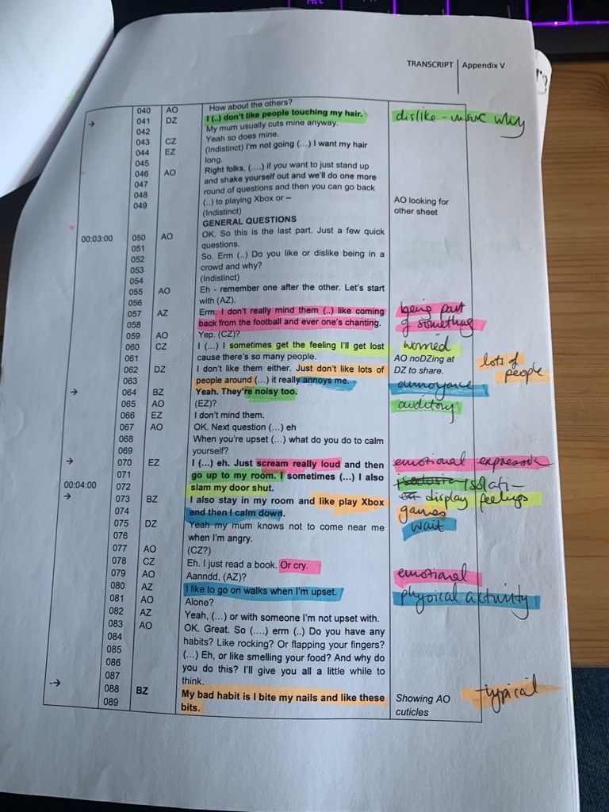

# Qualitative project: Data analysis (Individual)

## Data analysis

This chapter has information to support you with Thematic Analysis. This chapter, alongside with Ashley's lectures, will talk you through the six steps required for TA; we advise using Braun & Clarke (2006) to structure your data analysis. This can be [accessed through the library](https://tinyurl.com/ybrsf5eg). There is also a good overview in Clarke & Braun (2013), which is on the reading list.

**Overview of the steps of TA**

  1. Familiarisation with the data
  2. Generating initial codes
  3. Searching for themes
  4. Reviewing themes
  5. Defining and naming themes
  6. Producing the report

## Coding (steps 1-2)

Here, we'll focus on Steps 1 and 2 of the process. These can be found on pages 87-89 of the Braun & Clarke (2006) paper. We also covered how to do the analysis in the Thematic Analysis lecture.

### Step 1: Familiarisation with the data

  * Transcribing (or sorting/anonymising your transcript) helps you to become more familiar with your data
  * Read over the transcript, but do it in an 'active' way. This means reading while searching for meanings and patterns
  * Note down anything of interest that comes up

**Practical steps:**

Read through your transcript and take notes and/or make comments in the margins. Generate a list of ideas: what is interesting about the discussion?

### Step 2: Generating initial codes

  * Codes identify a feature of the data that seems interesting
  * The process of coding involves going through the transcript and thinking about the data, and picking out what seems interesting/important.
  * Coded data is specific (themes, which come later, are broad) -you will likely end up with quite a lot of different codes.
  * Code for as many patterns as you can at this point  - it won't all make it to the next stage, but it's good if you pick up as much as you can at this stage.
  
**Practical steps:**

Insert labels beside quotes - what is interesting about the quote? What does it tell us in relation to your research question?

### How to actually do the coding (logistically)?

There are many different ways to approach this - find the way that works for you! There are also different software to conduct thematic analysis (such as NVivo); you are welcome to use these if you wish, but due to the introductory nature of this course we don't have guidance for using them, so you need to do learn it independently, should you want to use one.

Option 1: Hand-coding

(\#fig:img-handcoded)Example of a hand-coded transcript

Option 2: Code using Word, by adding comments

(\#fig:img-commentcoded)Example of a transcript coded using comments on Microsoft Word

Option 3: Construct a table for your codes and quotes. This is an example from Braun & Clarke (2013)

(\#fig:img-tablecoded)Example of a transcript coded using a table

## Developing themes (steps 3-6)

Here, we'll focus on Steps 3 to 6 of the process. These can be found on pages 89-93 of the Braun & Clarke (2006) paper. We also covered how to do Step 3 in in the lecture for Semester 1 Week 11, while Steps 4-6 were  Semester 1 Week 12. For these activities, you are welcome to do them individually or in pairs/small groups  - whichever you prefer!

### Step 3: Searching for themes

  * In this stage, you should sort the codes into potential themes. Here, you will start to analyse your codes, and consider how they might combine to form an overarching theme.
  * It might be helpful to visualise this in some way, and see how the codes fit together.
  * You may have codes that don’t seem to fit anywhere, others will fit neatly into themes, others might be in sub-themes
  * You end this step with a collection of candidate themes (and/or sub-themes)

**Practical steps:**

  * Start to group your initial codes into broader themes.
  * Can you see a pattern across different codes?
  * What are the similarities across codes?
  * End this stage by collating all the coded quotes relevant to each theme.
  * Themes can be descriptive or interpretative (see Braun & Clarke, 2013, Ch 11). 
  * Using tables or mind maps at this stage can be helpful
  
### Step 4: Reviewing themes

This step involves two levels of reviewing and refining

*Level 1*

Reviewing at the level of the coded extracts. Read all the collated extracts for a theme…do they form a coherent pattern?

If they do, then move on to Level 2.

If they don’t, is it the case that a) the theme itself is problematic or b) the theme is fine, but some of the data doesn’t fit?

*Level 2*

Look across the entire dataset and consider the validity of your theme(s) – does it accurately reflect the meanings in the dataset?

**Practical steps:**

  * This involves checking that the themes ‘work’ in relation to both the coded extracts and the full data-set.
  * Reflect on whether the themes tell a convincing and compelling story about the data, and begin to define the nature of each individual theme, and the relationship between the themes.
  * It may be necessary to collapse two themes together or to split a theme into two or more themes, or to discard the candidate themes altogether and begin again the process of theme development.
  * Not every participant will make specific reference to every theme - that is ok - but think about how each person is represented in the analysis.
  * It can be helpful at this stage to group the relevant quotes together that represent each given theme

### Step 5: Defining and naming themes

  * During this step, you should define and refine the themes.
  * Define and refine = identifying what this theme is about, what aspect of the data is captured by each theme?
  * For each theme, you need to conduct and write a detailed analysis
  * In your report, you will report one theme with sub-themes or two themes (no subthemes) – do they explain different things without overlapping too much?

**Practical steps:**

  * This involves being able to explain each theme: 'What story does this theme tell?’ and ‘how does this theme fit into the overall story about the data?’.
  * Identify the ‘essence’ of each theme and construct a concise, punchy and informative name. Usually, you would aim for two themes for the qualitative report
  
### Step 6: Producing the report

  * The analysis should provide a concise, coherent, logical, non- repetitive and interesting account
  * The write up must provide sufficient evidence of the theme(s) (this is where the quotes come in!)
  * The extracts you choose should clearly illustrate the theme

**Practical steps:**

  * For the RM2 qualitative report, you should report either two themes (no subthemes) or one theme with 2-3 sub-themes. This is to allow you to balance depth and breadth.
  * Each theme should include approx. three quotes to illustrate it in the write up. Think about which quotes best illustrates your them.
  * If you are doing a qualitative dissertation, you will have scope to go further with your analysis; it is a good idea to discuss your data with your supervisor throughout the analytic process.
  

## Developing a narrative

When doing your thematic analysis, it is important to develop a narrative and go beyond paraphrasing/summarising your data.

Thematic Analysis requires an active approach from an analyst. It is your role to make sense of the data and to present this in a coherent, understandable and accessible way to the reader. You will take these 'patterns of meaning' and make sense of/interpret them, and convey these to the reader.

One point to note: Remember that **themes do not emerge**  - this suggests that they are lying in wait for you to discover them, and that the same themes would come up regardless of the analyst. This is not the case  - your experiences and interpretations will affect the themes you end up with.

When you present your data in the analysis section, you will have a) your list of themes and b) your quotes. It is your job to combine these with analytical commentary, in order to tell the story of your data. It's not enough to present the themes and then back these up with quotes  - your job is to add in a narrative that brings the themes and the evidence (i.e. quotes) together.

**Semantic and latent analysis**

Thematic Analysis allows you to explore *semantic* or *latent* themes (or both) in your analysis:

*Semantic:* captures explicitly-expressed meaning and stays close to the language of the participants/overt meaning of data, realist. This tends to be somewhat deductive. Semantic approaches still go beyond summarising/paraphrasing.

*Latent:* focuses on a deeper, more implicit meaning of the data. What are the underlying meaning, ideas, concepts? This tends to be a bit more inductive.

**Things to be aware of in developing a narrative**

1. Remember to introduce your theme to the reader – what is it about? Don’t start a theme with a quote. If you have sub- themes, still introduce the overall theme briefly before you discuss your first sub-theme
2. Explain to the reader why you’ve chosen to include each quote. Why is it important enough to be included? What does it tell us about your data?
3. Focus on depth rather than breadth – it is important that we get a real sense of your theme. In the RM2 report you only have 3000 words in total, and so will have to choose what you discuss
4. Show the reader who each quote comes from  - we should be able to match this up with the demographics table/list of interviews in the Methods section (which then gives us some context). You can do this by using pseudonyms and linking this to the table by using the same names there too.
5. Think about where the opportunities are in your data to go beyond description. Is there anything you can infer? If so, remember to be clear with the reader that this is your interpretation. Your reader should be able why you have interpreted the data this way from the quotes you've chosen.

## Themes vs. codes

This is an **optional** activity to help you discriminate between themes and codes. 

Read [this handout](https://gla-my.sharepoint.com/:w:/g/personal/ashley_robertson_glasgow_ac_uk/ESNH19f8vxJFoNgOMxZjP_wB1y-fKWuxVythoLPYLAHJdA?e=CPhrx4). This is an activity from Braun & Clarke (2022), which has data collected via online survey. The initial RQ was 'What are New Zealand men and women’s views of men’s body hair?'.

- Decide whether each label is a **code** or a **theme**
- There is no absolute distinction, but:
  + codes will tend to capture *one* insight or observation
  + themes will capture several insights/observations. Themes should also capture a pattern of shared meaning
- Reflect on why you decided whether it is a code or a theme. What made you decide this? 

### List of the labels to be categorised as either a code or theme

<ul>
<li>‘Natural’ gender difference</li>
<li>Men’s body hair is natural</li>
<li>Looks wrong when men remove hair</li>
<li>Animal metaphor</li>
<li>Men’s body hair is unpleasant</li>
<li>Imperative to remove hair</li>
<li>‘Ideal’ amount of hair</li>
<li>Back hair is ALWAYS excessive</li>
<li>Men’s ‘excess’ body hair needs to be managed</li>
</ul>

**Need to add in a hidden box here with the answers in it**

## Checklist for a good TA

This checklist is taken from Braun & Clarke (2006)

1. The data have been transcribed to an appropriate level of detail, and the transcripts have been checked against the recordings for accuracy
2. Each data item has been given equal attention in the coding process
3. Themes have not been generated from a few vivid examples (an anecdotal approach), but instead the coding process has been thorough, inclusive, and comprehensive
4. All relevant extracts for each theme have been collated
5. Themes have been checked against each other and back to the original data set
6. Themes are internally coherent, consistent, and distinctive
7. Data have been analysed – interpreted, made sense of – rather than just paraphrased or described
8. Analysis and data match each other – the extracts illustrate the analytic claims
9. Analysis tells a convincing an well-organised story about the data and topic
10. A good balance between analytic narrative and illustrative extracts is provided
11. Enough time has been allocated to complete all phases of the analysis adequately, without rushing a phase or giving it a once-over-lightly
12. The assumptions about, and specific approach to, thematic analysis are clearly explicated
13. There is a good fit between what you claim you do, and what you show you have done – i.e. described method and reported analysis are consistent
14. The language and concepts used in the report are consistent with the epistemological position of the analysis
15. The researcher is positioned as active in the research process; themes do not just ‘emerge’

## OPTIONAL: Research skills session - Preparing for data analysis

Ashley has recorded **optional** research skills sessions on different aspects of qualitative research. These sessions take a little bit deeper dive into some of the topics and may be particularly useful if you are planning on doing a qualitative dissertation next year. 

[Watch the video here](https://echo360.org.uk/media/d4df06eb-4cf1-4ae0-bf8b-cf280d9da7e0/public)

### Thinking about reflexivity

We ask you to think about your own position in the research as part of your RM2 report (there is a section in the methods!).

This can be quite tricky to do, but is very important for qualitative research. Some suggestions to get you started:

  * Think about the topic you are doing for your research and your position in it. Where would you place yourself in relation to it? What are your own views on the topic? Do you feel quite strongly about it or not?
  * Write as you reflect. Writing – be it using pen or pencil on paper, typing on a keyboard, dictating to some voice capture device, or some other mode – is an important tool for developing reflexive depth. It is good to do this at various stages of the research process.
  * Start with your own experiences, understandings and views, but then also try to interrogate those (i.e. why do you have these particular understandings, views etc.?)

Some questions that you might ask yourself:

  * What do I expect to come up in the data? How does this relate to what we found?
  * What broader experiences have I had that might influence how I'm thinking about this?
  * What are my values (i.e. what is important to me)? What about my beliefs? How might these have infuenced my thinking?
  * How might all of these be connected to my identities and the communities I am a part of?
  
### Becoming familiar with the data

It's important to become familiar with the data in the process of doing the analysis. Read through your data and make the following notes:

  * Things of potential interest
  * Ideas that you might want to explore further when you are coding
  * Your responses to the data (e.g. how do you feel when you read it?)

Try to unpick any assumptions you have that underpin your initial reactions and observations:

  * What was familiar?
  * What was unfamiliar/surprising?
  * Why are you reacting to the data in that way?
  

### Some common problems with thematic analysis

  * Thematic analysis that fails to address the research question.
  * Unconvincing or under-developed analysis: 1) Too many or too few themes 2) Too much overlap between themes or themes are unrelated 3) Themes are vague or not internally consistent or coherent
  * Little or no analytic work has been carried out (for example, using data collection questions as ‘themes’).
  * Mismatch between data and analytic claims (e.g. going beyond what your participants say)
  * Too few or too many data extracts (and little or no analytic commentary).
  * Paraphrasing rather than analysing and interpreting data
  * Arguing with the data – pointing out the ‘errors’ in a participant’s account.

### Strategies for ensuring quality in your analysis

**Reflexive journalling**

  * Reflect on your experiences throughout the whole research process (not just at the end!)
  * Think about your emotional responses to the data
  * Try to reflect on your assumptions that you already have about the topic
  
**Talk about your data with others**

  * Discuss your analysis with other people - it helps to clarify your analytic insights
  * Do stages 1-2 in pairs if you want
  * Discuss your findings in groups
  * Come along to office hours
  * Present your analysis (even if its preliminary), this can help solidify where we are going with it

**Give yourself time**

  * Try not to leave the analysis until the last minute
  * Give yourself time to step away and breathe
  * Perhaps work on other sections of your report at the same time, so that you have a mental break from analysis
  
**Make sure themes are themes (and be careful when naming them)**

*Connelly and Peltzer (2016, p.55): "When a researcher designated a 1-word theme, such as 'collaboration', what does that mean in relationship to the experiences of the informants as interpreted by the researcher? Using only 1 word as a theme, there is no way of knowing, for example if the experiences of collaboration were positive or negative, or whether collaboration is important to the nurses. One-word themes do not convey what the researcher found out about collaboration"*

