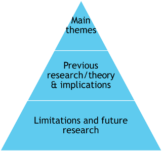

# Summative Assessment: Qualitative report

## Report Writing Guide

This section is intended to help you in the write up of your qualitative project report.  When writing your report, remember to use the other resources available to you:

- [Assessment Information Sheet](https://sway.office.com/YWnPEkrMf7zV5RDu?ref=Link) 
- [Feedback Information Sheet](https://sway.office.com/cFEJyYoDgSaz2oTt?ref=Link)
- The feedback your group received on your group proposal
- The feedback you received from RM1
- [Braun & Clark (2022) guide to Thematic Analysis](https://glasgow.summon.serialssolutions.com/#!/search?pn=1&ho=t&include.ft.matches=t&l=en-UK&bookMark=eNqNzU0OgjAQQOFJ_ImCLLwBFzCZaSmla6PxAOzJgLWQVEhsifH2cgLj_nt5CWQ8x96Oceg42vsKElKiLEhLrLaQGmMqbRSiUTvIQhhaVKVERVTs4Vj39slLmfPI_hOGcIDNg32wGazja7Yp5NdLfb6dnOfgpnezPNhPrmllhUJrMuIXIUFKovyDfAG5wDe7)
- [Constructing a narrative in TA video](https://uofglasgow.zoom.us/rec/component-page?action=viewdetailpage&sharelevel=meeting&useWhichPasswd=meeting&clusterId=us02&componentName=need-password&meetingId=Csf5XCNoFQf2J3jLF4e_J_r1gkfbAZpR4pVatJouMY8TcOsJSv_TxegIL_cIk_eG.H1YwSf33hRnck_se&originRequestUrl=https%3A%2F%2Fuofglasgow.zoom.us%2Frec%2Fshare%2Fs8qpzBlywcjCIntVoq662nde6lHp690IR5yNk7uF-AnqiutBPz7YlGnO8pwJT-np.DAknYyUZ6GHPw1bK%3FstartTime%3D1614861285000). The password is Narrative1!
- [Published articles which use a Thematic Analysis](https://rl.talis.com/3/glasgow/lists/BD0B1666-4680-8962-715B-1D02A0EB769B.html?embed=1&lang=en&lti_relink_url=https:%2F%2Fglasgow.rl.talis.com%2Flti%2Flaunch.html%3Foauth_consumer_key%3D108BC128-BDFA-D97F-D691-9F6B0DBC6F77%26roles%3DInstructor%26context_id%3D38155%26context_label%3DMSc%2528Conv%2529%2BResearch%2BMethods%2B2%2B%2528PSYCH5089%2529%2B2023-24%26context_title%3DMSc%2528Conv%2529%2BResearch%2BMethods%2B2%2B%2528PSYCH5089%2529%2B2023-24%26resource_link_id%3D79832%26custom_node_code_regex%3D%252F%255E%2528.%252A%2529%2524%252F%26custom_node_code_replacement%3D%2524%257B1%257D%26relink%3Dtrue%26embed%3Dtrue%26signature%3Dfed281cd3416c9b73ec0bc9d9ad4a53b1b17e50dc27ddd48d9b662ada8e2f9eb)
- Helpful resources for APA formatting are [OWL Purdue](https://owl.purdue.edu/owl/research_and_citation/apa_style/apa_formatting_and_style_guide/index.html)
- Materials from [the labs](https://wtoivo.github.io/RM2-F2F-quali-book/labs.html) and [APA Style](https://apastyle.apa.org/style-grammar-guidelines)
- We have developed a resource of [Frequently Asked Questions](https://wtoivo.github.io/RM2-F2F-quali-book/frequently-asked-questions.html) from previous cohorts
- [Student Learning Development](https://www.gla.ac.uk/myglasgow/sld/) have useful information about writing for students

If you have further questions, post on Teams and/or visit your tutor's office hours.  All the best in writing your report.

### Suggested word count

We suggest the following for each section. Adhering to this exactly is not a mandate or requirement (i.e. it is the overall word count is the important one) but it does give an indication of where we do and do not expect to see lots of detail.

- Abstract: 100-150 words
- Introduction: 700-800 words
- Methods: 350-450 words
- Analysis: 750-900 words
- Discussion: 750-850 words

However, we strongly encourage you not to have an overly long abstract, as this can make things unecessarily tight for the rest of the report.

## Title

The title should reflect the research question(s) and define your sample (e.g., UG students experience of…). Be specific should include: 

- Who
- What 
- How 

*Example* 

**A Thematic Analysis** (how) of the **panic attack experiences** (what) of **primary aged children in inner city Schools in the UK** (who)

**Barriers and enablers to modifying sleep behaviour** (what) in **adolescents and young adults** (who): **A qualitative investigation** (how)

## Abstract (suggested word count: 100-150 words)

In an academic journal, the function of an abstract is to allow the reader to decide whether or not to read the full article.  Aim to summarise all sections of the report in 150 words, including;  1) area of research 2) aim of the study 3) brief methodology, 4) approach to analysis , 5) main findings, and 6) main 'take-away'/ headline findings and implications. Outline your main themes as findings instead of statistics  - as would be typical in a quantitative report. Keep in mind that you are summarising your research for a non-expert and you want to “entice” them to read more.

## Introduction (suggested word count: 700-800 words)

---
A resource for helping you to develop evaluation in your Introduction can be found in the [Week 8 lab materials](https://wtoivo.github.io/RM2-F2F-quali-book/labs.html#week-8-lab-7-evaluation-in-the-introduction-and-discussion)
---

The aim of the introduction is to provide the reader with the necessary background to interpret your rationale for further research  -  this is true whether you are using qualitative or quantitative led enquiry. You are expected to provide a detailed, critical literature review of relevant, published research  (quantitative and/or qualitative) for this topic/area. Identify the key issues and debates, and use these to develop an argument for your study. As with any introduction to an APA research report, you should develop the introduction using the' funnel approach'. You start with a broad overview of the topic and get more and more specific, until you arrive at the rationale for 'your' research and of course the research question(s).

Remember you have a limited number of words to say all of this, so your literature review should focus on relevant and recent articles in the area that have influenced your choice of research question.  Do try to locate the most recent examples of qualitative research in this well defined topic area - take the reader to the last example of relevant research and say how you plan to 'build' on this research - helping to create a great rationale! The [topic guide](https://wtoivo.github.io/RM2-F2F-quali-book/qualitative-project-preparation-group.html#topic-guide) cites a number of relevant studies.  Identify the most relevant studies, and you are also expected to find your own research articles related to your research question. Remember to reference all sources of information in the text (for example, government reports, websites, media reports).  

Next, remember to outline any limitations of previous studies - critique (however, make sure the limitations you discuss are actually something your study can address - otherwise your rationale will not be very strong)! Instead of just describing previous studies, try to evaluate them. What do the findings mean? Are there any contrasting findings? If so, why?  This should lead clearly to a justification of your own study; how will your study address these issues?  This should not be done independently of your literature review. When you are outlining the research and theory you should be developing a clear rationale for your research question. 

Finally, explain your study and clearly outline your research question/s.

In sum:
- Review and evaluate previous theories and research relevant to the topic.
- Provide a clear justification and explanation of your study, linked to your research questions
- The main and subsidiary research questions have been outlined clearly and offer good alignment with qualitative methods (in this case a thematic approach).

Remember that the point of this section is exactly the same as a quantitative report: you are demonstrating what work has been done in the past, to build up an argument as to why the current study has been conducted. 

## Method (suggested word count: 350-450 words)

The aim of the method section is to clearly report how your study was conducted – the reader should be able to re-run your research from the details provided. In this case, report details of your focus group and the qualitative analysis you used.  True 'replication' is difficult due to central role of researcher in influencing some aspects of the research such as analysis.  This is not an experiment.

### Participants & Recruitment

How many, who were they? Include their age, gender and nationality if known. How were they sampled? Why were your participants right for the study? In this study, participants were sampled from a group of PG students as part of their course requirements.  A table of relevant participant characteristics is recommended - please see the example in [this document](https://gla-my.sharepoint.com/:w:/g/personal/ashley_robertson_glasgow_ac_uk/EQcRFFUCP9xNj7kIGp0G2ykB4BW_w2va1gJyie43CRhDpw?e=AvfQMT)

APA Styles has more information about how to report [tables in APA format](https://apastyle.apa.org/style-grammar-guidelines/tables-figures/tables)

### Data Collection

What materials did you use to run the focus group? What information was given to participants? How was the focus group recorded, and how long did it take? Tell the reader about your approach to this, did you follow rapport building guidelines? Refer to the focus group questions in the appendices.    

### Ethics 

Include a brief account of the ethical procedures and consider both 'formal ethics' (getting consent) as well as more nuanced 'non-formal' such as the rapport building, consent as a process and reflective practices of researcher (this may warrant its own sub-heading).

### Reflexivity 

In the method section, you should also include a ‘Reflexive Analysis’. In qualitative research it is important to acknowledge the role of the researcher in interpretation of the data (Elliot & Fischer & Rennie, 1999).  This is where you question your own motives and attitudes in doing this project. Obviously we told you that you had to do it. But what assumptions did you hold prior to beginning the research? Had you considered issues around the topic previously? Did they match what the focus group say? Or did you disagree with them? And if so, how did this impact on your analysis? As different people would interpret the data differently, it is useful for you to expose your own attitudes at this point so that others can see how you have impacted on the analysis. See Braun & Clarke (2013, pp36-37, 303-304).  Reflexive analysis should be concise for this project, perhaps around 3-4 sentences.  

### Data Analysis  

In this section, report the following: 
- Details on how was the data prepared for the analysis (e.g., did you use any software for transcription? What about approach to transcription? How did you anonymise the data  - did you replace or redact identifiable information, were participants given pseudonyms etc.?) 
- Details on the analysis you are using 
- Briefly outline the your theoretical approach (look back at the lecture on theoretical perspectives for help with this if needed)
- Outline the different stages of the analysis. Qualitative analysis is accused of being fluffy/opaque sometimes. BE SPECIFIC about the stages of analysis. It's good practice at this stage to refer directly to a methodologists guidelines (e.g. Smith IPA, B and C for TA etc). Literally outline it as STAGE1: STAGE 2: etc.  For the project, 2-3 sentences outlining the stages is sufficient (i.e. here, we mean in total, NOT per stage).  A high quality account of the approach to analysis should offer transparency - try to 'open up the box' to be clear about what goes on between noting codes and arriving at themes.  Remember that the researcher observes themes in the data  - they do not *emerge*

## Analysis (suggested word count: 750-900 words)

Your analysis section is the part of the project where you show the evidence you have collected. It is similar therefore to a Results Section in a quantitative report.  It is useful to use sub-headings here.  Each sub-heading should state the name of each theme/sub-theme. You may wish to number these sub-headings if you have quite a few themes and sub-themes - this can make it easier to follow.

The aim is to make your analysis as transparent as possible, so that anyone can see how you have arrived at your interpretations from your transcript. Quotes and the narrative you develop in this section should be supported using sections taken from the transcript. Start by giving an overview of the main themes in a paragraph (there should be no quotes at this time), then present your first themes, inserting supporting quotes at appropriate points.

Guidelines for presenting quotes from participants in APA format can be found in [the relevant section in APA Styles](https://apastyle.apa.org/style-grammar-guidelines/citations/quoting-participants). Further guidance is included in [this document](https://gla-my.sharepoint.com/:w:/g/personal/ashley_robertson_glasgow_ac_uk/EQcRFFUCP9xNj7kIGp0G2ykB4BW_w2va1gJyie43CRhDpw?e=AvfQMT). 

PLEASE NOTE: most qualitative analyses require you to provide some analytical commentary after each quote. See the Constructing a Narrative in TA video (link is at [the top of this page](https://wtoivo.github.io/RM2-F2F-quali-book/qualitative-report.html#using-this-report-writing-guide)) and the Braun & Clarke (2013) text [chapter 11](https://elevate.talis.com/glasgow/player/modules/5f55ffaa3f2b343bc876562b/textbooks/5f5607666d79536ec4fbb953?page=10) for examples for analytical commentary

Due to the word limit we recommend that you:

- Choose a maximum of 2 themes to include in the Analysis Section. You may have found more in the analyses, but the scope and word limit of the project allows you to develop a narrative and evidence for 2 main themes with no subthemes. One alternative would be to report one theme with 2-3 subthemes. You may identify more themes than this, which is fine, but please stick to the guidelines here when reporting them.
- Introduce and explain each theme briefly using sub headings
- Include key quotes to support each theme (include the Pseudonym/participant number). You are likely to have a mix of longer and shorter quotes. A ballpark number might be 3-5 quotes for each theme. 
- If you want to use a quote that is too long – or includes unnecessary detail – you can remove part of the text and replace it with ellipses. 

(\#fig:img-analysis)What to aim for and avoid for analysis

## Discussion (suggested word count: 750-850 words)

---
A resource for helping you to develop evaluation in your Discussion can be found in the Week 8 [lab materials](https://wtoivo.github.io/RM2-F2F-quali-book/labs.html#week-8-lab-7-evaluation-in-the-introduction-and-discussion)
---

The aim of the discussion is to summarise and explain your overall findings and consider how they help inform the research questions.  It will be necessary to consider the findings in relation to previous research and theories (that are referenced in the Introduction).  You should also discuss any practical implications of your findings, methodological limitations, and suggestions for further research.

Start by briefly summarising your RQ/s and the themes that you have observed. How do your findings add to, or fit with previous research?  You can either take each main theme as a big discussion or break it down to sub-theme theme level. Be critical. Bring in the literature you discussed in the introduction, and new literature if need be. Do your findings agree/disagree with previous studies? Do your findings challenge existing research in any way? Did your methodology (using focus groups) uncover something that the other studies couldn’t get at? Basically... what is your contribution?

### Implications

In addition to theoretical implications you would normally discuss in a quantitative report in psychology, there is also scope for discussion of the implications.  Remember to only discuss implications that you can realistically relate to your own findings, and to support your arguments with evidence. Try to over some specifics and not vague/general implications.

### Limitations

Obviously you only spoke to one group of people and these were a fairly homogenized group, so a wider and larger sample would potentially bring richer, more in-depth data. However, avoid evaluating your study purely on quantitative standards such as validity and reliability and sample size. We strongly suggest that you do not use lack of generalisation as a limitation.  This can be contradictory to the philosophy of the method of analysis.  Evaluate the strengths and weaknesses on qualitative grounds, e.g., were focus groups the best way of eliciting the information you were looking for?  For guidance on evaluating qualitative research against a set of guidelines see Yardley (2000) & Braun & Clarke (2013, Ch 12).  

Think of your research project as an apprenticeship. We are not looking for you to do the perfect research project at your first attempt so don’t be shy about pointing out the things you could have done better. But be constructive. It’s not so much about telling us what you did wrong, as telling us what you have learned and how you would improve this study if you got another chance.

(\#fig:img-discussion)Narrow-to-broad structure of a discussion

### Suggestions for future research

If you had unlimited access to resources, how would you improve on your study? If you had the chance what kind of research questions would you like to ask? Why do you suggest the specific things that you do? Is there evidence to support the suggestions that you have?

## References

References both in the main body of text and in the reference list are structured in exactly the same way as in a quantitative report using APA style. 

## Appendices

An appendix (plural: appendices) is a supplementary document which forms part of a main document but is not essential for its completeness, containing supporting information, and usually appearing at the end. 

The appendix can often hold a lot of information.  In the qualitative report we ask you to Include the following in the appendices of the report: 

- your focus group schedule
- a sample of initial coding of the transcript

Your group will be asked to upload the transcript to Moodle before the submission of the report but it should *not* be included as part of the appendices.

## Further reading 

The RM2 reading list has examples of how qualitative research is presented and written up.  [The APA Reporting Standards for Psychological Research](https://apastyle.apa.org/jars/qual-table-1.pdf) provide comprehensive guidance on how to meet APA style journal article reporting standards in a qualitative article.  These APA guidelines are very detailed and go beyond the scope of what you need to report in the qualitative report, but do provide insight into how to report methods and analysis in a transparent way.

For those who want to really dive into thematic analysis, you can find further resources [here](https://www.thematicanalysis.net/resources-for-ta/)

If in doubt consult the guidance in this book, the assessment information sheet for the course and ask on the Teams channel. 

---
For information, the authors of this qualitative report writing guide are: Maxine Swingler, Gillian Hendry, Kate Reid. It has then been adapted by Ashley Robertson and Wilhelmiina Toivo for Research Methods 2.

Attribution 4.0 International (CC BY-SA 4.0)

If you have any questions about this resource contact maxine.swingler@glasgow.ac.uk
